# ARES Runtime — Technical Specification

**A browser-first volumetric media runtime and container format**

Name: **ARES Volumetric** (short form **ARES**)
Container extension: `.ares`

| | |
|---|---|
| **Document** | ARES Runtime Technical Specification |
| **Version** | 0.2 (Draft — consolidated master) |
| **Status** | Working draft — for implementation planning |
| **Date** | July 2026 |
| **Editors** | Project ARES |
| **Intended audience** | Engine/runtime engineers, codec engineers, tooling authors |
| **Supersedes** | *ARES — Browser-First Volumetric Media Runtime, Architecture and Specification, Draft 0.1* (the 57-page §1–5 document) |

### Provenance

This is the consolidated, single-source master specification. It merges and supersedes three earlier
artifacts:

- **`ARES.pdf`** (Draft 0.1) — a 57-page formal document that fully developed §1–5 (Introduction,
  Existing Ecosystem, Design Requirements, System Architecture, Geometry) and then stopped at §5.18
  with a note requesting a dedicated chapter on treating geometry as a video-compression problem.
  That chapter is now [§8](#8-compression-architecture)/[§8.5](#85-video-assisted-geometry-packing-attributes-into-pixels).
  Draft 0.1's conceptual depth (topology classification, temporal categorization, encoder pipelines,
  cache hierarchy, determinism/portability requirements, regional and hybrid geometry) is retained
  and folded in here.
- **`ARES_Project_Implementation_Outline.pdf`** — the one-page objectives + comparison table.
- **`Volumetric Video Codecs & Formats (2023–2026).pdf`** — the cited research brief that grounds
  [§3](#3-survey-of-existing-formats) and [Appendix E](#appendix-e--references).

Relative to Draft 0.1, this master (a) completes §6–17 and the appendices, (b) adds concrete binary
layouts, a runtime API, and code, (c) updates the survey for mid-2026 developments (Arcturus AVV,
Brown "PackUV" / CVPR 2026, the Khronos glTF Volumetric subgroup), and (d) flags several technical
traps Draft 0.1 left implicit (WebCodecs vs. `<video>`, the video-geometry precision problem,
`SharedArrayBuffer` cross-origin isolation).

---

## Abstract

ARES is a browser-first volumetric media **runtime** and **container format**. Where
existing volumetric formats optimize *interchange* between digital-content-creation
(DCC) tools, ARES optimizes *delivery* to JavaScript, WebGPU, Three.js, and React
applications. The central design premise is a deliberate inversion of the mesh-per-frame
model that dominates current pipelines:

> **Stop treating every frame as a 3D model. Treat every frame as a compressed set of
> GPU instructions.**

From that premise, ARES is designed around three ideas that legacy formats — built for
DCC interchange — never fully exploited:

1. **Temporal coherence as a first-class citizen.** For most captures (especially of
   humans) 95–99% of mesh connectivity is stable frame to frame. ARES encodes a
   persistent-topology stream with I/P/B-style geometry frames, borrowing five decades of
   video-compression theory for geometry, not just texture.
2. **The hardware video decoder as a geometry engine.** Modern devices ship fixed-function
   AV1/HEVC/VP9 decoders. ARES can route both texture *and* suitably-encoded geometry
   through them via `WebCodecs`, keeping the CPU almost idle.
3. **GPU-resident frames.** The on-the-wire layout is chosen so that a decoded frame can be
   uploaded to GPU buffers with little or no CPU-side transformation, enabling triple-buffered,
   worker-driven playback.

This document specifies the container layout, the geometry and texture codecs, the streaming
model, the runtime architecture, and a conversion toolchain from existing formats (Microsoft
HoloVideo, 4DViews, Depthkit, PLY+PNG, OBJ/glTF/Alembic/USD sequences). It is written as an
engineering specification: **assertions are distinguished from projections**, assumptions are
called out explicitly, and all quantitative targets not yet measured are labeled
*Projected — pending empirical validation*.

---

## Document status and how to read this

This is a **draft specification and research agenda**, not a finished standard. It is intended
to be the canonical reference for an implementation effort, and to be revised section by section
as experiments retire the open questions in [§16](#16-open-research-questions-and-risks).

Notation used throughout:

- **[ASSERTED]** — established technique or fact with a citation or first-principles derivation.
- **[PROJECTED]** — a quantitative estimate pending measurement. Treat as a hypothesis.
- **[ASSUMPTION]** — a premise the design rests on that should be validated early.
- **[OPEN]** — an unresolved design question tracked in [§16](#16-open-research-questions-and-risks).

The key words **MUST**, **MUST NOT**, **REQUIRED**, **SHOULD**, **SHOULD NOT**, **MAY**, and
**OPTIONAL** are to be interpreted as described in RFC 2119 / RFC 8174 when, and only when, they
appear in all capitals.

Byte layouts are little-endian unless stated otherwise. `u8/u16/u32/u64` denote unsigned
integers of that width; `f16/f32` denote IEEE-754 floats; `varint` denotes LEB128 unless noted.

---

## Table of contents

1. [Introduction and problem statement](#1-introduction-and-problem-statement)
2. [Background: volumetric representations](#2-background-volumetric-representations)
3. [Survey of existing formats](#3-survey-of-existing-formats)
4. [Design goals and requirements](#4-design-goals-and-requirements)
5. [Overall architecture](#5-overall-architecture)
6. [Geometry representation](#6-geometry-representation)
7. [Texture and video encoding](#7-texture-and-video-encoding)
8. [Compression architecture](#8-compression-architecture)
9. [Streaming architecture](#9-streaming-architecture)
10. [Runtime architecture](#10-runtime-architecture)
11. [File format specification](#11-file-format-specification)
12. [JavaScript / WebGPU implementation](#12-javascript--webgpu-implementation)
13. [Benchmark methodology and projected performance](#13-benchmark-methodology-and-projected-performance)
14. [Development roadmap](#14-development-roadmap)
15. [Future research: the avatar pipeline](#15-future-research-the-avatar-pipeline)
16. [Open research questions and risks](#16-open-research-questions-and-risks)
17. [Conclusion](#17-conclusion)
- [Appendix A — Binary layouts](#appendix-a--binary-layouts)
- [Appendix B — Pseudocode](#appendix-b--pseudocode)
- [Appendix C — Core runtime data structures](#appendix-c--core-runtime-data-structures)
- [Appendix D — Glossary](#appendix-d--glossary)
- [Appendix E — References](#appendix-e--references)


## 1. Introduction and problem statement

### 1.1 Motivation

Volumetric video — free-viewpoint capture of real people and objects as a time sequence of
3D frames — has matured on the capture side (Azure Kinect rigs, 4DViews HOLOSYS stages,
Depthkit, photogrammetry domes, neural reconstruction) far faster than on the *delivery* side.
Unlike conventional video, a volumetric frame contains continuously changing **geometry** in
addition to surface appearance: each frame may carry hundreds of thousands of vertices whose
positions, normals, texture coordinates, colors, and connectivity change over time. A single second
of raw capture is enormous: the Fraunhofer "Dimitri" sequence (2.8 M points at 30 fps) would
require roughly **110 Gbps uncompressed** [1]. Even after meshing, decimation, and codec
compression, volumetric sequences routinely exceed conventional video by one or more orders of
magnitude.

The web is where this content increasingly needs to live — product configurators, WebXR
experiences, live performers, virtual try-on, telepresence, digital preservation — yet the browser is
the most constrained delivery target: no arbitrary native codecs, a single-threaded main loop that
must not stall, garbage collection that must not spike, a strict memory ceiling on mobile, and users
on metered networks who abandon after a few seconds of blank screen.

### 1.2 Problem statement

Current volumetric workflows typically optimize **one stage** of the pipeline while accepting
inefficiency elsewhere:

- capture systems emphasize acquisition quality;
- DCC tools emphasize editing flexibility;
- interchange formats emphasize compatibility;
- streaming systems emphasize transport;
- rendering engines emphasize visualization.

Each optimization adds a *translation stage* before content reaches the browser. A representative
pipeline is a long chain, and every arrow is storage, time, metadata, or allocations:

```
Capture → Reconstruction → Mesh cleanup → Retopology → Texture baking → Export
        → Interchange format → Compression → Packaging → HTTP delivery
        → Browser parsing → Geometry decoding → GPU upload → Rendering
```

On top of this, the dominant web pipeline is **mesh-per-frame**: each frame becomes an independent
asset (typically a Draco-compressed glTF/GLB plus a WebP/KTX2 texture), listed in a JSON manifest and
loaded sequentially [4][16]. This is the correct baseline to beat, but it carries structural
inefficiencies that no amount of per-asset tuning removes:

1. **Every frame re-transmits its own topology and interchange metadata.** glTF is an interchange
   format; each GLB re-encodes accessors, buffer views, materials, and a scene graph that is
   *identical* across thousands of frames. [ASSERTED]
2. **Temporal redundancy is discarded.** Consecutive frames of a talking person differ by centimeters
   of surface motion, yet each is compressed *independently*. Video codecs would never do this for
   pixels; mesh-per-frame does it for geometry. [ASSERTED]
3. **CPU decode dominates.** Draco decoding is comparatively expensive and, unless carefully
   offloaded, competes with the render loop [29]. The pipeline is CPU-bound exactly where the browser
   is weakest.
4. **Repeated allocation.** New mesh objects and GPU buffers per frame drive garbage collection and
   buffer re-creation — both sources of frame-time variance.
5. **Request amplification.** Thousands of small files stress connection pools and caches and make
   smooth seeking hard; there is no codec-style keyframe/GOP structure or ABR ladder.

ARES treats browser playback as the **primary design objective**, not the final stage of an existing
production pipeline.

### 1.3 The core premise

ARES rejects the framing that a volumetric frame *is a 3D model that happens to be one of many*.
Instead:

> A volumetric frame is a **compressed set of GPU state changes** — new positions for a mostly
> unchanged vertex set, a new region of a texture atlas, a handful of topology patches — applied on
> top of the previous frame.

Under this framing the problems above dissolve into well-understood video-coding problems:

| Mesh-per-frame framing | ARES framing |
|---|---|
| Frame = independent asset | Frame = delta on prior GPU state |
| Topology re-sent every frame | Topology persists; patched rarely |
| Independent (intra) compression only | I / P / B geometry frames + motion prediction |
| CPU parses glTF + Draco | Hardware/`WebCodecs` decode → direct GPU upload |
| Thousands of files | One container, chunked like an MP4 |
| Seek = find an asset | Seek = jump to nearest geometry keyframe |

### 1.4 Design philosophy

Seven principles guide every decision in this document. They are stated here and made concrete as
requirements in [§4](#4-design-goals-and-requirements).

1. **Deployment, not interchange.** The runtime delivers finished assets; editing stays in existing
   formats. Compatibility is the *encoder's* job, achieved by conversion tools
   ([§14](#14-development-roadmap)), never by adding authoring features to the runtime.
2. **GPU-oriented data layout.** On-wire structures resemble GPU buffer layouts to minimize
   translation between storage and rendering.
3. **Temporal coherence.** Information unchanged between frames is neither re-stored nor re-decoded.
4. **Progressive streaming.** Playback begins before complete download whenever practical.
5. **Asynchronous execution.** Long-running work runs off the render thread whenever the browser
   permits.
6. **Open specification.** Fully documented; no dependence on proprietary software.
7. **Extensibility.** New geometry representations, codecs, and rendering APIs are incorporable
   without invalidating existing assets.

### 1.5 What ARES is and is not

- ARES **is** a *delivery and playback* format and runtime. Its container exists to feed a
  JavaScript/WebGPU renderer efficiently.
- ARES **is not** an interchange format and does not replace glTF, USD, Alembic, or FBX for authoring.
  Those remain the *inputs* to the ARES encoder.
- ARES **is not** tied to a single geometry representation. Textured meshes, persistent-topology
  deforming meshes, and 3D Gaussian splats are all first-class citizens of the same container
  ([§6](#6-geometry-representation)).

> **[ASSUMPTION A1]** The runtime target is WebGPU-capable browsers (Chromium, Safari, and Firefox
> all ship WebGPU by 2026), with a WebGL2 fallback path for the mesh profile. WebGPU is assumed
> available on the primary target devices.

> **[ASSUMPTION A2]** `WebCodecs` (`VideoDecoder`/`VideoEncoder`) is available and exposes
> hardware-accelerated AV1 and/or HEVC decode on the primary target devices. This is load-bearing for
> the video-assisted paths ([§7](#7-texture-and-video-encoding), [§8](#8-compression-architecture))
> and is validated in the roadmap's Phase 0.

### 1.6 Scope

**In scope:** runtime architecture; binary file format; geometry representation; texture
representation; compression research; streaming protocol; decoder architecture; JavaScript runtime;
WebGPU integration; WebGL compatibility; conversion utilities; performance benchmarking; future
extensions.

**Out of scope:** capture hardware; photogrammetry/reconstruction algorithms; neural-reconstruction
methods; animation-authoring workflows; DCC software. Neural reconstruction and the automated avatar
pipeline appear only as a **future module** ([§15](#15-future-research-the-avatar-pipeline)),
explicitly outside the v1 runtime.


## 2. Background: volumetric representations

Before surveying formats it is worth separating the *representation* (how a frame's geometry and
appearance are described) from the *container* (how frames are packed for delivery). ARES is
primarily a container-and-runtime effort, but the representation it carries dictates what is
possible. Four representation families matter in 2026.

### 2.1 Textured mesh sequences

The mainstream representation: each frame is a triangle mesh (positions, normals, UVs, indices)
plus a texture (an atlas, or a per-frame image). This is what 4DViews, Depthkit, Microsoft's
HoloVideo, and UVOL ultimately emit.

- **Strengths.** Renders trivially on any GPU pipeline; well-understood; compresses with mature
  tools (Draco, meshopt, KTX2/Basis).
- **Weaknesses.** Topology is typically *regenerated per frame* by the reconstruction algorithm,
  so vertex counts and connectivity change frame to frame, which defeats temporal prediction. This
  is the single biggest missed opportunity in the current ecosystem, and the one ARES targets
  directly ([§6.5](#65-persistent-topology--the-core-bet)).

### 2.2 Point clouds

Frames are unstructured sets of colored points (the native output of depth sensors, before
meshing). Standardized compression exists — MPEG **V-PCC** (projects points to 2D video atlases
and rides standard video codecs) and **G-PCC** (octree/predictive coding for sparse/LiDAR-like
clouds) [39].

- **Strengths.** No meshing step; V-PCC already proves the "geometry through a video codec" idea at
  standards scale.
- **Weaknesses.** Rendering points convincingly (hole-free surfaces, lighting) is harder than
  meshes on the web; V-PCC decoders are not natively present in browsers and would need WASM.

### 2.3 3D Gaussian splats

Since 2023, **3D Gaussian Splatting (3DGS)** has become a major representation: a scene is a cloud
of anisotropic Gaussians (position, covariance/scale+rotation, opacity, view-dependent color via
spherical harmonics), rendered by differentiable rasterization. By 2026 it is prominent enough
that Khronos's new glTF Volumetric subgroup explicitly calls it out [7][16], and a Brown CVPR 2026
project ("PackUV") maps *dynamic* Gaussian-splat frames into 2D video tracks so they ride standard
codecs [43].

- **Strengths.** Photoreal appearance at low geometric complexity; no UV unwrapping; extremely
  web-friendly to *render* (a splat is just instanced/point rendering with blending) and a natural
  fit for the "compressed GPU instructions" framing — a splat frame **is** a GPU buffer.
- **Weaknesses.** Per-splat attributes are heavy (SH coefficients dominate); temporal 3DGS
  (deforming splats over time) is young; sorting/blending order and mobile fill-rate need care.

> ARES treats 3DGS as a **first-class geometry profile**, not an afterthought
> ([§6.8](#68-gaussian-splat-profile)). The PackUV result — splat attributes packed into 2D video
> tracks — aligns exactly with the ARES premise and the video-assisted geometry path
> ([§8.5](#85-video-assisted-geometry-packing-attributes-into-pixels)).

### 2.4 Neural / implicit representations

NeRF-style implicit fields and their descendants give the highest quality per byte for *static*
scenes but require network inference per pixel/ray, which is still too costly for real-time
volumetric *video* on commodity web devices in 2026. ARES does not carry implicit fields as a
runtime profile; neural methods appear in ARES only as an **offline reconstruction stage** that
produces meshes or splats ([§15](#15-future-research-the-avatar-pipeline)). [ASSERTED]

### 2.5 Summary: what the representation choice buys

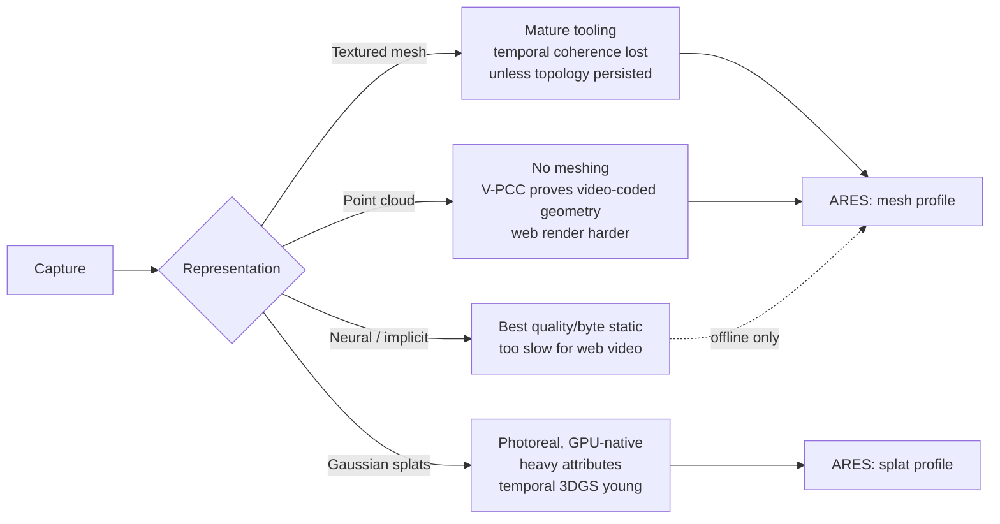

The takeaway that shapes the rest of this document: **the container must be
representation-agnostic**, carrying whichever of {persistent-topology mesh, splat} wins for a given
capture, while sharing one timeline, one streaming model, one runtime, and one texture/video
subsystem. The representation debate is settled per-capture by the encoder, not by the format.


## 3. Survey of existing formats

This section surveys what exists as of mid-2026, what each format does well, where it is weak for
*browser delivery specifically*, and the concrete lesson ARES draws. The goal is explicitly to
learn from years of accumulated field experience — including these systems' known pain points — not
to reinvent their mistakes.

Each system is judged against seven criteria relevant to browser delivery:

| Criterion | Meaning |
|---|---|
| Storage efficiency | Encoded size relative to geometric complexity |
| Decode complexity | CPU/GPU resources required during playback |
| Streaming capability | Ability to progressively load and seek |
| Browser suitability | Compatibility with JS/WebGPU without proprietary runtimes |
| Temporal compression | Exploitation of frame-to-frame coherence |
| Extensibility | Ease of supporting new rendering techniques |
| Production maturity | Stability of the existing pipeline |

**The baseline — raw mesh sequences.** The simplest representation stores one complete mesh per
frame (PLY/OBJ/STL/FBX/Alembic/glTF). A 30 fps sequence contains thirty complete models per second
regardless of how little changes. It is simple, randomly accessible, and DCC-compatible, but it
duplicates geometry, has no temporal compression, and creates a large number of filesystem objects.
Every other format — and ARES's projected numbers ([§13](#13-benchmark-methodology-and-projected-performance))
— is measured against this reference.

### 3.1 Microsoft HoloVideo / MR volumetric codec

The lineage from Microsoft's Mixed Reality Capture Studios: textured mesh sequences delivered in an
`.mp4`-wrapped codec where **geometry is packed into the video bitstream alongside texture**, so a
single hardware video decode recovers both.

- **Strengths.** Proves the thesis that a hardware video decoder can carry geometry; single-decode
  A/V-style sync; battle-tested at scale.
- **Weaknesses for web.** Proprietary; the decoder historically shipped as a native/Unity plugin,
  not a browser-native path; per-frame meshes (no persistent topology); large files.
- **Lesson for ARES.** Adopt the "geometry rides the video decoder" idea, but do it through the
  open `WebCodecs` API with AV1/VP9, and pair it with persistent topology to cut what must be
  encoded in the first place.

### 3.2 4DViews (HOLOSYS)

Capture-stage vendor producing "lightweight" textured meshes ready for engines [37], with its own
`.4ds` sequence container and Unity/Unreal/web players.

- **Strengths.** High capture quality; established runtime players; practical LOD.
- **Weaknesses for web.** Vendor container and player; per-frame meshes; web playback is a port of
  an engine runtime rather than a browser-native design.
- **Lesson for ARES.** The *player ergonomics* (drag-in-and-play, LOD) matter as much as the codec;
  ARES must ship a great `@react-three/fiber` component, not just a spec.

### 3.3 Depthkit

Popular capture/reconstruction toolkit that emits textured meshes and a combined color+depth video
layout ("CPP" — a single video frame carrying color and packed depth) [36].

- **Strengths.** Accessible; the color+depth-in-one-video layout is elegant and web-friendly.
- **Weaknesses for web.** Still fundamentally per-frame reconstruction; quality bounded by the
  single-perspective depth layout for some captures.
- **Lesson for ARES.** Depthkit's packed color+depth frame is essentially a *geometry image*
  (§8.5). ARES generalizes this to arbitrary attribute packing and multi-view.

### 3.4 UVOL (Universal Volumetric)

Open format (Etereal/`.uvol`): each frame is a **Draco-compressed mesh** plus **KTX2/Basis
textures**, organized by a JSON manifest [4].

- **Strengths.** Open; uses GPU-friendly KTX2/Basis; a real reference for a manifest-driven web
  player.
- **Weaknesses for web.** Per-frame Draco (CPU-heavy decode); manifest + many files (request
  amplification); no temporal geometry prediction; seeking is asset lookup.
- **Lesson for ARES.** UVOL is the closest open prior art and the most honest baseline. ARES's job
  is to (a) collapse the many-files model into one chunked container, (b) replace independent Draco
  frames with I/P/B persistent-topology geometry, and (c) prefer meshopt/GPU-side dequantization
  over CPU-heavy Draco where latency matters.

### 3.5 VVglTF

A 2025 research prototype adapting glTF for **streaming** volumetric frames over HTTP: the sequence
is split into glTF "segments" streamed and rate-adapted to network conditions [16].

- **Strengths.** Demonstrates chunked streaming and frame-rate adaptation on top of the familiar
  glTF stack.
- **Weaknesses for web.** Inherits glTF's per-frame interchange overhead; still mesh-per-frame at
  heart.
- **Lesson for ARES.** Validates chunked streaming + ABR for volumetric; ARES keeps the streaming
  model but drops the glTF envelope in favor of a purpose-built chunk.

### 3.6 MPEG V-PCC and G-PCC

International standards for point-cloud compression: **V-PCC** projects a point cloud onto 2D
patches and encodes them with a conventional video codec (geometry, occupancy, attribute videos);
**G-PCC** uses octree/predictive coding for sparse clouds [39].

- **Strengths.** Rigorous, standardized; V-PCC is the canonical proof that geometry-through-video
  works and interoperates.
- **Weaknesses for web.** No browser-native decoder; a full V-PCC decoder in WASM is heavy;
  optimized for point clouds, not textured meshes or splats.
- **Lesson for ARES.** Borrow V-PCC's *atlas/patch* thinking for attribute packing
  ([§8.5](#85-video-assisted-geometry-packing-attributes-into-pixels)), but keep the reconstruction
  cheap enough for a WebGPU compute shader rather than a general standards decoder.

### 3.7 Arcturus AVV (HoloSuite)

Commercial volumetric codec (2024) advertising near-lossless compression, **multi-resolution
textures**, and **per-vertex motion vectors** for real-time playback and inter-frame
interpolation [13].

- **Strengths.** Explicitly uses motion vectors and multi-res textures — both directly relevant to
  ARES; reports compressing assets to ~25% of original with negligible loss [13].
- **Weaknesses for web.** Proprietary pipeline and runtime.
- **Lesson for ARES.** Per-vertex motion vectors are exactly the P-frame mechanism ARES formalizes;
  multi-resolution texture is the ARES texture LOD ladder ([§7.6](#76-multi-resolution-texture-ladder)).

### 3.8 Khronos glTF Volumetric subgroup and PackUV

In 2026 Khronos launched a **glTF Volumetric subgroup** to extend glTF for 3D video, explicitly
noting neural techniques including Gaussian Splatting [7][16]. Separately, Brown's **PackUV**
(CVPR 2026) maps 3D Gaussian-splat frames into 2D video tracks for compatibility with standard
codecs, and recommends splitting long sequences into short chunks to reset stream state and handle
object entry/exit [43].

- **Lesson for ARES.** The standards direction and ARES agree on the destination (glTF-adjacent
  extensions, splats, video-coded attributes). ARES's differentiator is being a *runtime-first*
  design rather than an *interchange-first* extension: ARES can be a concrete, shipping
  implementation of ideas the subgroup is standardizing, and can later expose a glTF-extension
  import/export bridge.

### 3.9 Comparative summary

Relative size is normalized to raw PLY+PNG = 100%. All non-ARES figures are drawn from vendor and
research claims [4][13][16][32]; the ARES row is a **[PROJECTED]** target
([§13](#13-benchmark-methodology-and-projected-performance)).

| Format | Rel. size | CPU decode | Browser-native | Persistent topology | Temporal geometry | Random seek | Notes |
|---|---|---|---|---|---|---|---|
| Raw PLY + PNG | 100% | Very high | n/a | — | — | — | Reference |
| OBJ / FBX / Alembic seq | 70–100% | High | No | — | — | — | Authoring formats |
| GLB (uncompressed) | 60–90% | High | Yes | No | No | Per-asset | Interchange metadata heavy |
| Draco GLB seq | 15–35% | High (Draco) | Yes | No | No | Per-asset | Common web baseline |
| Meshopt GLB seq | 20–40% | Low–med | Yes | No | No | Per-asset | Faster decode than Draco |
| Depthkit | 30–50% | Med | Partial | No | Partial (video) | Video seek | Color+depth video |
| Microsoft HoloVideo | 20–40% | Med | No (plugin) | No | Yes (video) | Video seek | Geometry-in-video |
| 4DViews (.4ds) | 20–40% | Med | Port | No | Partial | Yes | Vendor runtime |
| UVOL (.uvol) | 15–35% | Med–high | Yes | No | No | Per-asset | Draco + KTX2 + manifest |
| VVglTF | 15–30% | Med | Yes | No | No | Segment | Streaming glTF |
| Arcturus AVV | ~25% | Med | No | Partial | Yes (MV) | Yes | Motion vectors, multi-res tex |
| **ARES (target)** | **5–15%** | **Low** | **Yes** | **Yes** | **Yes (I/P/B)** | **Yes (GOP)** | **[PROJECTED]** |

### 3.10 Synthesis: the ARES thesis in one paragraph

Every mature system either (a) rides a hardware video decoder but is proprietary and per-frame
(Microsoft, 4DViews, Arcturus, Depthkit), or (b) is open and browser-native but per-frame and
CPU-heavy (UVOL, Draco-GLB, VVglTF). **No open format combines browser-native decode, persistent
topology, and temporal geometry compression.** That gap is the ARES thesis: an open, runtime-first
container that treats geometry with the same I/P/B temporal machinery the industry already trusts
for pixels.


## 4. Design goals and requirements

The principles of [§1.4](#14-design-philosophy) become measurable requirements here. Where goals
conflict, the runtime prioritizes **runtime performance over encoding speed**, and **deployment
efficiency over authoring convenience**.

### 4.1 Design goals (ranked)

In priority order — when goals conflict, the higher one wins:

1. **Fast time-to-first-frame (TTFF).** The single most important user-facing metric. A capture must
   begin rendering from a small initial download, before the full asset is present.
2. **Tiny downloads.** Aggressive size reduction versus Draco-GLB sequences, the prevailing baseline.
3. **Extremely low CPU usage.** Decode belongs on the hardware video decoder, in Workers, or on the
   GPU — not the main thread. The render loop must never stall.
4. **GPU-first, GPU-resident frames.** The wire format maps onto GPU buffers with minimal CPU
   transformation.
5. **Progressive streaming and random seek.** Netflix-style chunked delivery, a keyframe/GOP model
   for seeking, and adaptive bitrate.
6. **React / Three.js / WebGPU native.** A drop-in component and a small, dependency-light core.
7. **Predictable, bounded memory.** A configurable cache/ring-buffer budget; no unbounded growth;
   near-zero GC during steady playback.
8. **Open, extensible, versioned format.** A published binary spec with a forward-compatible
   extension mechanism.
9. **No runtime dependence on glTF/GLB.** The runtime carries no glTF parser
   ([§4.9](#49-clarifying-zero-dependence-on-glb)).

### 4.2 Functional requirements

| ID | Requirement | Priority |
|---|---|---|
| F1 | Decode and render a textured, deforming volumetric sequence in a WebGPU browser | MUST |
| F2 | Persistent-topology geometry stream with I (keyframe), P (predicted), and B (bidirectional) geometry frames | MUST |
| F3 | Texture delivered as a hardware-decoded video track (AV1/VP9) via `WebCodecs` | MUST |
| F4 | Single chunked container with a seekable GOP index | MUST |
| F5 | Adaptive bitrate across ≥2 quality tiers | SHOULD |
| F6 | 3D Gaussian-splat geometry profile sharing the same container/timeline | SHOULD |
| F7 | Optional audio track, sync'd to the frame timeline | SHOULD |
| F8 | WebGL2 fallback for the mesh profile (reduced features) | SHOULD |
| F9 | Optional per-frame metadata: markers, subtitles, bounding volumes | MAY |
| F10 | Extension blocks that unknown decoders skip safely | MUST |

Expanded detail on the load-bearing functional requirements:

- **F-Input (encoder).** The encoder SHALL import PLY, OBJ, GLB, Alembic, FBX animation, USD, point-cloud
  sequences, and the vendor formats Microsoft MRC, Depthkit, 4DViews, UVOL, and VVglTF. Gaussian-splat
  and neural datasets are future targets. Importers perform *format translation only*, no optimization.
- **F-Stream.** Assets SHALL support progressive loading, adaptive buffering, chunk prioritization,
  interrupted-download recovery/resume, and HTTP range requests.
- **F-Seek.** Playback SHALL seek without decoding every preceding frame; the encoder SHALL provide
  configurable keyframe intervals and SHALL bound delta chains to cap seek latency.
- **F-Extend.** The binary format SHALL permit additive extensions without modifying existing
  structures; unknown extensions SHALL be safely ignored (F10).
- **F-Meta.** Metadata (capture info, licensing, performer, timestamps, camera calibration,
  reconstruction settings, user attributes) SHALL be separable from runtime-critical data and SHALL
  NOT affect playback performance.

### 4.3 Non-functional requirements

| ID | Requirement |
|---|---|
| N1 | Core runtime (excl. WASM codecs) ≤ ~50 KB gzipped. **[PROJECTED]** |
| N2 | No main-thread task > 8 ms during steady-state playback (headroom in a 16.6 ms frame). |
| N3 | Deterministic, bounded GPU + CPU memory given a configured cache budget; transient allocation minimized; geometry buffers resident; reusable pools over repeated allocation. |
| N4 | Graceful degradation: on decode/network stall, hold the last frame or drop to a lower tier — never crash or leak. |
| N5 | All multi-byte fields little-endian; format independent of host endianness. |
| N6 | Security: never `eval`; treat all container data as untrusted (bounds-check every offset). |
| N7 | Cross-origin isolation (COOP/COEP) required only for the `SharedArrayBuffer` fast path; a non-isolated fallback MUST exist ([§10.5](#105-threading-sharedarraybuffer-and-cross-origin-isolation)). |
| N8 | **Determinism.** Given identical encoded assets, decoder output SHALL be deterministic across supported platforms; floating-point error SHALL remain within predefined tolerances. |
| N9 | **Stability over peak.** Frame-time *variance* matters more than average frame time; stable delivery is preferred to bursts followed by stalls. |
| N10 | **Portability.** Consistent execution on Windows, Linux, macOS, Android, iOS; platform-specific optimizations remain optional. |

### 4.4 Browser requirements

The runtime SHALL account for browser subsystems that add latency uncommon in native apps, and SHALL
minimize interaction with the unpredictable ones:

- JavaScript garbage collection (minimize hot-path allocation; N3).
- Asynchronous execution and worker communication (transferables over clones).
- `SharedArrayBuffer` availability gated by cross-origin isolation (N7).
- WebGPU feature detection with WebGL2 fallback (F8).
- Browser/tab memory limits (bounded budget, N3).

### 4.5 Performance targets

All values are **[PROJECTED]** — hypotheses to be confirmed by the
[§13](#13-benchmark-methodology-and-projected-performance) methodology. They assume a mid-tier 2025
laptop / recent flagship phone, a ~30 fps human capture (~30–80k triangles/frame or ~150–400k
splats), and a good network.

| Metric | Baseline (Draco-GLB seq) | ARES target | Basis for target |
|---|---|---|---|
| Size per second @ "high" | 8–20 MB/s | **1.5–4 MB/s** | Temporal geometry + video texture |
| Time-to-first-frame (cached) | 1.5–4 s | **< 250 ms** | Small I-frame + progressive |
| Time-to-first-frame (broadband) | 2–5 s | **< 2 s** | Chunk 0 only |
| Main-thread CPU / frame | 6–15 ms | **< 3 ms** | HW decode + Worker + GPU upload |
| Steady-state FPS | 24–30 | **60** (playback ≥ capture fps) | GPU-resident triple buffer |
| GPU upload / frame | varies | **hidden behind buffering** | Delta upload, persistent buffers |
| Seek latency (to any point) | 0.5–3 s | **< 250 ms** | GOP index + keyframe fetch |
| Memory growth (continuous) | high/unbounded | **constant, bounded** | Ring buffer + budget |

> These are deliberately ambitious. The document's job is to make them *falsifiable*: each is tied
> to a mechanism, and [§13](#13-benchmark-methodology-and-projected-performance) specifies how to
> measure it. Actual targets require empirical validation.

### 4.6 Compression philosophy: per-subsystem strategy

No single algorithm is optimal across every component; compression is chosen by the **statistical
properties** of each data type ([§8](#8-compression-architecture)):

| Subsystem | Strategy |
|---|---|
| Geometry | predictive coding, delta compression, quantization, entropy coding |
| Textures | video codecs (AV1/VP9) for motion; AVIF/KTX2/Basis/WebP for static |
| Animation | motion prediction, temporal deltas, sparse updates |
| Metadata | conventional lossless (Zstd/Brotli) |

### 4.7 Temporal-coherence categorization

A foundational requirement that shapes both geometry ([§6](#6-geometry-representation)) and texture
([§7](#7-texture-and-video-encoding)): information is classified by *how fast it changes*, and each
class gets an appropriate strategy.

| Class | Examples | Strategy |
|---|---|---|
| **Static** | topology, UV layout, material definitions, vertex ordering, tangent basis | store once per GOP |
| **Slowly changing** | texture, normals, material parameters, lighting/shadow, subtle wrinkles | low-rate updates / temporal deltas |
| **Rapidly changing** | vertex displacement, visibility, local topology, facial expression, cloth motion | per-frame sparse deltas |

This taxonomy is the conceptual core of the whole design: ARES exists to stop paying static-data cost
on every frame.

### 4.8 Progressive refinement

To satisfy the TTFF goal (4.1) without sacrificing quality, an asset SHOULD become usable before it
is fully downloaded, refining in stages that each improve quality without interrupting playback:

```
1. Bounding volume        (instant placeholder)
2. Low-resolution proxy   (coarse mesh / low splat count)
3. Reduced vertex density (mid LOD)
4. Full geometry
5. High-resolution textures
```

### 4.9 Clarifying "zero dependence on GLB"

The plan states two things that appear to conflict — "zero dependence on GLB" and "convert from glTF
sequences" — which are not in conflict:

- The **runtime** MUST NOT require a glTF/GLB parser to play an ARES file. No `GLTFLoader`, no JSON
  scene graph, no Draco decoder on the critical path unless a capture explicitly uses the Draco
  fallback profile.
- The **encoder** MAY ingest glTF/GLB (and OBJ/Alembic/USD/etc.) as *source* material. Import is an
  offline concern with no runtime cost.

An OPTIONAL `glTF-extension bridge` for interop with the Khronos Volumetric subgroup is future work
([§15](#15-future-research-the-avatar-pipeline)), explicitly *not* part of the core runtime.


## 5. Overall architecture

ARES is organized as a **deployment pipeline**, not a single file format. It is three cooperating
systems — an **offline encoder**, a **container**, and a **browser runtime** — meeting at two
boundaries: the encoder's *intermediate representation* (IR) and the *container bitstream* on the
wire. The guiding rule: **all expensive work happens during encoding; the runtime performs only the
work needed to reconstruct and display each frame.**

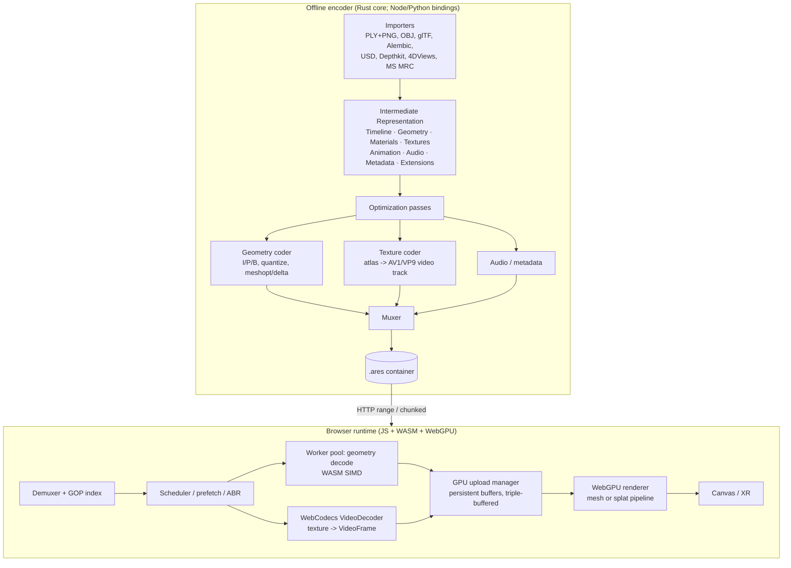

### 5.1 Subsystems

Six replaceable subsystems, each with one responsibility:

| Subsystem | Responsibility | Where it runs |
|---|---|---|
| Importer | Read source formats into the IR | Offline |
| Optimizer | Remove redundancy (topology, quantization, deltas) | Offline |
| Encoder | Produce runtime assets (the container) | Offline |
| Loader/Demuxer | Stream and parse the binary | Runtime |
| Decoder | Reconstruct GPU resources | Runtime |
| Renderer | Display volumetric content | Runtime |

### 5.2 The encoder

A batch tool (reference implementation in Rust with Node/Python bindings). All expensive,
non-real-time work lives here.

**Geometry pipeline** (the largest computational component):

```
Import → Validation → Topology analysis → Mesh cleanup → Quantization
       → Vertex ordering → Compression → Delta generation → Keyframe selection → Encoding
```

- **Validation** rejects malformed geometry before it can reach the runtime: duplicated vertices,
  invalid indices, degenerate triangles, disconnected regions, NaN/Inf values, invalid UVs/normals.
- **Topology analysis** classifies how geometry evolves (static / semi-static / dynamic / unknown,
  [§6.4](#64-topology-classification)) and drives GOP boundaries and I/P/B assignment.
- **Delta generation + keyframe selection** produce the temporal stream
  ([§6](#6-geometry-representation), [§8](#8-compression-architecture)).

**Texture pipeline** (independent of geometry):

```
Import → Color analysis → Atlas generation → Mip generation → Compression → Video analysis → Encoding
```

The encoder decides per capture whether static images, image sequences, or a video stream is most
efficient, using the temporal-coherence categorization ([§4.7](#47-temporal-coherence-categorization),
[§7](#7-texture-and-video-encoding)).

**Animation pipeline** describes temporal change independent of geometry: vertex displacement, morph
targets, visibility, topology events, material changes, camera motion. The runtime decodes only the
streams a given frame needs.

**Optimization passes** are modular so future algorithms drop in without redesigning the encoder:
geometry (quantization, duplicate removal, index/cache optimization, delta encoding), textures (atlas
generation, color quantization, block compression, video conversion), animation (sparse keyframes,
delta prediction, motion estimation), metadata (dedup, dictionary compression).

### 5.3 The intermediate representation (IR)

Imported assets enter a normalized IR that separates content into **independent streams**, each
optimized in isolation so improving one subsystem never disturbs another:

```
Scene
├── Timeline        frame PTS, fps, duration, in/out points
├── Geometry        per-frame positions/normals/uvs/indices or splats + correspondence
├── Materials       material/shader parameters
├── Textures        atlas layout + per-frame texture data
├── Animation       displacement / morph / visibility / topology events
├── Audio
├── Metadata        capture info, licensing, markers
└── Extensions      forward-compatible user blocks
```

This boundary lets a new importer be written once and immediately benefit from every coder
improvement.

### 5.4 The container

A chunked binary file ([§11](#11-file-format-specification)), MP4/Matroska-like in spirit but
purpose-built: a superblock header, a GOP index (time → byte range), then time-ordered **chunks**
(typically 1–2 s). Each chunk is **independently decodable** — it carries a complete decoding context
(one geometry keyframe + its predicted frames, the matching texture-video segment, audio/metadata for
its span) — which is what makes streaming, seeking, ABR, and interrupted-download recovery tractable.
Once decoding begins on a chunk, the browser does not need earlier chunks.

### 5.5 The runtime

A small JS/WASM/WebGPU library ([§10](#10-runtime-architecture),
[§12](#12-javascript--webgpu-implementation)). The decoder path performs runtime operations only — no
geometry optimization ever happens during playback:

```
Read chunk → Integrity check → Geometry decode → Texture decode → Animation decode
           → GPU upload → Ready queue → Renderer
```

**Threading model.** Work is spread across the concurrency the browser offers:

- *Main thread:* rendering, input, scheduling.
- *Worker pool:* geometry decode, entropy decode, streaming.
- *WebCodecs (own/HW thread):* texture decode.
- *GPU:* rendering, compute (splat sort, delta scatter), buffer upload.

Long-running operations never block rendering ([§10](#10-runtime-architecture)).

**Memory architecture.** Fixed pools defeat fragmentation and GC: a persistent geometry pool, a
persistent texture pool, a chunk cache, a frame cache, a GPU upload queue, and small transient decode
buffers. After playback begins, transient allocation approaches zero (N3).

**Cache hierarchy.** Three levels, sized to available memory ([§9.4](#94-prefetch-and-buffer-management)):

| Level | Contents | Example around frame 120 |
|---|---|---|
| L1 | Current frame ± immediate neighbors | 119–121 |
| L2 | Nearby frames | 110–130 |
| L3 | Prefetched future chunks | 131–180 |

**Rendering backend.** The runtime is renderer-independent: it exposes standardized GPU resources
consumed by Three.js, React-Three-Fiber, Babylon.js, native WebGPU, or native WebGL2 — not
file-specific objects.

### 5.6 Selective stream decoding

Because streams are independent (5.3), a client decodes only what it needs:

| Use case | Streams required |
|---|---|
| Thumbnail | Metadata only |
| Static preview | Metadata + proxy geometry |
| Muted playback | Geometry + textures |
| Interactive playback | All runtime streams |

This avoids spending bandwidth and CPU on data a given view will not display.

### 5.7 Data-flow for a single frame (steady state)

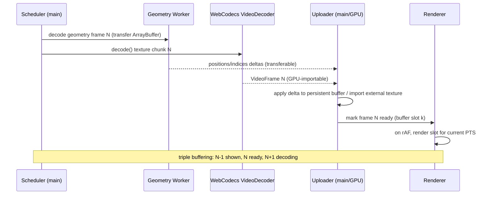

The critical property: on the main thread, per frame, the only work is issuing decode calls and a
small buffer-swap/upload. Heavy lifting is on the hardware decoder, the Worker pool, and the GPU.

### 5.8 Architectural principles

1. Source formats terminate at the importer.
2. Optimization occurs only during encoding.
3. Runtime execution performs no unnecessary processing.
4. Geometry, textures, and animation remain independent streams.
5. GPU upload is a first-class design concern.
6. Streaming architecture is independent of rendering.
7. Decoder complexity is substantially lower than encoder complexity.
8. Every subsystem is replaceable without redesigning the rest.


## 6. Geometry representation

Geometry is the largest source of storage, bandwidth, decode time, and GPU transfer in most
volumetric pipelines, so the geometry subsystem most influences overall performance. The plan's
Phase 0 instinct is correct: *do not assume GLB is best; benchmark every representation.* This section
evaluates the candidate on-the-wire representations, then specifies the two ARES geometry **profiles**
(persistent-topology mesh; Gaussian splat) that the container carries.

### 6.1 The candidates (from the plan's Options A–D)

#### Option A — GLB (baseline, for comparison only)

- **Pros:** industry standard; Three.js/Blender support; Draco/meshopt/KTX2 available.
- **Cons:** interchange metadata per frame; general-purpose scene graph; every frame is another
  asset; CPU-heavy parse.
- **Verdict:** ARES keeps GLB as a **benchmark baseline**, not a runtime representation. Compatibility
  is served by the *encoder importing* GLB, not the runtime consuming it.

#### Option B — Three.js object serialization (JS source emitting `BufferGeometry`)

Emitting `new THREE.BufferGeometry(); geometry.setAttribute(...)` or raw `Float32Array(...)` literals.

- **Pros:** no glTF/JSON parser; no scene-graph overhead.
- **Cons — and a correction:** shipping geometry as **JS source** is a *false economy*. JS source is
  UTF-8 text the engine must parse, is far larger than binary for numeric data, and cannot be
  transferred to a Worker or uploaded to the GPU without reconstruction. The *good* part of this idea —
  "produce a `BufferGeometry` directly, skip glTF" — is real, but it is achieved by Option C/D (binary
  → typed array → `BufferGeometry`), not by emitting source code.
- **Verdict:** **Rejected as a wire format.** Adopt only its *intent* (target `BufferGeometry`
  directly) via binary.

> **[SANITY CHECK]** "Very small JS bundle" is misleading: numbers-as-text is ~2–4× larger than the
> equivalent binary and adds parse cost. Binary buffers win on every axis that matters here.

#### Option C — Binary `BufferGeometry` (custom `.bin`)

A compact binary blob: `{vertexCount, indexCount, positions, normals, uvs, indices}` → `decode(buffer)`.

- **Pros:** smallest *intra* mesh representation; no parser; cache-friendly; Worker/transferable
  friendly.
- **Cons:** custom tooling.
- **Verdict:** This is the **intra (I-frame) geometry payload** for the mesh profile — the base on top
  of which deltas are applied — combined with quantization + meshopt ([§8](#8-compression-architecture)).

#### Option D — GPU-ready binary (buffers exactly as the GPU wants them)

Store interleaved vertex buffers in the target layout so decode is `createBuffer()` + copy.

- **Pros:** near-zero CPU; fastest upload.
- **Cons — and a correction:** "hardware specific" is the key risk. A truly GPU-ready blob bakes in
  attribute interleaving, alignment (WebGPU wants 4-byte-aligned, often 16-byte-friendly strides), and
  index width. That is fine *if the layout is canonicalized by the spec* rather than by a particular
  GPU. ARES defines **one canonical interleaved layout** per profile so "GPU-ready" is portable, not
  device-specific. A tiny normalization step covers the rare mismatch.
- **Verdict:** ARES's I-frame layout is Option C's contents arranged in Option D's canonical
  interleaving — cheap to upload, still portable.

### 6.2 Decision: a layered geometry model

ARES does not pick one option; it **layers** them:

```
Canonical quantized attributes (Option C contents)
        │  arranged as →
Canonical interleaved GPU layout (Option D discipline)
        │  compressed by →
meshopt vertex/index codecs (fast SIMD decode)   [intra / I-frame]
        │  extended by →
Temporal deltas: P/B frames over persistent topology   [inter]
```

The result is small (temporal + quantized), fast to decode (meshopt SIMD, no glTF), and cheap to
upload (canonical layout). Each layer is independently benchmarkable, satisfying Phase 0.

### 6.3 Quantization

Positions are quantized to fixed-point within the frame's (or GOP's) bounding box. The encoder picks
the minimum acceptable precision per sequence; adaptive precision may improve compression further.

| Level | Bits/axis | Typical use |
|---|---|---|
| High | 24–32 | reference / lossless comparison |
| Standard | 14–16 | visually lossless for human-scale captures |
| Aggressive | 11–12 | lower tiers / distant subjects |
| Variable | adaptive | experimental, per-region precision |

- Normals: octahedral encoding to 2×8–2×12 bits (or omit and derive on GPU).
- UVs: 12–16-bit fixed point over the atlas.
- Store the bounding box + scale in the frame/GOP header so the GPU (or a vertex-pull shader)
  dequantizes on read, keeping dequantization *off* the CPU.

### 6.4 Topology classification

Not every capture behaves alike; the encoder classifies each sequence before choosing a strategy.
This taxonomy (from the temporal-coherence categorization, [§4.7](#47-temporal-coherence-categorization))
decides which frames can be P/B and which force an I-frame:

| Class | Behavior | Examples | Preferred representation |
|---|---|---|---|
| **A — Static topology** | only vertex positions change | facial/body capture, rigid motion | Persistent mesh (best case) |
| **B — Semi-static** | most topology stable; localized change | cloth folds, hair, loose accessories | Persistent mesh + regional updates (§6.6) |
| **C — Dynamic** | connectivity changes frequently | fluid, destruction, vegetation | Hybrid encoding / frequent I-frames |
| **D — Unknown** | no reliable correspondence | arbitrary/failed tracking | Independent keyframe meshes (fallback) |

Class A/B are where ARES wins big; Class C/D degrade gracefully toward the mesh-per-frame baseline
rather than breaking.

### 6.5 Persistent topology — the core bet

This is the single idea that most differentiates ARES, and the plan's "one additional idea worth
investigating." For most captures — especially humans — 95–99% of connectivity is stable across many
frames. If the encoder maintains a **stable topology** over a GOP and encodes only:

- **vertex displacement** (motion), and
- **appearance changes** (in the texture video), and
- **topology patches** when connectivity genuinely changes (occlusion, object entry/exit),

then the geometry stream stops looking like a sequence of independent meshes and starts looking like
*skeletal animation with dense per-vertex deformation* — to which the entire toolbox of video
compression (I/P/B frames, motion prediction, chunked GOPs) applies. Persistent information
(connectivity, UV layout, material assignments, tangent basis, vertex ordering) is stored once;
dynamic information (displacement, normals, visibility, texture) streams per frame.

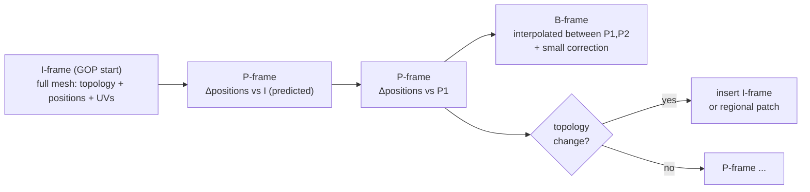

#### 6.5.1 The hard part: establishing correspondence

The encoder must produce a **stable vertex correspondence** across a GOP, because raw reconstruction
emits a *new, differently-numbered* mesh each frame. The correspondence algorithm is intentionally
**unspecified** in the format (future improvements stay runtime-compatible). Candidate techniques (an
[OPEN] research area, [§16](#16-open-research-questions-and-risks)):

1. **Track a canonical mesh.** Reconstruct/skin a canonical mesh at the I-frame; non-rigidly register
   it (embedded deformation / as-rigid-as-possible, optical-flow-guided) onto each new reconstruction.
   Output: same vertex set, new positions.
2. **Wrap-based retopology.** Fit a template (for humans, a parametric body/face model) and carry it
   through the sequence.
3. **Hybrid with re-anchor.** Track until registration error exceeds a threshold, then emit a fresh
   I-frame (new GOP). This bounds error and naturally handles topology changes.

Additional correspondence tools the encoder MAY use: nearest-neighbor search, geodesic correspondence,
spectral matching, optical flow, learned correspondence estimation. The registration error threshold
is the encoder's main quality/size knob and the P/B-vs-I decision driver.

#### 6.5.2 Payoff

When correspondence holds, a P-frame is a buffer of per-vertex displacement vectors, which are (a)
small in magnitude (quantize to 8–10 bits), (b) spatially smooth (predict from neighbors), and (c)
temporally smooth (predict from the previous displacement). This is where the projected 5–15% size
target primarily comes from. **[PROJECTED]**

### 6.6 Delta encoding, sparse and regional updates

For a P-frame vertex `v`:

```
predicted_pos(v) = prev_pos(v)                     # temporal (zeroth order)
        or        prev_pos(v) + prev_velocity(v)   # linear motion (first order)
residual(v)      = quantize(cur_pos(v) - predicted_pos(v))
```

- **Delta.** Storing residuals instead of absolute positions collapses the value distribution's
  entropy — most residuals are near zero (static regions) and entropy-code to almost nothing.
- **Sparse.** Only vertices whose residual exceeds a dead-zone are transmitted (index + Δ); the
  decoder preserves unchanged data. Static regions cost ~0 bytes.
- **Regional.** Topology changes rarely affect the whole mesh at once. Instead of rebuilding the
  entire character, ARES rebuilds only affected **regions** (e.g., left sleeve, hair, cape), defined by
  connected components, material boundaries, UV islands, spatial partitioning, or learned segmentation.
  A regional patch is far cheaper than a full I-frame and is what makes Class-B captures efficient.
- **Motion vectors.** Optional per-vertex motion vectors (à la Arcturus [13]) let the runtime
  *interpolate* intermediate frames (30→60 fps) without extra data. B-frames interpolate between two
  anchors and store only a small correction.

### 6.7 Fast intra codec: meshopt over Draco (default)

> **[SANITY CHECK / design tension]** The plan lists both "extremely low CPU usage" and "Draco." These
> are in tension: Draco achieves excellent *ratios* but its decode is comparatively CPU-heavy and must
> be Worker-offloaded to avoid stalls [29].

ARES defaults the **mesh I-frame** to **meshopt** (`meshoptimizer`) vertex/index codecs: SIMD-friendly,
very fast decode, quantization-aware. Draco is retained as an **optional high-ratio profile** for
size-critical, latency-tolerant captures. A general-purpose lossless layer (LZ4 / Zstandard / Brotli)
MAY wrap metadata and non-hot streams. The container's profile flags say which codec was used so the
runtime loads only the decoder it needs.

| | Draco | meshopt | ARES default |
|---|---|---|---|
| Ratio | Best | Good | meshopt (Draco optional) |
| Decode CPU | High | Low | Low |
| WASM size | Larger | Small | Small |
| GPU-side dequant | Partial | Yes | Yes |

### 6.8 Gaussian splat profile

For captures better served by splats (photoreal, no clean topology), ARES defines a **splat profile**
sharing the same container and timeline. A splat frame is a set of Gaussians:

`position (3) · scale (3) · rotation quaternion (4) · opacity (1) · color/SH (3…48)`

Design notes:

- **SH coefficients dominate size.** SH degree is a profile parameter (degree 0 = flat color, cheapest;
  up to degree 3 for view-dependence). Most web captures use degree 0–1. [ASSERTED]
- **Temporal splats.** Apply the same I/P/B model to per-splat attributes: an I-frame is the full splat
  set; P-frames are attribute deltas. Correspondence is easier than for meshes (no connectivity) but
  splat *birth/death* must be coded.
- **Video-packed attributes.** Following PackUV [43], splat attributes can be laid into 2D tiles and
  encoded as a video track ([§8.5](#85-video-assisted-geometry-packing-attributes-into-pixels)),
  routing splat geometry through the hardware decoder just like texture. The §8.5.1 warning applies
  in full: only colour is video-shaped. Positions fail exactly as for meshes, and rotations fail
  worse — a quaternion is not spatially coherent, and a jittered splat has no index buffer holding
  it in place. The claim that "splats tolerate lossy packing better" holds for colour, not geometry.
- **Rendering.** Instanced quads per splat, back-to-front through an index indirection from a CPU
  counting sort (re-sorted only when the view direction moves), EWA covariance projection in the
  vertex stage, premultiplied "over" compositing. Both backends (WebGPU storage buffers; WebGL2
  data textures) — [§12](#12-javascript--webgpu-implementation).

**Implementation (2026-09-07).** The intra splat profile ships: block layout in
[§11.6.3](#1163-geometry-block--splat-profile); importers for Niantic SPZ (v1–v4), 3DGS PLY,
`.splat`, glTF/GLB with `KHR_gaussian_splatting`, and PlayCanvas SOG; exporters for SPZ, 3DGS PLY,
glTF/GLB and `.splat` (`ares export`). Degree 0 is the fast path (the common case for generated
environments); degrees 1–3 are carried as 8-bit bands and evaluated in the vertex shader.

### 6.9 Hybrid geometry (per-stream representations)

No single representation is optimal for all content, so the container permits **multiple geometry
representations within one asset**, each stream carrying its representation id and its own decoder while
sharing one scheduling, streaming, and synchronization framework:

```
Character   → persistent mesh
Environment → Gaussian splats
Hair        → point cloud
Smoke       → neural / volumetric (future)
```

This is what lets future rendering techniques coexist inside a stable runtime without touching the
surrounding infrastructure ([§1.4](#14-design-philosophy) principle 7).

### 6.10 Geometry representation decision matrix

Score 1 (poor) – 5 (excellent) for browser delivery. **[PROJECTED]** pending Phase 0 benchmarks.

| Representation | Size | Decode CPU | GPU upload | Quality | Temporal | Web render | Total |
|---|---|---|---|---|---|---|---|
| GLB (baseline) | 2 | 2 | 3 | 5 | 1 | 5 | 18 |
| JS source (Opt B) | 1 | 2 | 2 | 5 | 1 | 5 | 16 |
| Binary intra (Opt C) | 3 | 4 | 4 | 5 | 1 | 5 | 22 |
| GPU-ready canonical (Opt D) | 3 | 5 | 5 | 5 | 1 | 5 | 24 |
| **Persistent-topology mesh (I/P/B)** | **5** | **4** | **5** | **4–5** | **5** | **5** | **28–29** |
| **Gaussian splat (I/P/B)** | **4** | **4** | **5** | **5** | **4** | **4** | **26** |
| Video-packed geometry | 5 | 5 | 4 | 3–4 | 5 | 4 | 26–27 |

**Conclusion.** The two shipping profiles are **persistent-topology mesh** (primary) and **Gaussian
splat** (photoreal/topology-hostile captures). Both use the layered intra codec (§6.2) and the temporal
I/P/B model, and both can optionally route attributes through the video decoder (§8.5). The scores are
hypotheses; Phase 0 exists to fill this table with measurements. Geometry research priorities
(persistent-topology reconstruction, correspondence, sparse displacement, adaptive quantization,
GPU-native layout, hybrid streams, regional updates, predictive coding) are tracked in
[§16](#16-open-research-questions-and-risks).


## 7. Texture and video encoding

Texture is the larger half of most volumetric payloads. The plan's instinct — *stop shipping
thousands of WebP files; ship one video* — is correct, but the details determine whether it works.

### 7.1 The decision: one video track, decoded via `WebCodecs`

> **[SANITY CHECK — the most important correction in this section]** The plan says "store one AV1
> video; hardware decodes automatically." True for pixels, but a naïve `<video>` element is the
> **wrong** decode path for volumetric sync. An `HTMLVideoElement` does not give frame-accurate,
> pull-based access: `currentTime` seeking is imprecise, `requestVideoFrameCallback` is delivery- not
> pull-timed, and you cannot reliably say "give me exactly texture frame N *now*, synchronized to
> geometry frame N." For frame-accurate volumetric playback you MUST use **`WebCodecs`**
> (`VideoDecoder`): feed `EncodedVideoChunk`s, receive `VideoFrame`s you control, and import each
> `VideoFrame` directly into WebGPU.

So the texture subsystem is: **an AV1 (default) or VP9 video track, demuxed from the ARES container,
decoded with `WebCodecs` `VideoDecoder`, each `VideoFrame` imported to a GPU texture via
`copyExternalImageToTexture` / `importExternalTexture`.**

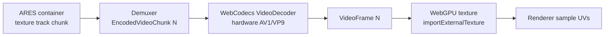

### 7.2 Codec selection (2026 reality)

| Codec | Compression | HW decode (2026) | Browser via WebCodecs | ARES role |
|---|---|---|---|---|
| **AV1** | Excellent | Widespread on 2023+ SoCs/GPUs | Broad (Chromium, FF; Safari improving) | **Default** |
| **VP9** | Good | Very widespread | Broad | **Fallback** (older/no-AV1 HW) |
| **HEVC/H.265** | Excellent | Widespread (native) | **Inconsistent / license-gated** in browsers | Optional, opt-in only |
| **H.264/AVC** | Modest | Universal | Universal | Last-resort lowest tier |

> **[SANITY CHECK — HEVC]** The plan lists "Lossless HEVC … very fast … browser support
> inconsistent." As of 2026, HEVC *hardware* decode is ubiquitous at the OS level, but **browser**
> exposure through WebCodecs remains inconsistent and entangled with licensing (available in Safari;
> gated/partial in Chromium depending on platform and flags). ARES therefore treats HEVC as an
> **optional, capability-detected** track, never the only track. AV1 + VP9 covers the field openly.

**Recommendation:** encode a **primary AV1** track and a **VP9 fallback** track for the same content
(or ship AV1 only and accept the small population without AV1 HW decode falling back to a software
decode or a lower profile). Capability is probed at load with
`VideoDecoder.isConfigSupported({...})`.

### 7.3 What about animated WebP / AVIF? (rejected for the primary path)

> **[SANITY CHECK]** The plan's own assessment is right and worth formalizing:
>
> - **Animated WebP** — poor temporal compression (it is essentially independently-coded frames in a
>   loop), no random access, decoded through the image pipeline. **Not competitive.** Reject.
> - **Animated AVIF** — backed by AV1 intra coding, so per-frame quality is good, but browser
>   *sequence* decoding is delivered through the image pipeline with weak seeking and no pull-based
>   frame access. Interesting for *very short* loops, but the *video* path (AV1 in the container via
>   WebCodecs) strictly dominates for streaming.
>
> Conclusion: **use the video codec through WebCodecs, not animated image containers.** Single WebP
> stills remain useful only as poster/preview thumbnails.

### 7.4 The texture atlas must be temporally stable

A video codec only compresses well if consecutive frames are *similar*. If the encoder re-lays-out
the UV atlas every frame (as per-frame reconstruction naturally does), the texture video becomes a
slideshow of unrelated images and inter-frame prediction collapses. Therefore:

- Within a GOP, the atlas layout MUST be **stable** (the same surface region maps to the same atlas
  region across frames). This is the texture-side counterpart of persistent topology
  ([§6.5](#65-persistent-topology--the-core-bet)) and is produced by the same correspondence step.
- Atlas stability turns surface motion into *pixel motion the codec's motion estimation already
  handles*, which is precisely why the video path pays off. [ASSERTED]

### 7.5 Alpha, confidence, and auxiliary channels

The plan's idea to use the alpha channel for a confidence/segmentation map is sound, with a caveat:

- AV1/VP9 support alpha, but a cleaner, better-compressing option is a **separate single-channel
  video track** (monochrome) for confidence/segmentation/depth, time-aligned to the color track.
  Separate tracks avoid coupling alpha quality to color quality and let the runtime skip decoding
  auxiliary tracks it does not need. [ASSERTED]
- Depthkit-style packed color+depth in one frame [36] is supported as an alternative single-track
  layout for the geometry-image path ([§8.5](#85-video-assisted-geometry-packing-attributes-into-pixels)).

### 7.6 Multi-resolution texture ladder

Following Arcturus's multi-resolution textures [13] and standard ABR practice, the encoder produces
a small **ladder** (e.g., 2048², 1024², 512²) as independent video renditions per GOP. The scheduler
([§9](#9-streaming-architecture)) selects a rung by bandwidth and on-screen size. Rungs share the
same timeline so switching is seamless at GOP boundaries.

### 7.7 GPU-compressed textures (KTX2/Basis) — where they still fit

KTX2/Basis (UASTC/ETC1S) transcodes to GPU-native block formats and saves *GPU memory and sampling
bandwidth* [4][33]. But it is an **image** technology with weak temporal compression, so it does not
replace the video track for a long sequence. ARES's use of KTX2/Basis is limited to:

- static/near-static captures (a single or rarely-changing atlas), and
- the **poster/first-frame** to make TTFF instant while the video track spins up.

For motion, the AV1 video track wins on size; the runtime samples the decoded `VideoFrame` directly.

### 7.8 Summary

- **Default texture path:** AV1 video track (VP9 fallback), decoded via **WebCodecs**, imported to
  WebGPU as an external texture, sampled with the mesh's stable UVs.
- **Rejected:** `<video>`-element playback for sync (use WebCodecs); animated WebP/AVIF as the
  streaming path; HEVC as a mandatory codec.
- **Kept in a supporting role:** WebP still for posters; KTX2/Basis for static atlases and TTFF;
  a separate mono track for confidence/segmentation/depth.


## 8. Compression architecture

This section specifies how bytes are actually saved, and — critically — subjects the plan's
"store geometry in video" idea to the precision analysis it requires before anyone builds it.

### 8.1 The compression stack (mesh profile)

```
Positions ─ quantize (14-bit/axis over GOP AABB)
          ─ spatial prediction (parallelogram / neighbor)
          ─ temporal prediction (P/B vs anchor + velocity)
          ─ meshopt vertex codec (SIMD)         ┐
Indices   ─ meshopt index codec                 ├─ per-frame geometry blob
Normals   ─ octahedral 2×10-bit (or GPU-derived)┘
Residuals ─ range/ANS entropy coding
Container ─ chunk = I-frame + P/B run + texture-video segment
```

Each stage is independently ablatable — required by Phase 0/Phase 6 benchmarking. The expected
contribution ordering (largest savings first) is: **temporal prediction ≫ quantization > entropy
coding > index coding.** **[PROJECTED]**

### 8.2 Intra (I-frame) geometry

An I-frame carries the full mesh: canonical interleaved, quantized positions/normals/UVs + meshopt
codecs (§6.7). It is the random-access point (a geometry keyframe) and the base for the GOP's deltas.
Size is dominated by vertex count × per-vertex bits; a 40k-vertex human at 14-bit positions +
octa normals + 14-bit UVs is on the order of tens of KB after meshopt. **[PROJECTED]**

### 8.3 Inter (P/B-frame) geometry

P/B frames carry quantized residuals against a prediction (§6.6). Static regions produce near-zero
residuals that entropy-code to almost nothing. The **GOP length** trades random-access granularity
(shorter = faster seek, larger) against size (longer = smaller, coarser seek). Default 30–60 frames
(1–2 s at 30 fps), matching the streaming chunk (§9) and PackUV's chunking guidance [43].

> **[SANITY CHECK — "keyframe every 60 frames, delta in between"]** The plan's instinct matches
> video GOP structure exactly and is correct. The subtlety the plan omits: an I-frame MUST also be
> forced whenever **topology changes** or **tracking error exceeds threshold** (§6.5.1), not only on
> a fixed cadence. Fixed-cadence-only keyframing would accumulate drift or break on occlusion.

### 8.4 Texture compression

Covered in [§7](#7-texture-and-video-encoding): AV1 (default) / VP9 video track over a
temporally-stable atlas, multi-resolution ladder, optional separate auxiliary track. The atlas
stability requirement (§7.4) is what makes the codec's existing motion estimation do the temporal
work for free.

### 8.5 Video-assisted geometry: packing attributes into pixels

The plan's most exciting — and most dangerous — idea: encode geometry into a video and let the
hardware decoder reconstruct it ("R = vertex x, G = vertex y, B = vertex z"). Microsoft, V-PCC, and
PackUV all prove *a* version of this works. But the naïve RGB-position mapping does **not** work, and
understanding why is essential.

#### 8.5.1 Why naïve "XYZ in RGB" fails

Four independent failure modes, each fatal on its own:

1. **Bit depth.** 8-bit video gives **256 levels per channel**. A vertex coordinate needs ~12–16
   bits. 256 positions across a body is centimeters-to-decimeters of quantization — visibly wrong.
   Even 10-bit video (1024 levels) is marginal for absolute positions. [ASSERTED]
2. **Chroma subsampling.** Standard 4:2:0 video stores full-resolution luma but **quarter-resolution
   chroma**. If X→R, Y→G, Z→B naïvely (converted to YUV), two of your three coordinates are
   spatially downsampled and cross-contaminated. Geometry would smear. [ASSERTED]
3. **Lossy DCT + inter prediction.** Video codecs are *perceptually* lossy: they discard
   high-frequency detail and quantize DCT coefficients. Applied to a "geometry image," this produces
   blocking and ringing **in the geometry** — wobbling surfaces, popping vertices. [ASSERTED]
4. **YUV color conversion.** The codec operates in YUV and applies a color transform; treating your
   packed bytes as RGB fights the codec's own colorspace handling. [ASSERTED]

> **Conclusion:** "just put XYZ in RGB and encode AV1" will yield unusable geometry. This must be
> stated plainly so no one wastes a sprint on it.

#### 8.5.2 How to do it correctly (if at all)

The techniques that make video-coded geometry actually work:

- **Encode displacement, not absolute position.** Over persistent topology, per-vertex *displacement*
  from the I-frame is small-magnitude and smooth → far more tolerant of 8–10-bit quantization and
  DCT than absolute positions. This is the ARES-native synergy: persistent topology makes the
  video-geometry path viable in the first place.
- **Use lossless / near-lossless, 4:4:4, 10–12-bit** configurations where the codec supports them,
  accepting lower ratio for correctness. AV1 supports 4:4:4 and higher bit depth.
- **Split high/low bytes across channels or tiles**, or use a **geometry image** parameterization
  (a 2D chart of the surface, à la V-PCC atlases / Depthkit depth packing) so spatial coherence in
  the map matches the codec's assumptions.
- **Keep a residual correction stream.** Decode the video-geometry to approximate positions, then
  apply a small entropy-coded correction to hit target precision — the video carries the bulk motion
  cheaply; the correction guarantees fidelity.

#### 8.5.3 ARES position on video-geometry

Video-assisted geometry is a **profile**, not the default, for v1:

- **Default mesh profile:** binary meshopt I-frames + entropy-coded P/B deltas (§8.1–8.3). Geometry
  does **not** go through the video decoder; texture does. This is the lowest-risk path to shipping.
- **Video-geometry profile (experimental):** displacement-image packing through AV1 4:4:4 + residual
  correction, evaluated against the default in Phase 2. Adopt only if it beats the default on the
  size×quality×CPU Pareto front. [OPEN]
- **Splat profile:** may use PackUV-style attribute-in-video packing [43] because splats tolerate it
  better than meshes (no connectivity to corrupt) — evaluated in Phase 2.

This keeps the exciting idea alive as a measured experiment while protecting the shipping timeline
from its risks.

### 8.6 Synchronization of geometry and texture streams

Two independently-decoded streams (geometry Worker; texture VideoDecoder) must present the *same*
frame together. This is a real hard problem the plan lists but does not solve.

- Every geometry frame and every texture frame carries a **presentation timestamp (PTS)** on the
  shared timeline (§11 chunk headers). The runtime presents a composed frame only when both the
  geometry and texture for that PTS are ready.
- A small **rebuffer/hold policy**: if one stream lags, hold the last complete composed frame rather
  than tearing (showing geometry N with texture N−1). Never present mismatched PTS.
- The texture ladder switch and geometry tier switch happen only at **GOP boundaries** so the two
  streams stay structurally aligned. [ASSERTED]

### 8.7 Neural / learned compression (future, not v1)

Gaussian-splat pruning/quantization, learned entropy models, and neural residual coding are active
research and can slot into the entropy-coding stage later. They are **out of scope for v1** (decode
cost and determinism), tracked in [§15](#15-future-research-the-avatar-pipeline) and
[§16](#16-open-research-questions-and-risks). [ASSERTED]

### 8.8 End-to-end size budget (illustrative, projected)

A 10-second, 30 fps human capture, "high" tier. **[PROJECTED] — illustrative, pending measurement.**

| Component | Per second | 10 s total | Notes |
|---|---|---|---|
| Geometry I-frames (1/s, ~40k verts) | ~40 KB | ~0.4 MB | meshopt intra |
| Geometry P/B deltas (29/s) | ~0.3–0.8 MB | ~3–8 MB | dominant geometry cost |
| Texture video (AV1, 1024²) | ~1–2.5 MB | ~10–25 MB | dominant overall cost |
| Audio (Opus) + metadata | ~20 KB | ~0.2 MB | optional |
| **Total** | **~1.5–3.5 MB/s** | **~15–35 MB** | vs ~80–200 MB Draco-GLB seq |

The texture video dominates, which is why [§7](#7-texture-and-video-encoding) (atlas stability, ABR
ladder) matters as much as the geometry cleverness. Both are needed to hit the
[§4.5](#45-performance-targets) targets.


## 9. Streaming architecture

The plan's "think Netflix" is exactly right. ARES borrows the proven shape of HTTP adaptive
streaming (HLS/DASH) — chunked media, a manifest, an ABR ladder — adapted for two synchronized
media types (geometry + texture) instead of one.

### 9.1 Chunked delivery

The container is a sequence of self-contained **chunks**, each spanning one GOP (default 1–2 s):

```
[ superblock header ][ GOP index ] [ chunk 0 ][ chunk 1 ][ chunk 2 ] ... [ chunk N ]
                                     └ 1–2 s each, independently decodable ┘
```

Each chunk contains, for its time span: one geometry I-frame + its P/B frames, the matching
texture-video segment (one closed GOP per rung), optional audio, and optional metadata. Because a
chunk is independently decodable, the runtime can start at any chunk (seek) and can fetch chunk
`n+1` while rendering chunk `n` (prefetch).

Two delivery modes, same container:

- **Single-file + HTTP range requests.** The GOP index gives byte ranges; the runtime issues
  `Range:` requests per chunk. Simplest to host (a static file on any CDN).
- **Segmented files + manifest.** Chunks as separate files with a small JSON/binary manifest, à la
  DASH. Better for some CDNs and for live. The runtime supports both; the manifest is optional sugar
  over the same chunk layout.

### 9.2 The GOP index (seek table)

A table at the head of the file (or in the manifest) mapping **time → {chunk index, byte offset,
byte length, is-keyframe, tier availability}**. This is what makes seeking O(1): to seek to time `t`,
binary-search the index for the chunk containing `t`, fetch it, decode from its I-frame, and present
from `t`. Seek latency is therefore one chunk fetch + one I-frame decode → the < 250 ms target
([§4.5](#45-performance-targets)). [PROJECTED]

### 9.3 Adaptive bitrate (ABR)

Each GOP is available at multiple **tiers** (texture ladder §7.6 × optional geometry LOD):

- The scheduler estimates throughput (EWMA of recent chunk download rates) and buffer occupancy.
- It selects the highest tier whose projected download time keeps the buffer above a low-water mark.
- Tier switches occur only at **chunk/GOP boundaries** (both streams switch together, §8.6).
- On-screen size feeds the choice too: a small on-screen capture never needs the 2048² rung.

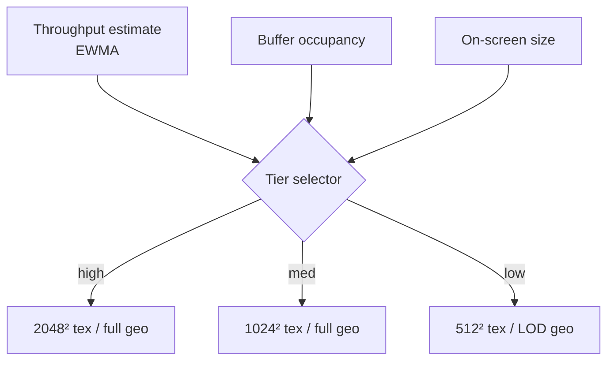

### 9.4 Prefetch and buffer management

- **Prefetch window.** Maintain a target of *K* seconds decoded-ahead (configurable, default ~2–3 s).
  Fetch and decode chunks to keep the window full; never let it drain to zero during steady playback.
- **Ring buffer.** Decoded frames live in a fixed-capacity ring sized by the memory budget
  ([§10.6](#106-memory-management-and-budgets)). Oldest frames evict as new ones arrive.
- **Predictive prefetch on seek.** On scrub, prefetch the chunk under the playhead *and* its
  neighbors to cover direction ambiguity.
- **Backpressure.** If decode can't keep up (slow device), drop to a lower tier and/or skip B-frames
  before dropping to a stall. Degrade smoothly (N4).

### 9.5 Worker scheduling

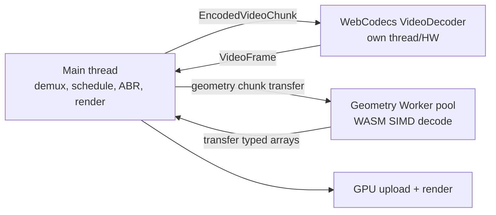

- A small **pool** of geometry Workers (default `min(navigator.hardwareConcurrency-1, 4)`) decodes
  P/B frames in parallel across chunks.
- Decoded buffers are **transferred** (zero-copy `Transferable`), not cloned.
- The `VideoDecoder` runs on its own (often hardware) thread; its `VideoFrame` outputs are consumed
  on the main thread for GPU import and **`close()`d promptly** to free decoder resources.

### 9.6 Live and low-latency (future-facing hooks)

The chunked model extends to live: an open-ended manifest with rolling chunks, low-latency chunk
transfer (chunked-transfer or WebTransport), and a short buffer. v1 targets **on-demand**; the
container reserves the header fields (live flag, rolling-window hints) so live is an extension, not a
redesign. [OPEN]

### 9.7 Deployment constraints (must be documented for integrators)

- **Cross-origin isolation.** The `SharedArrayBuffer` zero-copy fast path
  ([§10.5](#105-threading-sharedarraybuffer-and-cross-origin-isolation)) requires COOP/COEP response
  headers. Hosts that cannot set them get the (slightly slower) `Transferable`-only path. This MUST
  be called out in integration docs; it is a common deployment foot-gun.
- **Range requests / CORS.** The CDN MUST support `Range` and appropriate CORS headers for the
  single-file mode.
- **MIME type.** Serve `.ares` as `model/vnd.ares` (proposed) or `application/octet-stream`.
- **Caching.** Immutable chunks are highly cacheable (`Cache-Control: immutable`); the index/manifest
  is the only thing that changes for live.


## 10. Runtime architecture

The runtime is deliberately small and dumb: all cleverness is in the encoder. Its job is to fetch,
decode off the main thread, upload to the GPU, and swap buffers in time with the display.

### 10.1 The frame lifecycle and the playback pipeline

The plan contrasts the naïve pipeline (`Frame → load GLB → parse → decode → render`) with a
worker-driven one. ARES specifies the latter concretely:

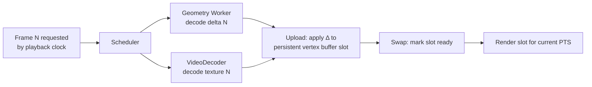

The pipeline is **decoupled from the render loop**: `requestAnimationFrame` renders whatever
composed frame is *ready* for the current playback time; decoding runs ahead asynchronously. A slow
decode causes a held frame, never a blocked render.

### 10.2 Triple buffering

Three GPU buffer slots per dynamic resource (vertex/displacement buffers, and the external texture
binding):

- **Slot A** — currently displayed (frame N−1).
- **Slot B** — ready to display (frame N).
- **Slot C** — being written by the uploader (frame N+1).

Rotating three slots means the GPU never reads a buffer the CPU is writing, eliminating stalls and
tearing. Double buffering is the minimum; triple absorbs jitter in decode timing. [ASSERTED]

### 10.3 WebGPU render path (primary)

- **Mesh profile.** Persistent index buffer (topology is stable within a GOP → uploaded once per
  GOP). Per frame, only the **position/displacement** buffer slot updates. Dequantization and
  (optionally) normal derivation happen in the vertex shader (WGSL), keeping the CPU out of it.
- **Splat profile.** Instanced billboards; per-frame splat attribute buffer; a compute-shader depth
  sort; OIT/additive blending. `VideoFrame`-packed attributes (§8.5) are read in a compute pass that
  unpacks pixels → splat buffer.
- **Texture.** `importExternalTexture(videoFrame)` binds the decoded frame directly; the fragment
  shader samples it with the mesh's stable UVs. No CPU pixel copy.

### 10.4 WebGL2 fallback (mesh profile, reduced features)

For the population without WebGPU (shrinking, but non-zero in early 2026):

- Mesh profile only (no splat compute sort).
- Texture via `texImage2D` from the `VideoFrame`/`ImageBitmap` (a CPU-visible copy path; slower).
- Dequant in the vertex shader (GLSL). No `SharedArrayBuffer` compute upload; `bufferSubData` per
  frame.
- Reduced tier ceiling. This path exists to *not exclude users*, not to be optimal (goal ranking
  §4.1). [ASSERTED]

### 10.5 Threading, `SharedArrayBuffer`, and cross-origin isolation

- **Fast path (cross-origin isolated).** With COOP/COEP set, decoded geometry lands in a
  `SharedArrayBuffer` ring the GPU uploader reads without a structured-clone copy. Workers and the
  main thread share memory; WASM uses threads + SIMD.
- **Compatible path (not isolated).** Without COOP/COEP, `SharedArrayBuffer` is unavailable; the
  runtime uses `Transferable` `ArrayBuffer`s (zero-copy *move*, one owner at a time). Slightly more
  coordination, no shared reads. Still fast; this is the default assumption.
- The runtime **feature-detects** `crossOriginIsolated` and picks the path automatically (N7).

> **[SANITY CHECK]** The plan lists "SharedArrayBuffer" as a runtime feature without noting it
> requires cross-origin isolation. Many hosting setups can't set COOP/COEP. Hence the mandatory
> non-isolated fallback — this is a requirement (N7), not a nice-to-have.

### 10.6 Memory management and budgets

- A single configurable **budget** (e.g., 256–512 MB) bounds decoded-frame cache + GPU buffers.
- The ring buffer sizes itself to the budget and the current tier's per-frame footprint.
- GPU buffers for dynamic data are **allocated once** (max-size for the profile) and reused across
  frames — no per-frame allocation, no GC pressure on the hot path.
- `VideoFrame`s are `close()`d immediately after GPU import; geometry buffers return to a free-list.
- Deterministic teardown: `dispose()` frees all GPU resources, terminates Workers, closes decoders.

### 10.7 WASM + SIMD for geometry decode

The geometry decoder (meshopt/entropy/delta) is WASM compiled with SIMD128, running in the Worker
pool. This is the only non-trivial CPU work, and it is (a) off the main thread and (b) vectorized.
Target: decode a P-frame in ≤ a few hundred microseconds for typical vertex counts. **[PROJECTED]**

### 10.8 Clock and A/V/geometry sync

- A single **playback clock** (audio clock if audio present, else a monotonic media clock) drives
  presentation.
- Geometry and texture are presented by matching PTS to the clock (§8.6); audio is rendered via
  `AudioContext`/`AudioWorklet` and is the sync master when present (audio glitches are more
  perceptible than a dropped visual frame).
- On drift, the visual streams resync to the audio clock at the next GOP boundary.

### 10.9 Public runtime API (sketch)

```ts
const player = await AresPlayer.create({
  canvas,                    // HTMLCanvasElement | offscreen
  src: 'capture.ares',       // URL (single-file range) or manifest
  renderer: 'webgpu',        // 'webgpu' | 'webgl2' | 'auto'
  memoryBudgetMB: 384,
  prefetchSeconds: 2.5,
  onFrame: (pts) => {},      // optional per-presented-frame hook
});
player.play(); player.pause();
player.seek(12.4);           // seconds; uses GOP index
player.setTier('auto');      // 'auto' | 0..n
player.dispose();
```

Integration wrappers (`@ares/three`, `@ares/react`) wrap this core; see
[§12](#12-javascript--webgpu-implementation).


## 11. File format specification

This section defines the `.ares` container. It is a chunked binary format: a fixed magic, a
superblock header, a GOP index, then time-ordered chunks. All integers little-endian;
offsets/lengths in bytes; strings UTF-8 with `u16` length prefix. This is a **draft**; field widths
marked *reserved* exist for forward compatibility.

### 11.1 Top-level layout

```
+-----------------------------+  offset 0
| File header (fixed 64 B)    |
+-----------------------------+
| Superblock (metadata)       |  variable, offset in header
+-----------------------------+
| GOP index (seek table)      |  variable, offset in header
+-----------------------------+
| Track directory             |  describes tracks: geometry, texture(s), audio, aux
+-----------------------------+
| Chunk 0 | Chunk 1 | ... | N  |  time-ordered, each = one GOP
+-----------------------------+
| Extension blocks (optional) |
+-----------------------------+
```

### 11.2 File header (64 bytes, fixed)

| Offset | Size | Type | Field | Notes |
|---:|---:|---|---|---|
| 0 | 4 | u8[4] | `magic` | `0x41 0x52 0x45 0x53` = "ARES" |
| 4 | 1 | u8 | `version_major` | `0` for this draft |
| 5 | 1 | u8 | `version_minor` | `1` |
| 6 | 2 | u16 | `header_flags` | bit0 live, bit1 has_audio, bit2 crossorigin_hint, … |
| 8 | 1 | u8 | `geometry_profile` | 0=mesh-IPB, 1=splat-IPB, 2=video-geometry (exp.) |
| 9 | 1 | u8 | `texture_codec` | 0=none,1=AV1,2=VP9,3=HEVC(opt),4=AVC |
| 10 | 1 | u8 | `intra_codec` | 0=meshopt,1=draco,2=raw |
| 11 | 1 | u8 | `entropy_codec` | 0=range/ANS,1=none |
| 12 | 4 | f32 | `fps` | nominal frame rate |
| 16 | 4 | u32 | `frame_count` | total frames |
| 20 | 8 | u64 | `duration_us` | microseconds |
| 28 | 8 | u64 | `superblock_offset` | |
| 36 | 8 | u64 | `gop_index_offset` | |
| 44 | 8 | u64 | `track_dir_offset` | |
| 52 | 8 | u64 | `first_chunk_offset` | |
| 60 | 4 | u32 | `header_crc32` | CRC of bytes [0,60) |

### 11.3 Superblock (global metadata)

Key–value metadata + global geometry/scene parameters:

| Field | Type | Notes |
|---|---|---|
| `aabb_min[3]`, `aabb_max[3]` | f32 | global bounding box (also per-GOP, §11.6) |
| `quant_bits_pos` | u8 | e.g. 14 |
| `quant_bits_uv` | u8 | e.g. 14 |
| `normal_encoding` | u8 | 0=none/derived,1=octahedral |
| `sh_degree` | u8 | splat profile only (0–3) |
| `gop_length` | u16 | nominal frames per GOP |
| `tier_count` | u8 | ABR tiers available |
| `kv_count` | u16 | user metadata pairs |
| `kv[]` | (str,str) | title, author, capture rig, color space, license, … |

### 11.4 GOP index (seek table)

One record per GOP, enabling O(log n) seek and range requests (§9.2):

| Field | Type | Notes |
|---|---|---|
| `start_pts_us` | u64 | presentation time of the GOP's I-frame |
| `frame_start` | u32 | first frame index in GOP |
| `frame_count` | u16 | frames in GOP |
| `byte_offset` | u64 | offset of chunk in file (single-file mode) |
| `byte_length` | u32 | chunk length (all tiers) or base tier |
| `tier_offsets[tier_count]` | u32 | per-tier sub-offsets within chunk |
| `flags` | u16 | bit0 forced_keyframe(topology change), bit1 has_aux |

### 11.5 Track directory

Describes each elementary stream so the runtime wires the right decoder:

| Field | Type | Notes |
|---|---|---|
| `track_count` | u16 | |
| per track: `track_id` | u16 | |
| `track_type` | u8 | 0=geometry,1=texture-color,2=texture-aux,3=audio,4=metadata |
| `codec_fourcc` | u8[4] | e.g. `AV01`,`VP09`,`MSHO`(meshopt),`OPUS` |
| `tier` | u8 | which ABR rung (texture) |
| `codec_config_len` | u16 | |
| `codec_config[]` | u8 | e.g. AV1 sequence header / `VideoDecoder.configure` description |

### 11.6 Chunk layout (one GOP)

Each chunk is self-contained and independently decodable:

```
Chunk
├─ Chunk header
│    magic 'CNK0' | pts_start_us(u64) | frame_count(u16) | flags(u16)
│    gop_aabb_min[3],gop_aabb_max[3] (f32)   # local quant range
│    block_count(u16) | block_dir[block_count]  # {type,u8; track_id,u16; offset,u32; length,u32}
├─ Geometry block(s)
│    I-frame: intra mesh/splat (meshopt/draco payload) — the keyframe
│    P/B-frames: [frame_type(u8)][ref(u8)][residual_stream …]
├─ Texture block(s)  (per tier present in this chunk)
│    one closed video GOP: [EncodedVideoChunk headers][coded bitstream]
├─ Aux block(s)      (confidence/segmentation/depth mono video; optional)
├─ Audio block       (Opus packets for this span; optional)
└─ Metadata block    (markers, subtitles, per-frame bounding volumes; optional)
```

#### 11.6.1 Geometry block — mesh I-frame

| Field | Type | Notes |
|---|---|---|
| `vertex_count` | u32 | |
| `index_count` | u32 | |
| `attr_mask` | u16 | bit0 pos, bit1 normal, bit2 uv, bit3 color |
| `positions` | meshopt(u16×3 quantized) | dequant via chunk AABB + `quant_bits_pos` |
| `normals` | meshopt(oct) | optional |
| `uvs` | meshopt(u16×2) | optional |
| `indices` | meshopt(u32) | triangle list |

#### 11.6.2 Geometry block — mesh P/B-frame

| Field | Type | Notes |
|---|---|---|
| `frame_type` | u8 | 1=P, 2=B |
| `ref_lo`,`ref_hi` | u8 | anchor frame indices (B uses two) |
| `predictor` | u8 | 0=prev,1=prev+velocity |
| `changed_count` | u32 | vertices with non-zero residual (sparse) |
| `residuals` | entropy(Δquantized) | per changed vertex: index varint + Δxyz |

> P/B frames are **sparse**: only vertices whose residual exceeds the dead-zone are listed. Static
> regions cost near-zero bytes. Topology (indices) is **not** repeated — it persists from the I-frame.

#### 11.6.2a Audio block (implemented 2026-09-07)

Track type 3, FourCC `OPUS`, `codec_config` = the 19-byte OpusHead (channels, pre-skip, input
rate). One block per chunk holding the Opus packets whose presentation time falls in the chunk's
span (the last chunk also takes the audio tail):

| Field | Type | Notes |
|---|---|---|
| `packet_count` | u16 | |
| `reserved` | u16 | |
| per packet: `pts_offset_us` | u32 | from the chunk's `pts_start_us` |
| `duration_us` | u16 | from the packet's TOC (20 ms at the encoder's default) |
| `size` | u16 | |
| `data[]` | u8 | the packets, concatenated in the same order |

Media time 0 is the first audible sample: the encoder subtracts the pre-skip when timing
packets, and the decoder receives OpusHead as its `description` so it trims the same priming.

#### 11.6.3 Geometry block — splat profile

Implemented (2026-09-07; `@ares/core` splat.ts / geometry.ts, `@ares/encoder` splat-frame.ts). The
geometry track's FourCC is `SPLT`, the header's `geometry_profile` is 1, and the superblock's
`sh_degree` byte (the mesh profile's reserved byte after `normal_encoding`) carries the SH degree.

I-frame:

| Field | Type | Notes |
|---|---|---|
| `splat_count` | u32 | |
| `sh_degree` | u8 | 0–3; the number of higher-order bands present |
| `flags` | u8 | bit0 antialiased (mip-splatting kernel) |
| `reserved` | u16 | |
| `positions` | meshopt(u16×3 + pad, stride 8) | quantized over the chunk AABB with `quant_bits_pos` — the mesh layout |
| `attrs` | meshopt(3×u32, stride 12) | word 0: scale bytes ×3 (`exp(s/16 − 10)`) + opacity u8; word 1: rotation, SPZ v3 "smallest three" (2-bit largest index, 3 × sign+9-bit magnitude); word 2: base colour rgb u8 (display-referred, `0.5 + C0·sh0` clamped) + reserved |
| `sh` | meshopt(u8, stride 12 / 24 / 48) | degree ≥ 1 only: `(v − 128)/128`, coefficient-major rgb, padded to a multiple of 4 |

Positions and rotations are never video-packed (§8.5.1); at `sh_degree` 0 the whole record is 18
bytes per splat before meshopt. Splats are Morton-ordered within a frame so the vertex codec's
delta prediction sees spatial neighbours.

P-frame (dynamic splat profile, implemented 2026-09-07). Correspondence is by index when the
Gaussian set is stable frame to frame, else nearest neighbour within a radius (encoder
`--splat-temporal auto|index|nn|off`, `--splat-match`); a frame keeping fewer survivors than
`--splat-min-survive` is coded intra. Survivors keep the previous frame's order (minus the dead);
births append.

| Field | Type | Notes |
|---|---|---|
| `splat_count` | u32 | this frame |
| `sh_degree`, `flags`, `reserved` | u8, u8, u16 | as the I-frame; degree must match the keyframe |
| `death_count` | u32 | over the PREVIOUS frame |
| `deaths[]` | varint | ascending previous indices, delta-coded (LEB128) |
| `survivor_count` | u32 | = previous count − deaths |
| `deltas` | meshopt(i16×3 + pad, stride 8) | quantized position deltas, added mod 2¹⁶ |
| `attrs` | meshopt(stride 12) | survivors' attrs as byte deltas mod 256 vs their previous copy |
| `sh` | meshopt(stride 12/24/48) | survivors' SH as byte deltas mod 256 (degree ≥ 1) |
| `birth_count` | u32 | = count − survivors |
| `birth positions`, `birth attrs`, `birth sh` | meshopt | absolute, the I-frame encodings |

Byte deltas turn an unchanged attribute into a run of zeros, which the vertex codec folds to
almost nothing; on the synthetic rotating clip a 60 fps GOP is > 20 % smaller than intra.

### 11.7 Versioning and extensions

- **Version.** `version_major` breaks compatibility; `version_minor` is additive. A decoder MUST
  refuse a higher `version_major` and MUST tolerate a higher `version_minor`.
- **Extension blocks.** Any block whose `type` a decoder does not recognize MUST be **skipped** using
  its `length` (F10). This is how new block types (live hints, new aux tracks, neural residuals) ship
  without breaking old decoders. Unknown *required* extensions are signalled by a bit in
  `header_flags` so a decoder can fail loudly when it genuinely cannot play.
- **FourCC registry.** Codec/track FourCCs are centrally registered in this spec's appendix to avoid
  collisions.

### 11.8 Integrity and security

- `header_crc32` guards the header; each chunk MAY carry a `crc32` in its header for corruption
  detection.
- The demuxer MUST bounds-check every offset/length against the file/chunk size before use (N6) and
  MUST treat all fields as untrusted. No offset may be dereferenced without validation. No code path
  uses `eval` or constructs code from container data.

### 11.9 Why not just wrap MP4/Matroska?

MP4/Matroska could carry these as custom tracks, and a future bridge MAY do so for tooling interop.
But a purpose-built container keeps the header/index tiny, avoids box-parsing overhead on the
critical path, and lets geometry and texture share one GOP-aligned chunk with one PTS domain. The
spec stays simple enough to parse in a few KB of JS. [ASSERTED] A Matroska mapping is tracked as
optional interop work ([§16](#16-open-research-questions-and-risks)).


## 12. JavaScript / WebGPU implementation

This section sketches the reference runtime's integration surface. Code is illustrative (TypeScript
+ WGSL), not final API. It shows the three things that make ARES fast: **WebCodecs texture decode**,
**persistent GPU buffers with per-frame delta upload**, and **GPU-side dequantization**.

### 12.1 Package layout

```
@ares/core     demuxer, scheduler, workers, WebGPU/WebGL renderers, WASM geo decoder
@ares/three    THREE.Object3D wrapper (drives a BufferGeometry / points from @ares/core)
@ares/react    <Ares src="..."/> component for @react-three/fiber
@ares/encoder  (Node/Rust) importers + coders + muxer (offline)
```

Runtime dependencies are minimal by design (goal N1): `@ares/core` has no Three.js dependency; the
Three.js/React wrappers are thin and optional.

### 12.2 Texture decode via WebCodecs (the correct path)

```ts
// One VideoDecoder per active texture track. Frames are pulled, not played.
const decoder = new VideoDecoder({
  output: (frame: VideoFrame) => {
    // Import directly into WebGPU — no CPU pixel copy.
    const tex = device.importExternalTexture({ source: frame });
    uploader.attachTexture(frame.timestamp, tex, frame); // frame.close() after use
  },
  error: (e) => scheduler.onDecodeError('texture', e),
});
const cfg = { codec: 'av01.0.05M.08', description: track.codecConfig /* from track dir */ };
if ((await VideoDecoder.isConfigSupported(cfg)).supported) decoder.configure(cfg);
else decoder.configure(vp9FallbackConfig);       // §7.2 capability probe

// Per chunk: feed EncodedVideoChunks demuxed from the .ares texture block.
for (const ec of demux.textureChunks(gopIndex)) {
  decoder.decode(new EncodedVideoChunk({
    type: ec.isKeyframe ? 'key' : 'delta',
    timestamp: ec.ptsMicros, data: ec.bytes,
  }));
}
```

> This is the concrete form of the [§7.1](#71-the-decision-one-video-track-decoded-via-webcodecs)
> correction: `VideoDecoder`, not `<video>`. Frame-accurate, pull-based, GPU-importable.

### 12.3 Geometry: persistent buffers + delta upload

```ts
// Allocated ONCE per capture (max size for the profile). Reused every frame. (§10.6)
const posBuf = device.createBuffer({ size: maxVerts*3*2, usage: STORAGE|COPY_DST }); // u16 x3
const idxBuf = device.createBuffer({ size: maxIdx*4,    usage: INDEX|COPY_DST });

function onIFrame(f: DecodedIFrame) {
  device.queue.writeBuffer(idxBuf, 0, f.indices);     // topology: once per GOP
  device.queue.writeBuffer(posBuf, 0, f.positions);   // quantized u16, dequant on GPU
}
function onPFrame(f: DecodedPFrame) {
  // Sparse: only changed vertices. Scatter via a small compute pass or ranged writes.
  applyDeltaCompute(posBuf, f.changedIndices, f.residuals); // §12.5
}
```

Only the position buffer changes per frame; indices persist for the whole GOP (persistent topology,
§6.5). That is the byte-level payoff of the core bet.

### 12.4 GPU-side dequantization (WGSL vertex shader)

```wgsl
struct GopParams { aabbMin: vec3f, aabbMax: vec3f, invMax: f32 };
@group(0) @binding(0) var<uniform> gop: GopParams;
@group(0) @binding(1) var<storage> qpos: array<u32>; // packed u16x3

@vertex
fn vs(@builtin(vertex_index) vi: u32) -> @builtin(position) vec4f {
  let q = unpackU16x3(qpos, vi);                 // 0..65535 per axis
  let n = vec3f(q) * gop.invMax;                 // 0..1
  let world = mix(gop.aabbMin, gop.aabbMax, n);  // dequantize — on the GPU, not the CPU
  return camera.viewProj * vec4f(world, 1.0);
}
```

Dequantization, normal derivation, and (splat profile) attribute unpacking run on the GPU, so the
CPU only ever moves compact quantized bytes (goal 3/4).

### 12.5 Applying sparse deltas

A tiny compute pass scatters `changedIndices[i] → posBuf[idx] += residual[i]`, so P-frame upload
cost scales with *changed* vertices, not total vertices. For the WebGL2 fallback, deltas apply on the
CPU into a staging typed array followed by `bufferSubData` over the changed range (§10.4).

### 12.6 Three.js wrapper

```ts
class AresObject extends THREE.Object3D {
  constructor(private player: AresPlayer) { super(); }
  // Presents into a BufferGeometry whose attributes alias the core's GPU buffers where possible;
  // on WebGL2 it updates a DynamicDrawUsage position attribute per frame.
}
```

### 12.7 React / react-three-fiber component

```tsx
export function Ares({ src, tier = 'auto', ...props }: AresProps) {
  const { gl } = useThree();
  const ref = useRef<AresObject>(null);
  useEffect(() => {
    let p: AresPlayer;
    AresPlayer.create({ src, renderer: gl.isWebGPURenderer ? 'webgpu' : 'webgl2' })
      .then((player) => { p = player; ref.current = new AresObject(player); player.play(); });
    return () => p?.dispose();               // deterministic teardown (§10.6)
  }, [src]);
  useFrame((_, dt) => ref.current?.player.tick(dt)); // advance clock; render is decoupled
  return <primitive object={ref.current} {...props} />;
}
```

Usage is a one-liner, matching the "drag-in-and-play" ergonomics lesson from 4DViews
([§3.2](#32-4dviews-holosys)):

```tsx
<Canvas><Ares src="/captures/dancer.ares" position={[0,0,0]} /></Canvas>
```

### 12.8 What the integrator must provide

- WebGPU (or accept WebGL2 fallback).
- For the `SharedArrayBuffer` fast path: COOP/COEP headers (else the compatible path is used
  automatically, §10.5).
- A CDN/host supporting `Range` requests (single-file mode) or serving the segmented chunks.


## 13. Benchmark methodology and projected performance

Every performance claim in this document is a **hypothesis** until this methodology confirms it. The
point of writing the methodology first is to make the targets *falsifiable* and to prevent
cherry-picking.

### 13.1 Principles

- **Fixed corpus.** A small, public, representative corpus (below), versioned, so runs are
  comparable over time.
- **Baselines are non-negotiable.** Every ARES number is reported *next to* Draco-GLB and meshopt-GLB
  sequences produced from the *same* source, on the *same* device.
- **Report the Pareto front, not a single number.** Size, quality, CPU, and latency trade off; a win
  on size that loses on CPU must be shown as such.
- **Quality is measured, not asserted.** Geometry error (Chamfer distance, Hausdorff) and appearance
  (PSNR/SSIM/LPIPS on rendered frames vs source) both reported.

### 13.2 Corpus

| Clip | Content | Frames | Why |
|---|---|---|---|
| `talk` | Single person talking, static camera | 300 | Best case for persistent topology |
| `dance` | Full-body fast motion | 300 | Stresses temporal prediction / re-keyframing |
| `two` | Two people, occlusion, entry/exit | 300 | Stresses topology patches / GOP cuts |
| `object` | Rotating textured object | 150 | Texture-dominated; ABR ladder |
| `splat` | Photoreal capture (splat-friendly) | 150 | Splat profile vs mesh profile |

Sources include PLY+PNG pairs and at least one Depthkit and one 4DViews export, to exercise importers.

### 13.3 Metrics and how each is measured

| Metric | Instrument | Target (§4.5) |
|---|---|---|
| Download size / s | encoder output bytes ÷ duration | 1.5–4 MB/s |
| Time-to-first-frame | `performance.now()` from `create()` to first presented frame | < 500 ms |
| Main-thread CPU / frame | `performance.measure` on the render-loop task; long-task API | < 3 ms |
| Decode time / frame | Worker-side timing, geometry; `VideoFrame` cadence, texture | budgeted |
| GPU upload / frame | timestamp queries around upload | < 2 ms |
| Steady FPS | rAF delta histogram | ≥ capture fps (target 60) |
| Seek latency | time from `seek()` to presented target frame | < 250 ms |
| Peak memory | `performance.memory` (where available) + GPU allocation tracking | bounded |
| Power (mobile) | platform battery/energy where available; else CPU%+GPU% proxy | Low |
| Geometry error | Chamfer / Hausdorff vs source mesh | below per-clip threshold |
| Visual quality | PSNR / SSIM / LPIPS on rendered frames | below per-clip threshold |

### 13.4 Ablations (Phase 6 in the plan)

Each mechanism must justify its complexity by an ablation that turns it off:

- Quantization bits sweep (11 → 16) vs geometry error.
- meshopt vs Draco vs raw intra (size × decode CPU).
- Temporal prediction on/off; predictor order 0 vs 1.
- GOP length sweep (15/30/60/120) vs size × seek latency.
- Texture: AV1 vs VP9 vs KTX2 vs WebP-seq (size × quality × decode).
- Video-geometry profile vs binary-delta profile (the §8.5 experiment).
- Splat vs mesh profile on `splat` and `talk`.

#### 13.4.1 Phase 0 intra results — **[MEASURED 2026-07-08]**

First measured fill of the intra rows (harness `ares/bench`, report at `/bench/report/`).
Synthetic corpus per §13.2 taxonomy, geometry-only, intra-only; AMD Ryzen 7 6800H, Node 24
(V8), single thread, 14-bit positions. `talk` clip, 40,962 verts / 81,920 tris:

| Intra codec | KB/frame | % of raw | decode ms/frame | decoder shipped |
|---|---|---|---|---|
| raw f32 | 1,440 | 100% | ~0 | — |
| quantized binary (Opt C/D) | 1,200 | 83% | 0.3 | — |
| qbin + Brotli | 494 | 34% | 5.3 | — |
| **meshopt** | **210** | **14.6%** | **1.1** | **≈29 KB** |
| **meshopt + Brotli (q5)** | **92** | **6.4%** | **2.1** | **≈29 KB** |
| Draco (edgebreaker, cl7) | 41 | 2.9% | 5.5 | ≈279 KB wasm |

Quantization sweep 11→16 bits: RMS error halves per added bit (1.4×10⁻⁴ → 4.5×10⁻⁶ of bbox
diagonal); qbin's size is bit-independent (u16 storage), so aggressive tiers save bytes only
through the entropy-coded codecs — consistent with §8.1's expected ordering.

**§6.7 confirmed as measured:** Draco ≈2.2× smaller than meshopt+Brotli but 3–5× slower to
decode and ~10× heavier to ship → **meshopt stays the mesh intra default**, Draco remains the
optional high-ratio profile. meshopt+Brotli's 6.4% already sits inside §13.5's projected 5–15%
band *before* temporal coding — the P0 exit criterion (§14) is met. Caveats (§13.6): synthetic
stand-ins pending real captures in `bench/data/`; Draco geometry error reported as the analytic
quantization bound (edgebreaker reorders vertices); timings are Node, not yet in-browser workers.

### 13.5 Projected performance table

Normalized to raw PLY+PNG = 100%. **All ARES figures are [PROJECTED] pending §13.1–13.4.** The
non-ARES rows carry the vendor/research claims from [§3](#3-survey-of-existing-formats).

| Format | Rel. size | CPU decode | TTFF | Seek | Notes |
|---|---|---|---|---|---|
| Raw PLY + PNG | 100% | Very high | Very slow | — | Reference |
| Draco-GLB seq | 15–35% | High | 1.5–4 s | Slow | Common baseline |
| Meshopt-GLB seq | 20–40% | Low–med | 1–3 s | Slow | Faster decode |
| UVOL | 15–35% | Med–high | Med | Asset | Draco+KTX2 |
| Microsoft HoloVideo | 20–40% | Med | Med | Video | Proprietary |
| Arcturus AVV | ~25% | Med | Med | Yes | Proprietary |
| **ARES mesh (target)** | **5–15%** | **Low** | **< 0.5 s** | **< 0.25 s** | **[PROJECTED]** |
| **ARES splat (target)** | **8–18%** | **Low** | **< 0.5 s** | **< 0.25 s** | **[PROJECTED]** |

### 13.6 Honesty clause

If, after Phase 2, the video-geometry profile does not beat the binary-delta profile, it is dropped —
not shipped for novelty. If persistent-topology tracking proves impractical on the `dance`/`two`
clips, the fallback is per-GOP re-keyframing with meshopt intra, and the size targets are revised
upward accordingly. Projections are commitments to *measure*, not to *hit*.


## 14. Development roadmap

Staged so that each phase produces something runnable and each de-risks the next. The plan's Phases
0–8 map onto this; the ordering here front-loads the load-bearing assumptions (A1/A2, persistent
topology) so they are validated before much is built on them.

```mermaid
gantt
  title ARES roadmap (indicative)
  dateFormat  X
  axisFormat %s
  section Foundations
  P0 Representation bench      :0, 2
  P1 Vertical slice (mesh)     :2, 3
  section Core
  P2 Temporal geometry         :5, 3
  P3 Streaming + ABR           :8, 2
  section Breadth
  P4 Splat profile             :10, 2
  P5 Encoders + tooling        :12, 3
  P6 Hardening + v1            :15, 2
```

### Phase 0 — Representation benchmark (de-risk the premise)

- Build the [§13](#13-benchmark-methodology-and-projected-performance) harness and corpus.
- Benchmark Options A–D intra representations + Draco/meshopt/quantization; fill the §6.10 matrix
  with **measured** numbers.
- **Validate [ASSUMPTION A1/A2]:** confirm WebGPU + WebCodecs AV1/VP9 hardware decode on target
  devices via `isConfigSupported`. If A2 fails widely, re-plan the texture path.
- **Exit criteria:** a measured intra baseline; a decision on intra codec default (expect meshopt).

### Phase 1 — Vertical slice (mesh profile, no temporal yet)

- Minimal `.ares` container (header, index, chunks) carrying **intra-only** mesh frames + AV1 texture
  via WebCodecs.
- `@ares/core` demuxer + scheduler + WebGPU renderer + Three.js/React wrappers.
- **Exit criteria:** a real capture plays in-browser end-to-end; TTFF and CPU/frame measured; already
  beats Draco-GLB on CPU and request count. This is the first demo.

> **[MET 2026-07-08]** Reference `ares/apps/demo` plays a full intra `.ares` (meshopt geometry
> blocks + still atlas) end-to-end in WebGPU: single fetch, GPU-side dequant (§12.4), topology/UVs
> once per GOP + positions per frame (§12.3). Measured (AMD 680M iGPU, ~8.8k-vert synth clip):
> TTFF ≈ 160 ms (< 500 ms), main-thread CPU ≈ 0.35 ms/frame (< 3 ms), decode ≈ 0.3 ms/frame, 60 fps,
> **1 request** vs a Draco-GLB sequence's per-frame requests. Deferred to later phases at the time:
> Worker-thread decode (§10.7), WebGL2 fallback (§10.4), WebCodecs video-texture (§7.1) — P1 shipped
> a still atlas (§7.7).
>
> **[UPDATE 2026-07-10]** All three deferred items have since shipped in the reference
> implementation: the WebCodecs VP9/AV1 video-texture path (§7.1) is the default for real captures,
> the WebGL2 fallback (§10.4) auto-selects when WebGPU is absent (61 fps measured), and
> worker-thread geometry decode (§10.7) is available opt-in (main-thread fallback where module
> workers do not inherit import maps).

### Phase 2 — Temporal geometry (the core bet)

- Encoder: persistent-topology tracking (§6.5.1), I/P/B classification, delta + entropy coding.
- Runtime: sparse delta upload (§12.5), triple buffering.
- Run the **video-geometry vs binary-delta** ablation (§8.5.3) and the splat-attribute-in-video test.
- **Exit criteria:** measured size drop from temporal coding on `talk`/`dance`; re-keyframing handles
  `two`; §13.5 targets confirmed or revised with honesty clause (§13.6).

### Phase 3 — Streaming, seeking, ABR

- GOP index seek; prefetch/ring buffer; multi-resolution texture ladder; tier selection; range-request
  and manifest delivery modes.
- **Exit criteria:** smooth seek < 250 ms; ABR adapts on a throttled network; bounded memory verified.

### Phase 4 — Splat profile

- Splat intra + temporal; WebGPU instanced/compute-sorted renderer; optional PackUV-style
  attribute-in-video.
- **Exit criteria:** `splat` clip plays; splat-vs-mesh trade-off documented per capture type.

### Phase 5 — Encoders and conversion tooling

Converters, each landing in the shared IR (§5.2) so every coder improvement applies to all inputs:

- PLY+PNG (primary), OBJ seq, glTF/GLB seq, Alembic, FBX animation, USD.
- Depthkit (color+depth video), 4DViews (`.4ds`), Microsoft HoloVideo where feasible.
- A `gltf-transform`-style CLI: `ares encode ./frames --profile mesh --tier 1024,512 -o out.ares`.
- **Exit criteria:** one-command conversion for PLY+PNG and Depthkit; documented importer matrix.

### Phase 6 — Hardening and v1.0

- Security pass (untrusted-input fuzzing of the demuxer, N6); WebGL2 fallback polish; live-streaming
  hooks stubbed; spec frozen at v1.0; docs + examples.
- **Exit criteria:** published spec, published packages, reproducible benchmark report.

### Dependencies and critical path

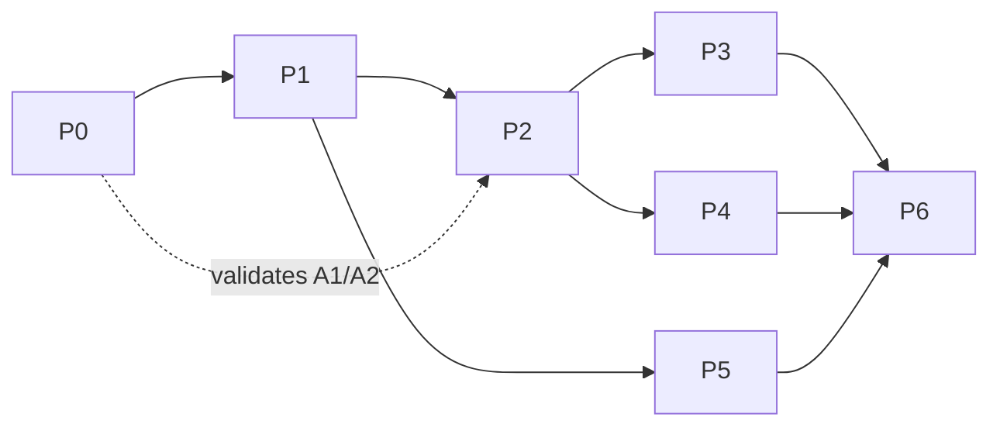

Persistent-topology tracking (Phase 2) is the highest-risk item and the critical path; Phase 0
explicitly exists to make sure the assumptions under it hold before Phase 2 starts.


## 15. Future research: the avatar pipeline

This is explicitly **out of the v1 runtime scope** and lives here as a separate module in the broader
ecosystem. It is the "generate volumetric content" counterpart to ARES's "deliver volumetric
content." ARES is the export target at the end of the pipeline, which keeps the pipeline and the
runtime cleanly decoupled.

### 15.1 Pipeline overview

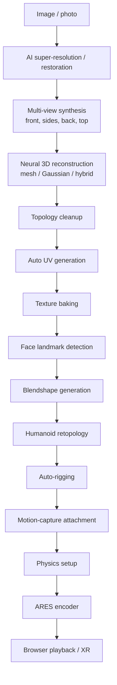

### 15.2 Where it connects to ARES

- **Retopology → persistent topology.** A retopologized humanoid mesh is *already* a stable-topology
  base — exactly what the mesh profile (§6.5) wants. A generated avatar is the ideal ARES input
  because correspondence is free.
- **Blendshapes → morph targets.** Blendshapes map onto the container's morph/motion blocks, so a
  rigged avatar can be delivered as a compact base mesh + animation rather than baked per-frame
  geometry — a different, even smaller, encoding mode. [OPEN]
- **Neural reconstruction → splat or mesh profile.** Whichever the reconstructor emits, the encoder
  ingests it; the runtime does not care.

### 15.3 Research stages and their maturity (2026)

| Stage | Maturity (2026) | Notes |
|---|---|---|
| Super-resolution / restoration | Mature | Off-the-shelf models |
| Multi-view synthesis | Rapidly improving | Diffusion-based novel view synthesis |
| Neural 3D reconstruction | Active | 3DGS/mesh hybrids; quality-vs-time trade |
| Auto UV / retopology | Semi-mature | Human-in-the-loop still common |
| Blendshape / rigging | Mature for humanoids | Template-based |
| Mocap attachment / physics | Mature | Standard DCC/engine tech |

The early stages are the least certain and the most valuable to invest research in; the later stages
are largely integration of existing tech. None of it blocks the ARES runtime — the runtime ships
against real captures (PLY+PNG, Depthkit, 4DViews) long before this pipeline is complete.


## 16. Open research questions and risks

These are the load-bearing unknowns. Each is tagged with the phase
([§14](#14-development-roadmap)) that resolves it and a fallback if it fails. Nothing in the shipping
path (mesh profile, Phases 0–3) depends on an unresolved *research* question — the risky ideas are
isolated behind profiles.

### 16.1 Open questions

| # | Question | Resolves in | Fallback if it fails |
|---|---|---|---|
| Q1 | Can persistent-topology correspondence be established robustly on fast/occluded motion (`dance`,`two`)? | P2 | Per-GOP re-keyframing with meshopt intra; revise size targets up (§13.6) |
| Q2 | Does the video-geometry profile (§8.5) beat binary-delta on the Pareto front? | P2 | Drop it; ship binary-delta only |
| Q3 | Is AV1 hardware decode via WebCodecs broad enough on target devices (A2)? | P0 | VP9 primary; AV1 opportunistic; document device matrix |
| Q4 | What GOP length best balances size vs seek across the corpus? | P3 | Per-capture adaptive GOP from tracking error |
| Q5 | Splat vs mesh: which per capture type, and can they share one runtime cleanly? | P4 | Ship mesh first; splat as a second profile |
| Q6 | Temporal 3DGS attribute deltas — stable enough to code as P/B frames? | P4 | Intra splat frames per GOP |
| Q7 | Blendshape/morph delivery mode for generated avatars (§15.2)? | Post-v1 | Bake to standard geometry frames |
| Q8 | Is a Matroska/MP4 mapping worth the interop for tooling (§11.9)? | Post-v1 | Keep bespoke container only |
| Q9 | Live/low-latency profile shape (§9.6)? | Post-v1 | On-demand only in v1 |

### 16.2 Risks and mitigations

| Risk | Impact | Likelihood | Mitigation |
|---|---|---|---|
| Persistent topology proves impractical broadly | Undercuts headline size claims | Medium | Isolated to a profile; re-keyframing fallback keeps ARES viable as "chunked meshopt + video texture," still beating baselines |
| WebCodecs/WebGPU device gaps | Excludes some users | Low–med | WebGL2 + VP9/AVC fallbacks; capability detection; honest device matrix |
| Encoder complexity (tracking, rate control) balloons | Slips schedule | Medium | Phase gates; ship intra-only slice (P1) first; tracking is P2 |
| Video-geometry precision issues underestimated | Wasted effort | Medium | §8.5 analysis already scopes it as experimental; guarded by ablation |
| Scope creep into the avatar pipeline | Distracts from runtime | Medium | §15 firewalled as a separate module, post-v1 |
| "Yet another format" adoption problem | Low uptake | Medium | Great DX (`<Ares/>`), open spec, converters from what people already have, glTF-subgroup alignment |

### 16.3 Assumptions register (single source of truth)

| ID | Assumption | Validated in | Status |
|---|---|---|---|
| A1 | WebGPU available on primary targets (WebGL2 fallback otherwise) | P0 | Confirmed on the reference desktop (2026-07 probe, §13.4.1); wider device matrix pending |
| A2 | WebCodecs exposes HW AV1/VP9 decode on primary targets | P0 | Confirmed on the reference desktop (all four codecs hardware, §13.4.1); wider device matrix pending |
| A3 | Most target captures have 95–99% stable connectivity within a GOP | P2 | Open |
| A4 | Atlas can be held stable across a GOP by the correspondence step | P2 | Open |
| A5 | Sparse per-vertex deltas dominate the size win | P2 | Open |

---

## 17. Conclusion

Every mature volumetric system today is either browser-native but per-frame and CPU-heavy (UVOL,
Draco-GLB, VVglTF), or temporally smart but proprietary and non-browser (Microsoft HoloVideo,
4DViews, Arcturus). **No open format combines browser-native decode, persistent topology, and
temporal geometry compression.** ARES targets exactly that gap.

The design rests on one inversion — *a frame is a compressed set of GPU state changes, not a 3D
model* — and three mechanisms that follow from it: persistent topology with I/P/B geometry frames,
hardware `WebCodecs` decode for texture (and, experimentally, geometry), and GPU-resident
triple-buffered playback. Around that core sits a conventional, proven streaming model (chunked GOPs,
a seek index, an ABR ladder) so the novel parts are contained and the risky ideas are firewalled
behind optional profiles.

This document is deliberately falsifiable. The headline numbers are labeled **[PROJECTED]** and tied
to a benchmark methodology and an honesty clause; the load-bearing unknowns are enumerated with
fallbacks; the assumptions are registered and scheduled for validation in Phase 0 before anything is
built on them. Even in the worst case — persistent topology proving impractical at scale — ARES
degrades to "one chunked container of meshopt-intra geometry plus a hardware-decoded video texture
with real seeking and ABR," which already beats the mesh-per-frame status quo on request count, CPU,
and seek. The upside case — temporal geometry working as well for humans as video prediction works
for pixels — is a genuinely new compression model for browser-native volumetric media, and a concrete,
shipping counterpart to the standardization the Khronos glTF Volumetric subgroup is beginning.

The next step is not more design. It is **Phase 0**: build the harness, benchmark the
representations, and validate A1/A2 on real devices.


## Appendix A — Binary layouts

Consolidated, byte-exact reference for implementers. Little-endian; `varint` = LEB128.

### A.1 File header (repeat of §11.2, canonical)

```
struct AresHeader {          // 64 bytes, fixed
  u8   magic[4];             // 'A','R','E','S'
  u8   version_major;        // 0
  u8   version_minor;        // 1
  u16  header_flags;         // bit0 live | bit1 has_audio | bit2 coi_hint | bit3 has_aux
  u8   geometry_profile;     // 0 mesh-IPB | 1 splat-IPB | 2 video-geometry(exp)
  u8   texture_codec;        // 0 none|1 AV1|2 VP9|3 HEVC|4 AVC
  u8   intra_codec;          // 0 meshopt|1 draco|2 raw
  u8   entropy_codec;        // 0 range/ANS|1 none
  f32  fps;
  u32  frame_count;
  u64  duration_us;
  u64  superblock_offset;
  u64  gop_index_offset;
  u64  track_dir_offset;
  u64  first_chunk_offset;
  u32  header_crc32;         // CRC-32 of bytes [0,60)
}
```

### A.2 GOP index record

```
struct GopRecord {
  u64  start_pts_us;
  u32  frame_start;
  u16  frame_count;
  u16  flags;                // bit0 forced_keyframe | bit1 has_aux
  u64  byte_offset;          // single-file mode
  u32  byte_length;
  u32  tier_offset[tier_count];
}
```

### A.3 Chunk header

```
struct ChunkHeader {
  u8   magic[4];             // 'C','N','K','0'
  u64  pts_start_us;
  u16  frame_count;
  u16  flags;
  f32  gop_aabb_min[3];
  f32  gop_aabb_max[3];
  u16  block_count;
  BlockDir block_dir[block_count];   // {u8 type; u16 track_id; u32 offset; u32 length}
}
```

### A.4 Mesh P-frame residual stream (sparse)

```
struct PFrame {
  u8    frame_type;          // 1 P | 2 B
  u8    ref_lo, ref_hi;      // anchor indices (B uses both)
  u8    predictor;           // 0 prev | 1 prev+velocity
  u32   changed_count;
  // then, delta-coded ascending vertex indices + quantized residuals:
  repeat changed_count {
    varint index_delta;      // gap from previous changed index
    svarint dqx, dqy, dqz;   // zig-zag quantized position residual
  }
}
```

### A.5 Splat I-frame record

```
struct SplatIFrame {
  u32   splat_count;
  repeat splat_count {
    f16  pos[3];
    f16  scale[3];
    i8   rot_quat[4];        // normalized
    u8   opacity;
    f16  sh[k];              // k = f(sh_degree): 1,4,9,16 coeff sets × 3 channels
  }
}
```

---

## Appendix B — Pseudocode

### B.1 Encoder: GOP segmentation via tracking error

```
canonical = reconstruct_mesh(frame[0])          # I-frame base
gop_start = 0
emit_I(canonical)
for t in 1..N-1:
    target = reconstruct_or_pointcloud(frame[t])
    fitted, err = nonrigid_register(canonical, target)   # §6.5.1
    if err > TAU or topology_changed(fitted, target):
        canonical = reconstruct_mesh(frame[t])           # new GOP
        gop_start = t
        emit_I(canonical)
    else:
        residual = quantize(fitted.pos - predict(canonical, history))
        emit_P(sparse(residual))                         # §A.4
        canonical.pos = fitted.pos                       # advance reference
```

### B.2 Runtime: seek

```
function seek(t_seconds):
    pts = t_seconds * 1e6
    gop = binary_search(gop_index, pts)     # O(log n), §9.2
    chunk = fetch_range(gop.byte_offset, gop.byte_length[tier])
    Iframe = decode_intra(chunk.geometry_I)
    upload_persistent(Iframe)               # indices once, positions once
    texdec.configure_if_needed(chunk.texture.codec_config)
    feed_texture_chunks(chunk, from=pts)
    present_when_ready(pts)                  # §8.6 sync
```

### B.3 Runtime: steady-state tick

```
function tick(now):
    ensure_prefetch_window(now, PREFETCH_SECONDS)   # §9.4 fetch+decode ahead
    abr_maybe_switch(estimate_bw(), buffer_level()) # §9.3 at GOP boundary only
    slot = ready_slot_for(clock.pts(now))           # triple buffer, §10.2
    if slot: renderer.draw(slot)                     # else hold last (§N4)
    recycle_old_frames(memory_budget)                # ring buffer, §10.6
```

### B.4 Runtime: apply sparse P-frame (compute)

```
# GPU compute, one invocation per changed vertex (§12.5)
i = changed_index[gid]
pos_buf[i] = pos_buf[i] + residual[gid]   # in quantized space; dequant in vertex shader
```

---

## Appendix C — Core runtime data structures

```ts
interface GopIndexEntry {
  startPtsUs: number; frameStart: number; frameCount: number;
  byteOffset: number; byteLength: number; tierOffset: number[];
  forcedKeyframe: boolean; hasAux: boolean;
}
interface DecodedFrame {
  pts: number;
  positions?: Uint16Array;        // quantized; dequant on GPU
  changedIndices?: Uint32Array;   // P/B sparse
  residuals?: Int16Array;         // P/B sparse
  splat?: SplatBuffers;           // splat profile
  texture?: VideoFrame;           // WebCodecs output, close() after import
}
interface RingBuffer<T> { capacity: number; push(f: T): void; get(pts: number): T|null;
                          evictOlderThan(pts: number): void; }
interface Scheduler { ensurePrefetch(now: number): void; onThroughput(bps: number): void;
                      selectTier(): number; }
```

---

## Appendix D — Glossary

| Term | Definition |
|---|---|
| **ARES** | This runtime + container format (working title). Container extension `.ares`. |
| **GOP** | Group of pictures/frames: an I-frame plus its dependent P/B frames; the unit of chunking and seeking. |
| **I / P / B frame** | Intra (keyframe, standalone) / Predicted (delta from prior) / Bidirectional (interpolated between two anchors). |
| **Persistent topology** | A stable vertex set + connectivity held across a GOP, so only positions change per frame. |
| **Geometry image** | A 2D parameterization of a surface where pixels encode geometry attributes, enabling video coding. |
| **3DGS / splat** | 3D Gaussian Splatting; scene as anisotropic Gaussians rendered by rasterization. |
| **WebCodecs** | Browser API (`VideoDecoder`/`VideoEncoder`) for frame-accurate, pull-based codec access. |
| **ABR** | Adaptive bitrate: switching quality tiers by network/on-screen conditions. |
| **TTFF** | Time-to-first-frame. |
| **meshopt / Draco** | Mesh compression codecs; meshopt favors fast SIMD decode, Draco favors ratio. |
| **PTS** | Presentation timestamp on the shared timeline. |
| **COOP/COEP** | HTTP headers enabling cross-origin isolation → `SharedArrayBuffer`. |

---

## Appendix E — References

Sources informing this specification (carried from the project research brief; bracket numbers match
in-text citations). Retrieval as of mid-2026.

1. Fraunhofer HHI — volumetric capture bitrate figures ("Dimitri" sequence, ~110 Gbps uncompressed).
4. Universal Volumetric (UVOL) — per-frame Draco mesh + KTX2/Basis textures + JSON manifest.
7. Khronos — glTF Volumetric subgroup launch (2026); notes Gaussian Splatting.
13. Arcturus AVV / HoloSuite (2024) — near-lossless compression, multi-resolution textures, per-vertex
    motion vectors; ~25% of original size claims.
16. VVglTF (2025) — streaming glTF segments over HTTP with frame-rate adaptation.
25. Google — WebP vs PNG size comparison (~26% smaller lossless; ~3× smaller lossy at similar SSIM).
29. Three.js docs — DRACOLoader / Web Worker decoding guidance.
32. glTF-Transform / Pixyz — Draco makes `.glb` "much lighter" (~10–20% of original geometry).
33. KTX2 / Basis Universal — GPU-compressed texture transcoding (UASTC/ETC1S).
36. Depthkit — capture toolkit; combined color+depth video layout.
37. 4DViews HOLOSYS — lightweight textured mesh capture; engine-ready runtimes.
39. MPEG — V-PCC (video-atlas) and G-PCC (octree/predictive) point-cloud coding standards.
43. Brown University "PackUV" (CVPR 2026) — mapping 3D Gaussian-splat frames into 2D video tracks;
    chunking long sequences to reset stream state and handle object entry/exit.

> Citation numbers are inherited from the source research brief and are intentionally
> non-contiguous. A future revision SHOULD normalize them and add DOIs/URLs verified at publication
> time. Any figure above without a first-principles derivation is a third-party claim, not an ARES
> measurement.

