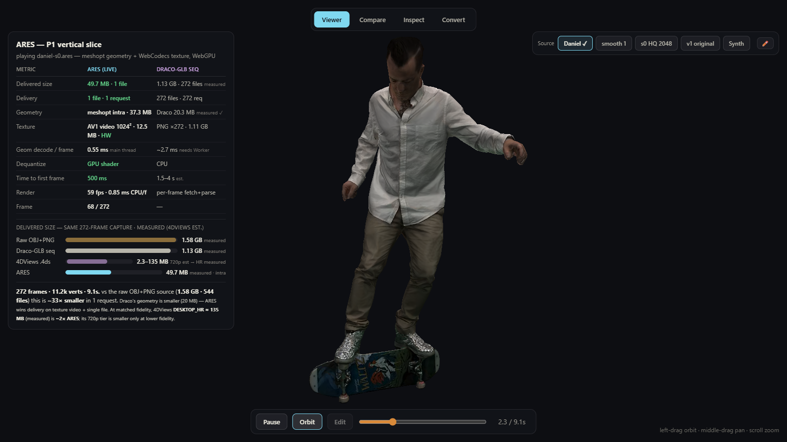
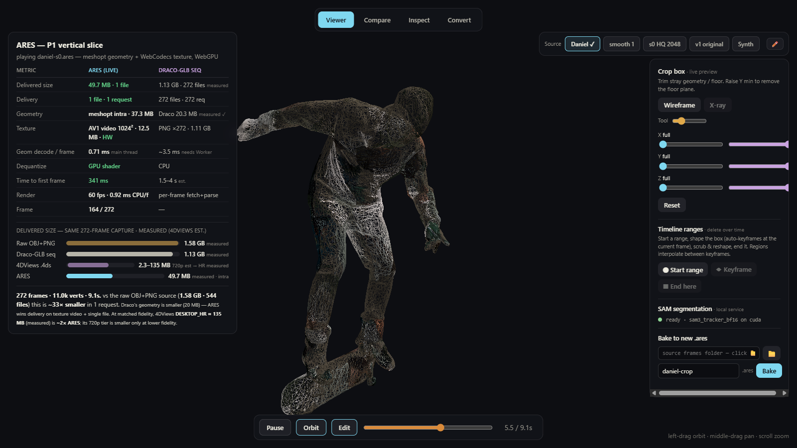
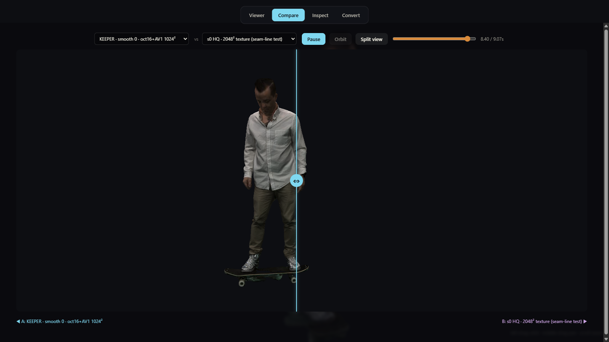
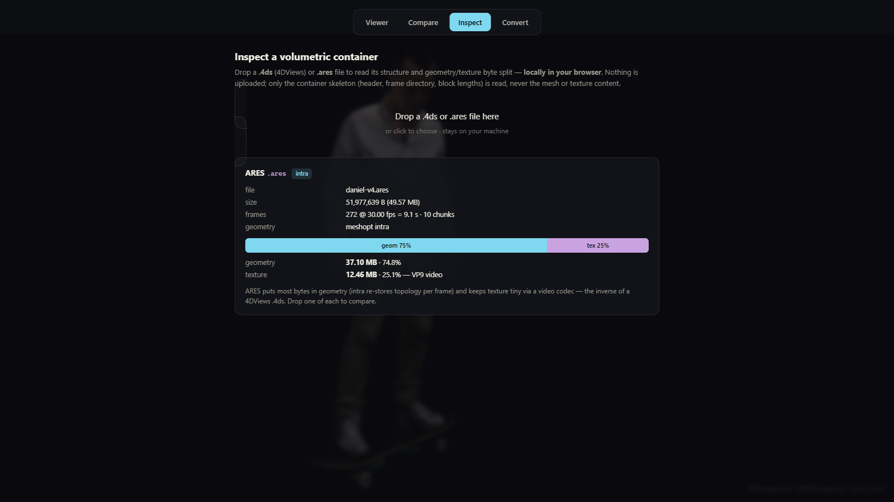
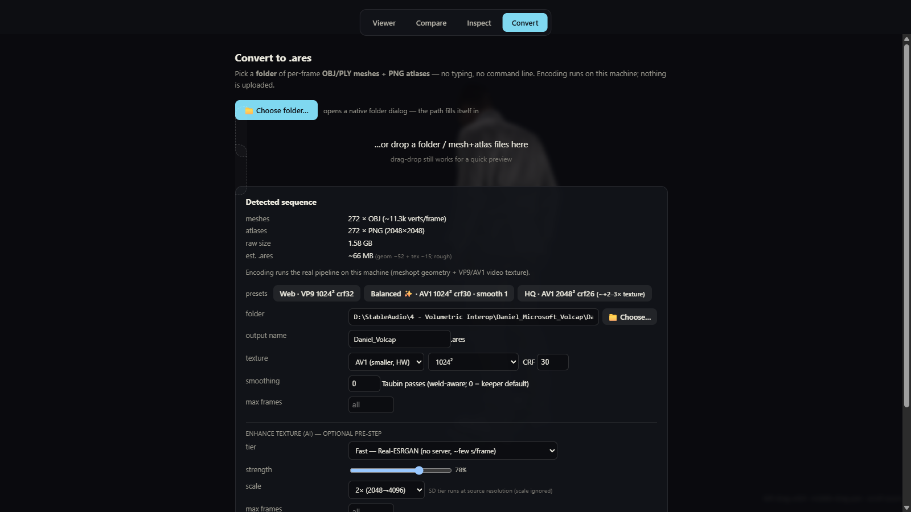
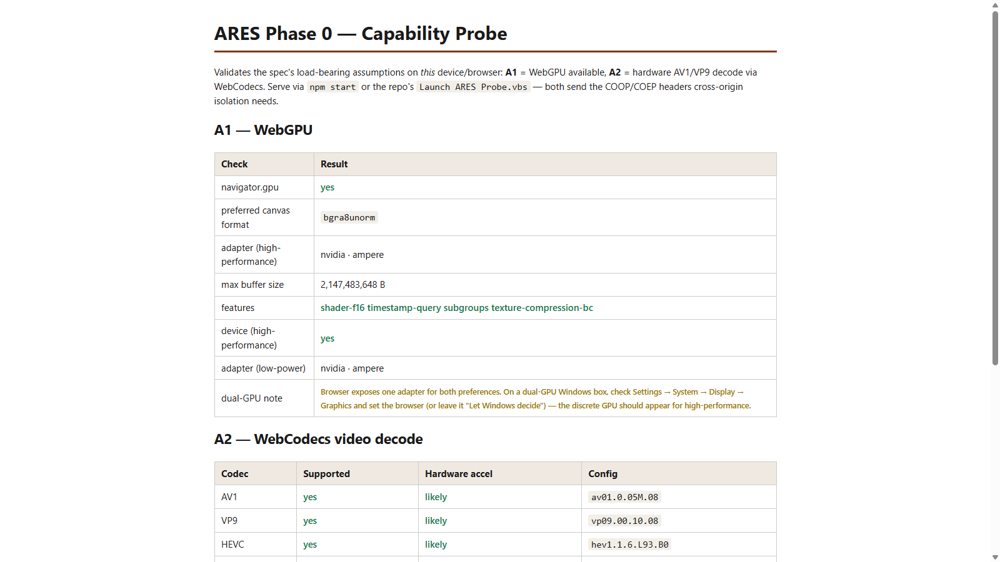

# ARES Volumetric

Reference implementation of the [ARES Runtime Specification](ARES-Runtime-Specification.md):
a single-file container format (`.ares`) and a browser runtime for volumetric video, built for
WebGPU, WebCodecs, Three.js, and React. One `.ares` file carries meshopt-compressed quantized
mesh geometry and a hardware-decodable VP9/AV1 video texture in one GOP-aligned stream. The
player fetches that one file, keeps vertex positions quantized until the vertex shader
dequantizes them on the GPU, and imports each decoded video frame to the GPU without a CPU
pixel copy.



The screenshot shows the demo viewer playing a real 272-frame Microsoft-style volumetric
capture (11.3k vertices per frame, 9.1 s at 30 fps): 49.7 MB delivered as one file and one
request, against 1.58 GB across 544 files for the raw OBJ+PNG source. The left panel compares
live playback stats against a measured Draco-GLB baseline; the size bars underneath place the
same capture on raw, Draco, 4DViews, and ARES scales.

Two companion documents summarize the project at different depths:
[docs/whitepaper.md](docs/whitepaper.md) (full technical treatment) and
[docs/briefing.md](docs/briefing.md) (plain-language overview).

## Layout

```
  spec/                  Specification source, one file per chapter; spec/build.py
                         assembles ARES-Runtime-Specification.md + .html
  apps/phase0-probe/     Capability probe: WebGPU adapters, WebCodecs HW decode, isolation
  apps/demo/             Four-tab app: Viewer | Compare | Inspect | Convert (+ mesh editor)
  packages/core/         @ares/core    container demux, geometry decode, WebGPU + WebGL2
                                       renderers, WebCodecs texture, edits, AresPlayer
  packages/encoder/      @ares/encoder OBJ/PLY importers, temporal GOP builder, meshopt
                                       encode, VP9/AV1 texture mux, `ares` CLI
  packages/three/        @ares/three   AresObject (THREE.Object3D wrapper)
  packages/react/        @ares/react   <Ares/> for @react-three/fiber
  tools/serve.mjs        Zero-dependency dev server: COOP/COEP headers + local GUI endpoints
  tools/*.ps1            Workers behind the one-click .vbs launchers
  tools/sam-service/     Local FastAPI SAM segmentation service (editor assist)
  tools/4ds/             .4ds decode host for a locally licensed 4DViews codec DLL (not included)
  tools/coherent/        Coherent-GOP pre-pass: stable-template registration + atlas rebake
  tools/sam3d/           Multiview SAM-3D-Body pose tools + RunPod pod orchestration
  tools/svf-extract/     Unity editor exporter for Microsoft SVF/HoloVideo captures
  tools/bin/             realesrgan-ncnn-vulkan lands here (git-ignored; BSD-3, fetched separately)
  bench/                 Phase 0 intra geometry benchmark + report page
  docs/                  Whitepaper, briefing, measurements, design notes, screenshots
```

Toolchain: npm workspaces (npm ships with Node; pnpm and yarn are not used here),
TypeScript 7.x (`tsc -b` project references), Node 18 or newer (tested on 24 LTS).

## Status

| Phase | State | Evidence |
|---|---|---|
| P0 probe + bench | Done | meshopt confirmed as intra default; report at `/bench/report/` |
| P1 vertical slice | Done (2026-07-08) | container + WebGPU player + demo; TTFF ~160 ms on synth clip |
| Video texture (spec 7.1) | Shipped | WebCodecs VP9/AV1, closed GOP per chunk, HW decoded |
| WebGL2 fallback (10.4) | Shipped | `?gl2=1`, verified 61 fps with AV1 texture |
| Worker decode (10.7) | Shipped, opt-in | `?worker=1`; falls back to main thread where import maps do not reach module workers |
| Editor v2 core | Shipped | time-ranged keyframed deletion regions, box/brush selection, bake |
| GUI convert + enhance | Shipped | native folder picker, SSE encode, Real-ESRGAN / SD tiers, batch |
| SAM 3 segmentation service | Shipped (2026-07-10) | in-app start, SAM 3 bf16 primary + ViT-H fallback, verified on the 6 GB GPU |
| SAM click-to-select editing | Shipped (2026-07-10) | SAM tool beside Box/Brush; masks become keyframed bitmap regions; preview == bake |
| Volcap history + Settings tab | Shipped (2026-07-10) | searchable analyse/encode/enhance/inspect history; dependency status with guided installs |
| P2 temporal geometry | Encoder path built; pulled for this capture class | roadmap below |
| P3 streaming/ABR, P4 splats, P5 importers, P6 hardening | Not started | spec 14 |

Measured highlights on the real capture (details and provenance in
[docs/size-comparison.md](docs/size-comparison.md) and the [whitepaper](docs/whitepaper.md)):

| | Raw OBJ+PNG | Draco-GLB seq | ARES (current) |
|---|---|---|---|
| Delivered size | 1.58 GB | 1.13 GB | 49.7 MB |
| Files / requests | 544 | 272 | 1 |
| Geometry | 485.7 MB | 20.3 MB (measured, real draco3d) | 37.3 MB meshopt intra |
| Texture | 1.11 GB PNG | 1.11 GB PNG | 12.5 MB AV1 video, HW decoded |
| Geometry decode | n/a | ~3 ms/frame (est., needs worker) | 0.4-0.8 ms/frame main thread |
| Dequantize | n/a | CPU | GPU shader |

Draco still wins geometry alone; ARES wins texture, delivery (one request), and decode
cost. Temporal geometry coding is the
planned lever that closes the geometry gap; a byte-level teardown of a shipping 4DViews file
showed its temporal mesh codec spending only 4% of the file on geometry, which confirms the
direction. File history for the capture: `daniel.ares` 67.1 MB (first full encode), 49.0 MB
after lossless vertex reorder, 49.6 MB after oct16 normals + AV1, and `daniel-s0.ares`
49.7 MB as the current keeper (smoothing off, per visual evaluation on 2026-07-10).

## Windows launchers

Each launcher is windowless: it runs `npm install` and the build when stale, reuses a
running server or starts one, and opens the browser. The Probe launcher additionally
installs Node via winget when missing; the Bench and Demo launchers expect one prior Probe
run for that. Logs land in `tools/*.log`;
`tools/launch-debug.cmd` runs the same flow with a visible console. All four sit at the
repo root:

| Launcher | Opens |
|---|---|
| `Launch ARES Probe.vbs` | Phase 0 capability probe |
| `Run ARES Bench.vbs` | intra benchmark + Pareto report (~1-2 min) |
| `Play ARES Demo.vbs` | the volumetric player (prefers `daniel-s0.ares`) |
| `Launch SAM Service.vbs` | optional manual start for the SAM service (the app starts it itself from the Edit panel) |

## Quick start (any OS, terminal)

```
npm install
npm run build    # tsc -b across packages
npm start        # tools/serve.mjs -> http://127.0.0.1:8137/apps/phase0-probe/
```

The demo lives at `http://127.0.0.1:8137/apps/demo/` (the server walks up to port 8147 if
8137 is taken). Capture data and `.ares` clips are not tracked in this repo — the tools that
read the reference capture take its path from `ARES_SRC_DIR`. A synth clip can be generated
without any capture data, and is all the demo needs to run:

```
node packages/encoder/dist/cli.js synth -o apps/demo/demo.ares --shape object --frames 60
```

The custom server exists because the worker decode path (spec 10.2) needs
`SharedArrayBuffer`, which browsers only enable under cross-origin isolation
(`Cross-Origin-Opener-Policy: same-origin` plus `Cross-Origin-Embedder-Policy:
require-corp`). Plain static servers such as `npx serve` or `python -m http.server` do not
send those headers, so the probe reports `crossOriginIsolated: no` under them. `serve.mjs`
sends them on every response and also hosts the local GUI endpoints (`/encode`, `/enhance`,
`/pick`, `/analyse`, `/edits/*`, `/sam/*`, `/showcase`).

The probe requests WebGPU adapters for both `high-performance` and `low-power` preferences.
On dual-GPU machines the discrete GPU should appear for high-performance; if both
preferences resolve to the same integrated adapter, the browser's GPU assignment can be
changed under Windows Settings > System > Display > Graphics. If hardware AV1/VP9 decode
fails across the target device matrix, the texture plan falls back to VP9 primary (spec 7.2).

## Demo application

The demo app presents four tabs over one player canvas. `?src=<file>.ares` selects a
clip; `?gl2=1` forces the WebGL2 renderer; `?worker=1` enables worker-thread geometry
decode.

The Viewer tab plays a clip with a live HUD: delivered size, request count, geometry and
texture byte split, per-frame decode cost, dequantization path, time to first frame, and
render rate, each against a measured Draco-GLB baseline. The source switcher persists
server-side and carries camera pose, timestamp, and pause state across clip switches so
back-to-back comparisons hold the same viewpoint.

The editor (Edit button) works on world-anchored regions rather than vertex ids, because
per-frame reconstructed captures have no stable vertex numbering: crop box with live GPU
preview, box marquee, surface brush, and SAM click-to-select with a Blender-style X-ray
toggle, wireframe, and timeline ranges whose keyframed regions interpolate over time. The
SAM tool captures the held frame on click, requests a mask from the local SAM 3 service
(Shift-click adds exclusion points), previews it as a tint, and applies it as an RLE-coded
bitmap region keyframed into the active range — the same evaluator drives the live preview
and the bake. Edits persist as a non-destructive `.edits.json` sidecar and bake to a new
`.ares` through the encoder. The panel's SAM row starts and monitors the service without
leaving the app.



Compare runs two frame-locked players from one external clock (wipe divider or
side-by-side split) for A/B checks between encode recipes; the current default pairs the
keeper against a 2048x2048-texture variant.



The Inspect tab reads the structure of a dropped `.ares` or 4DViews `.4ds` container in the
browser: header, frame directory, and block lengths only, via `File.slice()` byte ranges.
Nothing is uploaded and no mesh or texture content is decoded, which keeps it safe for
confidential files. It renders the geometry/texture byte split and a per-9.07 s equivalent
for cross-clip comparison.



For capture folders, the Convert tab encodes per-frame OBJ/PLY meshes plus PNG atlases
into a `.ares` without a terminal: a native folder dialog fills the path (reopening in the
last-used folder), the server analyses the sequence (mesh count, vertex count, atlas
dimensions, size estimate), and presets cover Web (VP9 1024 crf32), Balanced (AV1 1024
crf30), and HQ (AV1 2048 crf26). Encoding runs the real CLI on the local machine and
streams progress over SSE. An optional pre-step enhances atlas textures with a local
Real-ESRGAN install (no server, tiled to fit 6 GB VRAM; fetched via the Settings tab) or a Stable Diffusion img2img tier that
auto-launches a local Forge install headless. Jobs can queue as a batch. Known limitation:
the default Real-ESRGAN model invents artifacts on skin, documented in
[docs/whitepaper.md](docs/whitepaper.md) under Known limitations.

Both tabs share a searchable history of every volcap touched — folders analysed, files
inspected, encodes and enhances produced — persisted server-side; entries re-open with one
click (replay an inspection, re-analyse a folder, play an encode). A Settings tab (gear
icon) reports every optional component: what is installed, what each piece enables, and
either a download link (for gated or manual downloads such as the SAM 3 weights) or a
one-click local install (the SAM Python environment from `requirements.txt`, the synthetic
demo clip). Missing components never block the app from opening or switching tabs;
features that need one warn at the point of use with a pointer to Settings.





## Encoder CLI

```
node packages/encoder/dist/cli.js synth  -o demo.ares [--shape object|talk] [--frames 60]
                                         [--fps 30] [--no-texture]
node packages/encoder/dist/cli.js encode <frames-dir> -o out.ares
                                         [--fps 30] [--max-frames N] [--gop 30]
                                         [--texture-codec vp9|av1] [--tex-size 1024]
                                         [--crf 32] [--no-texture]
                                         [--edits file.json] [--crop x0,y0,z0,x1,y1,z1]
                                         [--track] [--smooth N] [--smooth-temporal N]
node packages/encoder/dist/cli.js info   file.ares
```

`encode` detects `*.obj`/`*.ply` meshes and `atlas-*.png` textures in the folder (descending
into a single frames subfolder when the parent is given), and needs ffmpeg on PATH or via
`FFMPEG=` for the video texture. GOPs with stable topology are coded as I+P deltas
automatically; `--track` forces persistent topology via nearest-point surface tracking with
per-frame UV transfer; everything else falls back to intra frames. `--smooth` applies
weld-aware Taubin smoothing (safe on atlased meshes; plain per-vertex filters crack UV
seams). `info` round-trips the file through the runtime demuxer and prints its layout.

## Documentation

| Document | Content |
|---|---|
| [docs/whitepaper.md](docs/whitepaper.md) | Full technical whitepaper: design, format, runtime, measurements, limitations, roadmap |
| [docs/briefing.md](docs/briefing.md) | Plain-language briefing for non-specialists |
| [docs/size-comparison.md](docs/size-comparison.md) | Measured size baselines and the 4DViews teardown |
| [docs/editor-v2-design.md](docs/editor-v2-design.md) | Editor design: keyframed regions, selection law, SAM assist |
| [docs/sam3d-body-colab.md](docs/sam3d-body-colab.md) | SAM-3D Body skeleton fitting via the Colab notebook |
| [bench/README.md](bench/README.md) | Benchmark harness: how to run it, corpus taxonomy, measured results |
| [ARES-Runtime-Specification.md](ARES-Runtime-Specification.md) | Built master spec (Draft 0.2), the normative document |
| [spec/](spec/) | Specification source, one file per chapter; rebuild with `python spec/build.py` |

## Roadmap

The near-term queue:

1. Visual evaluation gate across encode recipes (v1/v2/v3/v4 and the smoothing sweep);
   `daniel-s0.ares` (smoothing off) is the keeper so far.
2. SAM toolset follow-ons. The click-to-select tool shipped 2026-07-10 (masks become
   keyframed bitmap regions; preview and bake share one evaluator); remaining: a per-image
   feature cache in the service and temporal mask propagation —
   unresolved on 6 GB hardware, with `Sam3TrackerVideoModel` plus CPU-offloaded frames or
   SAM 2.1 small as the candidates.
3. Optional geometry decimation (`--decimate`) via meshopt `simplifyWithAttributes` with
   locked atlas-seam borders: an estimated 5-10 MB off the ~34 MB geometry without touching
   UVs. The estimate needs confirming with `tools/measure-baselines.cjs` before any number
   is quoted.
4. Temporal denoise via approximate nearest-point correspondence, deliberately last in the
   queue: it targets the frame-to-frame surface shimmer that per-frame reconstruction
   causes, and carries a motion-blur risk on fast limbs.

Research directions under evaluation: skin-appropriate texture enhancement (face-restoration
models such as GFPGAN/CodeFormer, per-chart or screen-space enhancement; the general photo
upscaler is unusable on UV atlases), and quad-remeshing co-designed with a fresh atlas so
one topology and one atlas layout persist per GOP. That second direction attacks jitter,
geometry size, and texture stability at once and would make P2 temporal coding applicable
to re-atlased captures.

The staged roadmap (spec 14) continues with P3 streaming (range-request seek, prefetch,
ABR ladder), P4 Gaussian splat profile, P5 importer suite (glTF, Alembic, USD, Depthkit,
4DViews), and P6 hardening toward a spec freeze.
