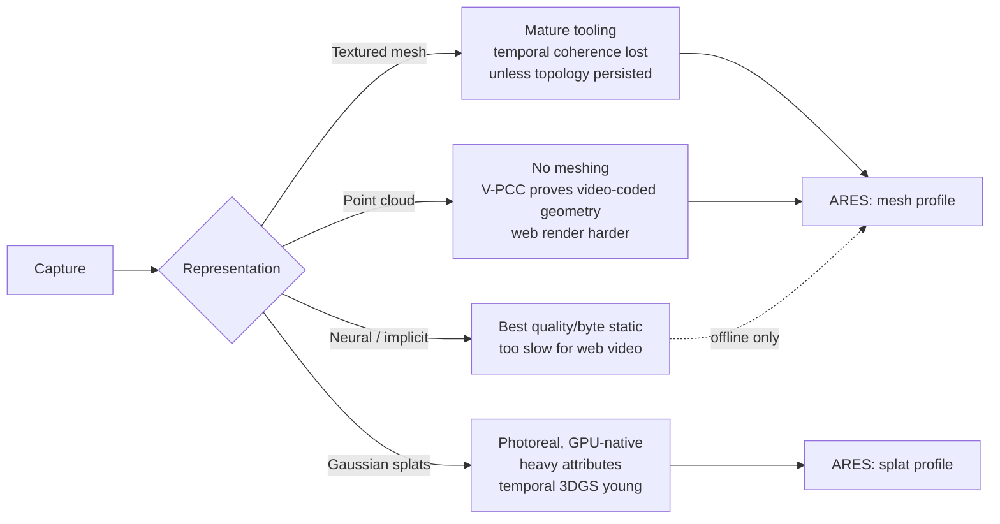

## 2. Background: volumetric representations

Before surveying formats it is worth separating the *representation* (how a frame's geometry and
appearance are described) from the *container* (how frames are packed for delivery). ARES is
primarily a container-and-runtime effort, but the representation it carries dictates what is
possible. Four representation families matter in 2026.

### 2.1 Textured mesh sequences

The mainstream representation: each frame is a triangle mesh (positions, normals, UVs, indices)
plus a texture (an atlas, or a per-frame image). This is what 4DViews, Depthkit, Microsoft's
HoloVideo, and UVOL ultimately emit.

- **Strengths.** Renders trivially on any GPU pipeline; well-understood; compresses with mature
  tools (Draco, meshopt, KTX2/Basis).
- **Weaknesses.** Topology is typically *regenerated per frame* by the reconstruction algorithm,
  so vertex counts and connectivity change frame to frame, which defeats temporal prediction. This
  is the single biggest missed opportunity in the current ecosystem, and the one ARES targets
  directly ([§6.5](#65-persistent-topology--the-core-bet)).

### 2.2 Point clouds

Frames are unstructured sets of colored points (the native output of depth sensors, before
meshing). Standardized compression exists — MPEG **V-PCC** (projects points to 2D video atlases
and rides standard video codecs) and **G-PCC** (octree/predictive coding for sparse/LiDAR-like
clouds) [39].

- **Strengths.** No meshing step; V-PCC already proves the "geometry through a video codec" idea at
  standards scale.
- **Weaknesses.** Rendering points convincingly (hole-free surfaces, lighting) is harder than
  meshes on the web; V-PCC decoders are not natively present in browsers and would need WASM.

### 2.3 3D Gaussian splats

Since 2023, **3D Gaussian Splatting (3DGS)** has become a major representation: a scene is a cloud
of anisotropic Gaussians (position, covariance/scale+rotation, opacity, view-dependent color via
spherical harmonics), rendered by differentiable rasterization. By 2026 it is prominent enough
that Khronos's new glTF Volumetric subgroup explicitly calls it out [7][16], and a Brown CVPR 2026
project ("PackUV") maps *dynamic* Gaussian-splat frames into 2D video tracks so they ride standard
codecs [43].

- **Strengths.** Photoreal appearance at low geometric complexity; no UV unwrapping; extremely
  web-friendly to *render* (a splat is just instanced/point rendering with blending) and a natural
  fit for the "compressed GPU instructions" framing — a splat frame **is** a GPU buffer.
- **Weaknesses.** Per-splat attributes are heavy (SH coefficients dominate); temporal 3DGS
  (deforming splats over time) is young; sorting/blending order and mobile fill-rate need care.

> ARES treats 3DGS as a **first-class geometry profile**, not an afterthought
> ([§6.8](#68-gaussian-splat-profile)). The PackUV result — splat attributes packed into 2D video
> tracks — aligns exactly with the ARES premise and the video-assisted geometry path
> ([§8.5](#85-video-assisted-geometry-packing-attributes-into-pixels)).

### 2.4 Neural / implicit representations

NeRF-style implicit fields and their descendants give the highest quality per byte for *static*
scenes but require network inference per pixel/ray, which is still too costly for real-time
volumetric *video* on commodity web devices in 2026. ARES does not carry implicit fields as a
runtime profile; neural methods appear in ARES only as an **offline reconstruction stage** that
produces meshes or splats ([§15](#15-future-research-the-avatar-pipeline)). [ASSERTED]

### 2.5 Summary: what the representation choice buys

The takeaway that shapes the rest of this document: **the container must be
representation-agnostic**, carrying whichever of {persistent-topology mesh, splat} wins for a given
capture, while sharing one timeline, one streaming model, one runtime, and one texture/video
subsystem. The representation debate is settled per-capture by the encoder, not by the format.
