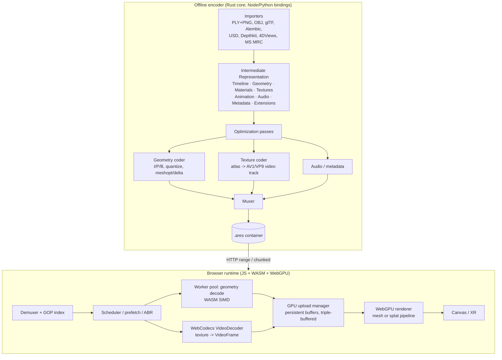
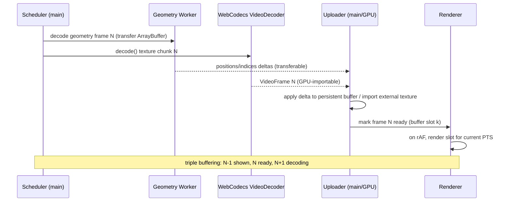

## 5. Overall architecture

ARES is organized as a **deployment pipeline**, not a single file format. It is three cooperating
systems — an **offline encoder**, a **container**, and a **browser runtime** — meeting at two
boundaries: the encoder's *intermediate representation* (IR) and the *container bitstream* on the
wire. The guiding rule: **all expensive work happens during encoding; the runtime performs only the
work needed to reconstruct and display each frame.**



### 5.1 Subsystems

Six replaceable subsystems, each with one responsibility:

| Subsystem | Responsibility | Where it runs |
|---|---|---|
| Importer | Read source formats into the IR | Offline |
| Optimizer | Remove redundancy (topology, quantization, deltas) | Offline |
| Encoder | Produce runtime assets (the container) | Offline |
| Loader/Demuxer | Stream and parse the binary | Runtime |
| Decoder | Reconstruct GPU resources | Runtime |
| Renderer | Display volumetric content | Runtime |

### 5.2 The encoder

A batch tool (reference implementation in Rust with Node/Python bindings). All expensive,
non-real-time work lives here.

**Geometry pipeline** (the largest computational component):

```
Import → Validation → Topology analysis → Mesh cleanup → Quantization
       → Vertex ordering → Compression → Delta generation → Keyframe selection → Encoding
```

- **Validation** rejects malformed geometry before it can reach the runtime: duplicated vertices,
  invalid indices, degenerate triangles, disconnected regions, NaN/Inf values, invalid UVs/normals.
- **Topology analysis** classifies how geometry evolves (static / semi-static / dynamic / unknown,
  [§6.4](#64-topology-classification)) and drives GOP boundaries and I/P/B assignment.
- **Delta generation + keyframe selection** produce the temporal stream
  ([§6](#6-geometry-representation), [§8](#8-compression-architecture)).

**Texture pipeline** (independent of geometry):

```
Import → Color analysis → Atlas generation → Mip generation → Compression → Video analysis → Encoding
```

The encoder decides per capture whether static images, image sequences, or a video stream is most
efficient, using the temporal-coherence categorization ([§4.7](#47-temporal-coherence-categorization),
[§7](#7-texture-and-video-encoding)).

**Animation pipeline** describes temporal change independent of geometry: vertex displacement, morph
targets, visibility, topology events, material changes, camera motion. The runtime decodes only the
streams a given frame needs.

**Optimization passes** are modular so future algorithms drop in without redesigning the encoder:
geometry (quantization, duplicate removal, index/cache optimization, delta encoding), textures (atlas
generation, color quantization, block compression, video conversion), animation (sparse keyframes,
delta prediction, motion estimation), metadata (dedup, dictionary compression).

### 5.3 The intermediate representation (IR)

Imported assets enter a normalized IR that separates content into **independent streams**, each
optimized in isolation so improving one subsystem never disturbs another:

```
Scene
├── Timeline        frame PTS, fps, duration, in/out points
├── Geometry        per-frame positions/normals/uvs/indices or splats + correspondence
├── Materials       material/shader parameters
├── Textures        atlas layout + per-frame texture data
├── Animation       displacement / morph / visibility / topology events
├── Audio
├── Metadata        capture info, licensing, markers
└── Extensions      forward-compatible user blocks
```

This boundary lets a new importer be written once and immediately benefit from every coder
improvement.

### 5.4 The container

A chunked binary file ([§11](#11-file-format-specification)), MP4/Matroska-like in spirit but
purpose-built: a superblock header, a GOP index (time → byte range), then time-ordered **chunks**
(typically 1–2 s). Each chunk is **independently decodable** — it carries a complete decoding context
(one geometry keyframe + its predicted frames, the matching texture-video segment, audio/metadata for
its span) — which is what makes streaming, seeking, ABR, and interrupted-download recovery tractable.
Once decoding begins on a chunk, the browser does not need earlier chunks.

### 5.5 The runtime

A small JS/WASM/WebGPU library ([§10](#10-runtime-architecture),
[§12](#12-javascript--webgpu-implementation)). The decoder path performs runtime operations only — no
geometry optimization ever happens during playback:

```
Read chunk → Integrity check → Geometry decode → Texture decode → Animation decode
           → GPU upload → Ready queue → Renderer
```

**Threading model.** Work is spread across the concurrency the browser offers:

- *Main thread:* rendering, input, scheduling.
- *Worker pool:* geometry decode, entropy decode, streaming.
- *WebCodecs (own/HW thread):* texture decode.
- *GPU:* rendering, compute (splat sort, delta scatter), buffer upload.

Long-running operations never block rendering ([§10](#10-runtime-architecture)).

**Memory architecture.** Fixed pools defeat fragmentation and GC: a persistent geometry pool, a
persistent texture pool, a chunk cache, a frame cache, a GPU upload queue, and small transient decode
buffers. After playback begins, transient allocation approaches zero (N3).

**Cache hierarchy.** Three levels, sized to available memory ([§9.4](#94-prefetch-and-buffer-management)):

| Level | Contents | Example around frame 120 |
|---|---|---|
| L1 | Current frame ± immediate neighbors | 119–121 |
| L2 | Nearby frames | 110–130 |
| L3 | Prefetched future chunks | 131–180 |

**Rendering backend.** The runtime is renderer-independent: it exposes standardized GPU resources
consumed by Three.js, React-Three-Fiber, Babylon.js, native WebGPU, or native WebGL2 — not
file-specific objects.

### 5.6 Selective stream decoding

Because streams are independent (5.3), a client decodes only what it needs:

| Use case | Streams required |
|---|---|
| Thumbnail | Metadata only |
| Static preview | Metadata + proxy geometry |
| Muted playback | Geometry + textures |
| Interactive playback | All runtime streams |

This avoids spending bandwidth and CPU on data a given view will not display.

### 5.7 Data-flow for a single frame (steady state)



The critical property: on the main thread, per frame, the only work is issuing decode calls and a
small buffer-swap/upload. Heavy lifting is on the hardware decoder, the Worker pool, and the GPU.

### 5.8 Architectural principles

1. Source formats terminate at the importer.
2. Optimization occurs only during encoding.
3. Runtime execution performs no unnecessary processing.
4. Geometry, textures, and animation remain independent streams.
5. GPU upload is a first-class design concern.
6. Streaming architecture is independent of rendering.
7. Decoder complexity is substantially lower than encoder complexity.
8. Every subsystem is replaceable without redesigning the rest.
