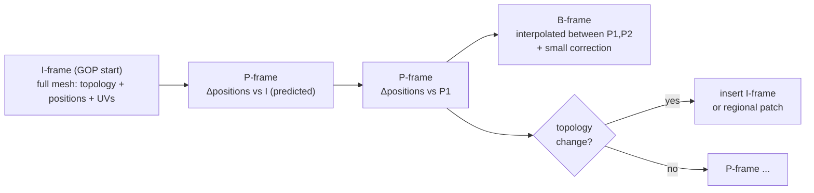

## 6. Geometry representation

Geometry is the largest source of storage, bandwidth, decode time, and GPU transfer in most
volumetric pipelines, so the geometry subsystem most influences overall performance. The plan's
Phase 0 instinct is correct: *do not assume GLB is best; benchmark every representation.* This section
evaluates the candidate on-the-wire representations, then specifies the two ARES geometry **profiles**
(persistent-topology mesh; Gaussian splat) that the container carries.

### 6.1 The candidates (from the plan's Options A–D)

#### Option A — GLB (baseline, for comparison only)

- **Pros:** industry standard; Three.js/Blender support; Draco/meshopt/KTX2 available.
- **Cons:** interchange metadata per frame; general-purpose scene graph; every frame is another
  asset; CPU-heavy parse.
- **Verdict:** ARES keeps GLB as a **benchmark baseline**, not a runtime representation. Compatibility
  is served by the *encoder importing* GLB, not the runtime consuming it.

#### Option B — Three.js object serialization (JS source emitting `BufferGeometry`)

Emitting `new THREE.BufferGeometry(); geometry.setAttribute(...)` or raw `Float32Array(...)` literals.

- **Pros:** no glTF/JSON parser; no scene-graph overhead.
- **Cons — and a correction:** shipping geometry as **JS source** is a *false economy*. JS source is
  UTF-8 text the engine must parse, is far larger than binary for numeric data, and cannot be
  transferred to a Worker or uploaded to the GPU without reconstruction. The *good* part of this idea —
  "produce a `BufferGeometry` directly, skip glTF" — is real, but it is achieved by Option C/D (binary
  → typed array → `BufferGeometry`), not by emitting source code.
- **Verdict:** **Rejected as a wire format.** Adopt only its *intent* (target `BufferGeometry`
  directly) via binary.

> **[SANITY CHECK]** "Very small JS bundle" is misleading: numbers-as-text is ~2–4× larger than the
> equivalent binary and adds parse cost. Binary buffers win on every axis that matters here.

#### Option C — Binary `BufferGeometry` (custom `.bin`)

A compact binary blob: `{vertexCount, indexCount, positions, normals, uvs, indices}` → `decode(buffer)`.

- **Pros:** smallest *intra* mesh representation; no parser; cache-friendly; Worker/transferable
  friendly.
- **Cons:** custom tooling.
- **Verdict:** This is the **intra (I-frame) geometry payload** for the mesh profile — the base on top
  of which deltas are applied — combined with quantization + meshopt ([§8](#8-compression-architecture)).

#### Option D — GPU-ready binary (buffers exactly as the GPU wants them)

Store interleaved vertex buffers in the target layout so decode is `createBuffer()` + copy.

- **Pros:** near-zero CPU; fastest upload.
- **Cons — and a correction:** "hardware specific" is the key risk. A truly GPU-ready blob bakes in
  attribute interleaving, alignment (WebGPU wants 4-byte-aligned, often 16-byte-friendly strides), and
  index width. That is fine *if the layout is canonicalized by the spec* rather than by a particular
  GPU. ARES defines **one canonical interleaved layout** per profile so "GPU-ready" is portable, not
  device-specific. A tiny normalization step covers the rare mismatch.
- **Verdict:** ARES's I-frame layout is Option C's contents arranged in Option D's canonical
  interleaving — cheap to upload, still portable.

### 6.2 Decision: a layered geometry model

ARES does not pick one option; it **layers** them:

```
Canonical quantized attributes (Option C contents)
        │  arranged as →
Canonical interleaved GPU layout (Option D discipline)
        │  compressed by →
meshopt vertex/index codecs (fast SIMD decode)   [intra / I-frame]
        │  extended by →
Temporal deltas: P/B frames over persistent topology   [inter]
```

The result is small (temporal + quantized), fast to decode (meshopt SIMD, no glTF), and cheap to
upload (canonical layout). Each layer is independently benchmarkable, satisfying Phase 0.

### 6.3 Quantization

Positions are quantized to fixed-point within the frame's (or GOP's) bounding box. The encoder picks
the minimum acceptable precision per sequence; adaptive precision may improve compression further.

| Level | Bits/axis | Typical use |
|---|---|---|
| High | 24–32 | reference / lossless comparison |
| Standard | 14–16 | visually lossless for human-scale captures |
| Aggressive | 11–12 | lower tiers / distant subjects |
| Variable | adaptive | experimental, per-region precision |

- Normals: octahedral encoding to 2×8–2×12 bits (or omit and derive on GPU).
- UVs: 12–16-bit fixed point over the atlas.
- Store the bounding box + scale in the frame/GOP header so the GPU (or a vertex-pull shader)
  dequantizes on read, keeping dequantization *off* the CPU.

### 6.4 Topology classification

Not every capture behaves alike; the encoder classifies each sequence before choosing a strategy.
This taxonomy (from the temporal-coherence categorization, [§4.7](#47-temporal-coherence-categorization))
decides which frames can be P/B and which force an I-frame:

| Class | Behavior | Examples | Preferred representation |
|---|---|---|---|
| **A — Static topology** | only vertex positions change | facial/body capture, rigid motion | Persistent mesh (best case) |
| **B — Semi-static** | most topology stable; localized change | cloth folds, hair, loose accessories | Persistent mesh + regional updates (§6.6) |
| **C — Dynamic** | connectivity changes frequently | fluid, destruction, vegetation | Hybrid encoding / frequent I-frames |
| **D — Unknown** | no reliable correspondence | arbitrary/failed tracking | Independent keyframe meshes (fallback) |

Class A/B are where ARES wins big; Class C/D degrade gracefully toward the mesh-per-frame baseline
rather than breaking.

### 6.5 Persistent topology — the core bet

This is the single idea that most differentiates ARES, and the plan's "one additional idea worth
investigating." For most captures — especially humans — 95–99% of connectivity is stable across many
frames. If the encoder maintains a **stable topology** over a GOP and encodes only:

- **vertex displacement** (motion), and
- **appearance changes** (in the texture video), and
- **topology patches** when connectivity genuinely changes (occlusion, object entry/exit),

then the geometry stream stops looking like a sequence of independent meshes and starts looking like
*skeletal animation with dense per-vertex deformation* — to which the entire toolbox of video
compression (I/P/B frames, motion prediction, chunked GOPs) applies. Persistent information
(connectivity, UV layout, material assignments, tangent basis, vertex ordering) is stored once;
dynamic information (displacement, normals, visibility, texture) streams per frame.



#### 6.5.1 The hard part: establishing correspondence

The encoder must produce a **stable vertex correspondence** across a GOP, because raw reconstruction
emits a *new, differently-numbered* mesh each frame. The correspondence algorithm is intentionally
**unspecified** in the format (future improvements stay runtime-compatible). Candidate techniques (an
[OPEN] research area, [§16](#16-open-research-questions-and-risks)):

1. **Track a canonical mesh.** Reconstruct/skin a canonical mesh at the I-frame; non-rigidly register
   it (embedded deformation / as-rigid-as-possible, optical-flow-guided) onto each new reconstruction.
   Output: same vertex set, new positions.
2. **Wrap-based retopology.** Fit a template (for humans, a parametric body/face model) and carry it
   through the sequence.
3. **Hybrid with re-anchor.** Track until registration error exceeds a threshold, then emit a fresh
   I-frame (new GOP). This bounds error and naturally handles topology changes.

Additional correspondence tools the encoder MAY use: nearest-neighbor search, geodesic correspondence,
spectral matching, optical flow, learned correspondence estimation. The registration error threshold
is the encoder's main quality/size knob and the P/B-vs-I decision driver.

#### 6.5.2 Payoff

When correspondence holds, a P-frame is a buffer of per-vertex displacement vectors, which are (a)
small in magnitude (quantize to 8–10 bits), (b) spatially smooth (predict from neighbors), and (c)
temporally smooth (predict from the previous displacement). This is where the projected 5–15% size
target primarily comes from. **[PROJECTED]**

### 6.6 Delta encoding, sparse and regional updates

For a P-frame vertex `v`:

```
predicted_pos(v) = prev_pos(v)                     # temporal (zeroth order)
        or        prev_pos(v) + prev_velocity(v)   # linear motion (first order)
residual(v)      = quantize(cur_pos(v) - predicted_pos(v))
```

- **Delta.** Storing residuals instead of absolute positions collapses the value distribution's
  entropy — most residuals are near zero (static regions) and entropy-code to almost nothing.
- **Sparse.** Only vertices whose residual exceeds a dead-zone are transmitted (index + Δ); the
  decoder preserves unchanged data. Static regions cost ~0 bytes.
- **Regional.** Topology changes rarely affect the whole mesh at once. Instead of rebuilding the
  entire character, ARES rebuilds only affected **regions** (e.g., left sleeve, hair, cape), defined by
  connected components, material boundaries, UV islands, spatial partitioning, or learned segmentation.
  A regional patch is far cheaper than a full I-frame and is what makes Class-B captures efficient.
- **Motion vectors.** Optional per-vertex motion vectors (à la Arcturus [13]) let the runtime
  *interpolate* intermediate frames (30→60 fps) without extra data. B-frames interpolate between two
  anchors and store only a small correction.

### 6.7 Fast intra codec: meshopt over Draco (default)

> **[SANITY CHECK / design tension]** The plan lists both "extremely low CPU usage" and "Draco." These
> are in tension: Draco achieves excellent *ratios* but its decode is comparatively CPU-heavy and must
> be Worker-offloaded to avoid stalls [29].

ARES defaults the **mesh I-frame** to **meshopt** (`meshoptimizer`) vertex/index codecs: SIMD-friendly,
very fast decode, quantization-aware. Draco is retained as an **optional high-ratio profile** for
size-critical, latency-tolerant captures. A general-purpose lossless layer (LZ4 / Zstandard / Brotli)
MAY wrap metadata and non-hot streams. The container's profile flags say which codec was used so the
runtime loads only the decoder it needs.

| | Draco | meshopt | ARES default |
|---|---|---|---|
| Ratio | Best | Good | meshopt (Draco optional) |
| Decode CPU | High | Low | Low |
| WASM size | Larger | Small | Small |
| GPU-side dequant | Partial | Yes | Yes |

### 6.8 Gaussian splat profile

For captures better served by splats (photoreal, no clean topology), ARES defines a **splat profile**
sharing the same container and timeline. A splat frame is a set of Gaussians:

`position (3) · scale (3) · rotation quaternion (4) · opacity (1) · color/SH (3…48)`

Design notes:

- **SH coefficients dominate size.** SH degree is a profile parameter (degree 0 = flat color, cheapest;
  up to degree 3 for view-dependence). Most web captures use degree 0–1. [ASSERTED]
- **Temporal splats.** Apply the same I/P/B model to per-splat attributes: an I-frame is the full splat
  set; P-frames are attribute deltas. Correspondence is easier than for meshes (no connectivity) but
  splat *birth/death* must be coded.
- **Video-packed attributes.** Following PackUV [43], splat attributes can be laid into 2D tiles and
  encoded as a video track ([§8.5](#85-video-assisted-geometry-packing-attributes-into-pixels)),
  routing splat geometry through the hardware decoder just like texture. The §8.5.1 warning applies
  in full: only colour is video-shaped. Positions fail exactly as for meshes, and rotations fail
  worse — a quaternion is not spatially coherent, and a jittered splat has no index buffer holding
  it in place. The claim that "splats tolerate lossy packing better" holds for colour, not geometry.
- **Rendering.** Instanced quads per splat, back-to-front through an index indirection from a CPU
  counting sort (re-sorted only when the view direction moves), EWA covariance projection in the
  vertex stage, premultiplied "over" compositing. Both backends (WebGPU storage buffers; WebGL2
  data textures) — [§12](#12-javascript--webgpu-implementation).

**Implementation (2026-09-07).** The intra splat profile ships: block layout in
[§11.6.3](#1163-geometry-block--splat-profile); importers for Niantic SPZ (v1–v4), 3DGS PLY,
`.splat`, glTF/GLB with `KHR_gaussian_splatting`, and PlayCanvas SOG; exporters for SPZ, 3DGS PLY,
glTF/GLB and `.splat` (`ares export`). Degree 0 is the fast path (the common case for generated
environments); degrees 1–3 are carried as 8-bit bands and evaluated in the vertex shader.

### 6.9 Hybrid geometry (per-stream representations)

No single representation is optimal for all content, so the container permits **multiple geometry
representations within one asset**, each stream carrying its representation id and its own decoder while
sharing one scheduling, streaming, and synchronization framework:

```
Character   → persistent mesh
Environment → Gaussian splats
Hair        → point cloud
Smoke       → neural / volumetric (future)
```

This is what lets future rendering techniques coexist inside a stable runtime without touching the
surrounding infrastructure ([§1.4](#14-design-philosophy) principle 7).

### 6.10 Geometry representation decision matrix

Score 1 (poor) – 5 (excellent) for browser delivery. **[PROJECTED]** pending Phase 0 benchmarks.

| Representation | Size | Decode CPU | GPU upload | Quality | Temporal | Web render | Total |
|---|---|---|---|---|---|---|---|
| GLB (baseline) | 2 | 2 | 3 | 5 | 1 | 5 | 18 |
| JS source (Opt B) | 1 | 2 | 2 | 5 | 1 | 5 | 16 |
| Binary intra (Opt C) | 3 | 4 | 4 | 5 | 1 | 5 | 22 |
| GPU-ready canonical (Opt D) | 3 | 5 | 5 | 5 | 1 | 5 | 24 |
| **Persistent-topology mesh (I/P/B)** | **5** | **4** | **5** | **4–5** | **5** | **5** | **28–29** |
| **Gaussian splat (I/P/B)** | **4** | **4** | **5** | **5** | **4** | **4** | **26** |
| Video-packed geometry | 5 | 5 | 4 | 3–4 | 5 | 4 | 26–27 |

**Conclusion.** The two shipping profiles are **persistent-topology mesh** (primary) and **Gaussian
splat** (photoreal/topology-hostile captures). Both use the layered intra codec (§6.2) and the temporal
I/P/B model, and both can optionally route attributes through the video decoder (§8.5). The scores are
hypotheses; Phase 0 exists to fill this table with measurements. Geometry research priorities
(persistent-topology reconstruction, correspondence, sparse displacement, adaptive quantization,
GPU-native layout, hybrid streams, regional updates, predictive coding) are tracked in
[§16](#16-open-research-questions-and-risks).
