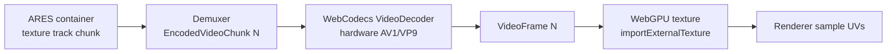

## 7. Texture and video encoding

Texture is the larger half of most volumetric payloads. The plan's instinct — *stop shipping
thousands of WebP files; ship one video* — is correct, but the details determine whether it works.

### 7.1 The decision: one video track, decoded via `WebCodecs`

> **[SANITY CHECK — the most important correction in this section]** The plan says "store one AV1
> video; hardware decodes automatically." True for pixels, but a naïve `<video>` element is the
> **wrong** decode path for volumetric sync. An `HTMLVideoElement` does not give frame-accurate,
> pull-based access: `currentTime` seeking is imprecise, `requestVideoFrameCallback` is delivery- not
> pull-timed, and you cannot reliably say "give me exactly texture frame N *now*, synchronized to
> geometry frame N." For frame-accurate volumetric playback you MUST use **`WebCodecs`**
> (`VideoDecoder`): feed `EncodedVideoChunk`s, receive `VideoFrame`s you control, and import each
> `VideoFrame` directly into WebGPU.

So the texture subsystem is: **an AV1 (default) or VP9 video track, demuxed from the ARES container,
decoded with `WebCodecs` `VideoDecoder`, each `VideoFrame` imported to a GPU texture via
`copyExternalImageToTexture` / `importExternalTexture`.**

### 7.2 Codec selection (2026 reality)

| Codec | Compression | HW decode (2026) | Browser via WebCodecs | ARES role |
|---|---|---|---|---|
| **AV1** | Excellent | Widespread on 2023+ SoCs/GPUs | Broad (Chromium, FF; Safari improving) | **Default** |
| **VP9** | Good | Very widespread | Broad | **Fallback** (older/no-AV1 HW) |
| **HEVC/H.265** | Excellent | Widespread (native) | **Inconsistent / license-gated** in browsers | Optional, opt-in only |
| **H.264/AVC** | Modest | Universal | Universal | Last-resort lowest tier |

> **[SANITY CHECK — HEVC]** The plan lists "Lossless HEVC … very fast … browser support
> inconsistent." As of 2026, HEVC *hardware* decode is ubiquitous at the OS level, but **browser**
> exposure through WebCodecs remains inconsistent and entangled with licensing (available in Safari;
> gated/partial in Chromium depending on platform and flags). ARES therefore treats HEVC as an
> **optional, capability-detected** track, never the only track. AV1 + VP9 covers the field openly.

**Recommendation:** encode a **primary AV1** track and a **VP9 fallback** track for the same content
(or ship AV1 only and accept the small population without AV1 HW decode falling back to a software
decode or a lower profile). Capability is probed at load with
`VideoDecoder.isConfigSupported({...})`.

### 7.3 What about animated WebP / AVIF? (rejected for the primary path)

> **[SANITY CHECK]** The plan's own assessment is right and worth formalizing:
>
> - **Animated WebP** — poor temporal compression (it is essentially independently-coded frames in a
>   loop), no random access, decoded through the image pipeline. **Not competitive.** Reject.
> - **Animated AVIF** — backed by AV1 intra coding, so per-frame quality is good, but browser
>   *sequence* decoding is delivered through the image pipeline with weak seeking and no pull-based
>   frame access. Interesting for *very short* loops, but the *video* path (AV1 in the container via
>   WebCodecs) strictly dominates for streaming.
>
> Conclusion: **use the video codec through WebCodecs, not animated image containers.** Single WebP
> stills remain useful only as poster/preview thumbnails.

### 7.4 The texture atlas must be temporally stable

A video codec only compresses well if consecutive frames are *similar*. If the encoder re-lays-out
the UV atlas every frame (as per-frame reconstruction naturally does), the texture video becomes a
slideshow of unrelated images and inter-frame prediction collapses. Therefore:

- Within a GOP, the atlas layout MUST be **stable** (the same surface region maps to the same atlas
  region across frames). This is the texture-side counterpart of persistent topology
  ([§6.5](#65-persistent-topology--the-core-bet)) and is produced by the same correspondence step.
- Atlas stability turns surface motion into *pixel motion the codec's motion estimation already
  handles*, which is precisely why the video path pays off. [ASSERTED]

### 7.5 Alpha, confidence, and auxiliary channels

The plan's idea to use the alpha channel for a confidence/segmentation map is sound, with a caveat:

- AV1/VP9 support alpha, but a cleaner, better-compressing option is a **separate single-channel
  video track** (monochrome) for confidence/segmentation/depth, time-aligned to the color track.
  Separate tracks avoid coupling alpha quality to color quality and let the runtime skip decoding
  auxiliary tracks it does not need. [ASSERTED]
- Depthkit-style packed color+depth in one frame [36] is supported as an alternative single-track
  layout for the geometry-image path ([§8.5](#85-video-assisted-geometry-packing-attributes-into-pixels)).

### 7.6 Multi-resolution texture ladder

Following Arcturus's multi-resolution textures [13] and standard ABR practice, the encoder produces
a small **ladder** (e.g., 2048², 1024², 512²) as independent video renditions per GOP. The scheduler
([§9](#9-streaming-architecture)) selects a rung by bandwidth and on-screen size. Rungs share the
same timeline so switching is seamless at GOP boundaries.

### 7.7 GPU-compressed textures (KTX2/Basis) — where they still fit

KTX2/Basis (UASTC/ETC1S) transcodes to GPU-native block formats and saves *GPU memory and sampling
bandwidth* [4][33]. But it is an **image** technology with weak temporal compression, so it does not
replace the video track for a long sequence. ARES's use of KTX2/Basis is limited to:

- static/near-static captures (a single or rarely-changing atlas), and
- the **poster/first-frame** to make TTFF instant while the video track spins up.

For motion, the AV1 video track wins on size; the runtime samples the decoded `VideoFrame` directly.

### 7.8 Summary

- **Default texture path:** AV1 video track (VP9 fallback), decoded via **WebCodecs**, imported to
  WebGPU as an external texture, sampled with the mesh's stable UVs.
- **Rejected:** `<video>`-element playback for sync (use WebCodecs); animated WebP/AVIF as the
  streaming path; HEVC as a mandatory codec.
- **Kept in a supporting role:** WebP still for posters; KTX2/Basis for static atlases and TTFF;
  a separate mono track for confidence/segmentation/depth.
