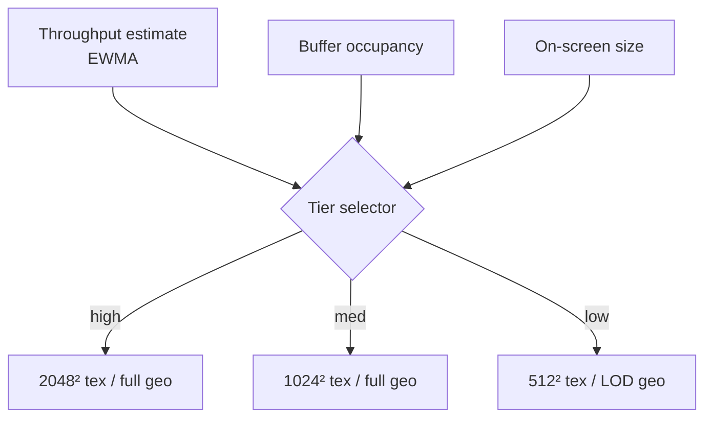
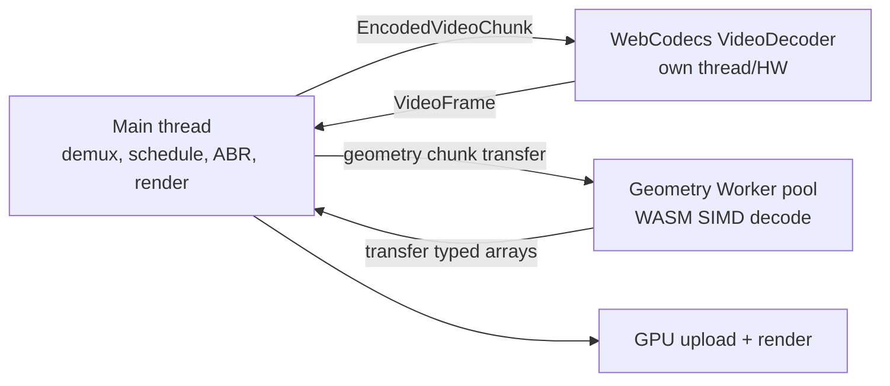

## 9. Streaming architecture

The plan's "think Netflix" is exactly right. ARES borrows the proven shape of HTTP adaptive
streaming (HLS/DASH) — chunked media, a manifest, an ABR ladder — adapted for two synchronized
media types (geometry + texture) instead of one.

### 9.1 Chunked delivery

The container is a sequence of self-contained **chunks**, each spanning one GOP (default 1–2 s):

```
[ superblock header ][ GOP index ] [ chunk 0 ][ chunk 1 ][ chunk 2 ] ... [ chunk N ]
                                     └ 1–2 s each, independently decodable ┘
```

Each chunk contains, for its time span: one geometry I-frame + its P/B frames, the matching
texture-video segment (one closed GOP per rung), optional audio, and optional metadata. Because a
chunk is independently decodable, the runtime can start at any chunk (seek) and can fetch chunk
`n+1` while rendering chunk `n` (prefetch).

Two delivery modes, same container:

- **Single-file + HTTP range requests.** The GOP index gives byte ranges; the runtime issues
  `Range:` requests per chunk. Simplest to host (a static file on any CDN).
- **Segmented files + manifest.** Chunks as separate files with a small JSON/binary manifest, à la
  DASH. Better for some CDNs and for live. The runtime supports both; the manifest is optional sugar
  over the same chunk layout.

### 9.2 The GOP index (seek table)

A table at the head of the file (or in the manifest) mapping **time → {chunk index, byte offset,
byte length, is-keyframe, tier availability}**. This is what makes seeking O(1): to seek to time `t`,
binary-search the index for the chunk containing `t`, fetch it, decode from its I-frame, and present
from `t`. Seek latency is therefore one chunk fetch + one I-frame decode → the < 250 ms target
([§4.5](#45-performance-targets)). [PROJECTED]

### 9.3 Adaptive bitrate (ABR)

Each GOP is available at multiple **tiers** (texture ladder §7.6 × optional geometry LOD):

- The scheduler estimates throughput (EWMA of recent chunk download rates) and buffer occupancy.
- It selects the highest tier whose projected download time keeps the buffer above a low-water mark.
- Tier switches occur only at **chunk/GOP boundaries** (both streams switch together, §8.6).
- On-screen size feeds the choice too: a small on-screen capture never needs the 2048² rung.



### 9.4 Prefetch and buffer management

- **Prefetch window.** Maintain a target of *K* seconds decoded-ahead (configurable, default ~2–3 s).
  Fetch and decode chunks to keep the window full; never let it drain to zero during steady playback.
- **Ring buffer.** Decoded frames live in a fixed-capacity ring sized by the memory budget
  ([§10.6](#106-memory-management-and-budgets)). Oldest frames evict as new ones arrive.
- **Predictive prefetch on seek.** On scrub, prefetch the chunk under the playhead *and* its
  neighbors to cover direction ambiguity.
- **Backpressure.** If decode can't keep up (slow device), drop to a lower tier and/or skip B-frames
  before dropping to a stall. Degrade smoothly (N4).

### 9.5 Worker scheduling



- A small **pool** of geometry Workers (default `min(navigator.hardwareConcurrency-1, 4)`) decodes
  P/B frames in parallel across chunks.
- Decoded buffers are **transferred** (zero-copy `Transferable`), not cloned.
- The `VideoDecoder` runs on its own (often hardware) thread; its `VideoFrame` outputs are consumed
  on the main thread for GPU import and **`close()`d promptly** to free decoder resources.

### 9.6 Live and low-latency (future-facing hooks)

The chunked model extends to live: an open-ended manifest with rolling chunks, low-latency chunk
transfer (chunked-transfer or WebTransport), and a short buffer. v1 targets **on-demand**; the
container reserves the header fields (live flag, rolling-window hints) so live is an extension, not a
redesign. [OPEN]

### 9.7 Deployment constraints (must be documented for integrators)

- **Cross-origin isolation.** The `SharedArrayBuffer` zero-copy fast path
  ([§10.5](#105-threading-sharedarraybuffer-and-cross-origin-isolation)) requires COOP/COEP response
  headers. Hosts that cannot set them get the (slightly slower) `Transferable`-only path. This MUST
  be called out in integration docs; it is a common deployment foot-gun.
- **Range requests / CORS.** The CDN MUST support `Range` and appropriate CORS headers for the
  single-file mode.
- **MIME type.** Serve `.ares` as `model/vnd.ares` (proposed) or `application/octet-stream`.
- **Caching.** Immutable chunks are highly cacheable (`Cache-Control: immutable`); the index/manifest
  is the only thing that changes for live.
