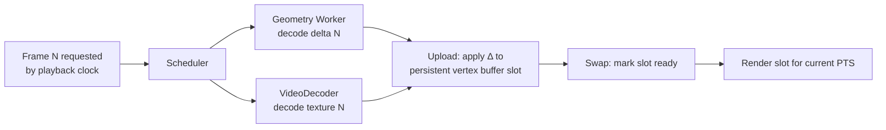

## 10. Runtime architecture

The runtime is deliberately small and dumb: all cleverness is in the encoder. Its job is to fetch,
decode off the main thread, upload to the GPU, and swap buffers in time with the display.

### 10.1 The frame lifecycle and the playback pipeline

The plan contrasts the naïve pipeline (`Frame → load GLB → parse → decode → render`) with a
worker-driven one. ARES specifies the latter concretely:



The pipeline is **decoupled from the render loop**: `requestAnimationFrame` renders whatever
composed frame is *ready* for the current playback time; decoding runs ahead asynchronously. A slow
decode causes a held frame, never a blocked render.

### 10.2 Triple buffering

Three GPU buffer slots per dynamic resource (vertex/displacement buffers, and the external texture
binding):

- **Slot A** — currently displayed (frame N−1).
- **Slot B** — ready to display (frame N).
- **Slot C** — being written by the uploader (frame N+1).

Rotating three slots means the GPU never reads a buffer the CPU is writing, eliminating stalls and
tearing. Double buffering is the minimum; triple absorbs jitter in decode timing. [ASSERTED]

### 10.3 WebGPU render path (primary)

- **Mesh profile.** Persistent index buffer (topology is stable within a GOP → uploaded once per
  GOP). Per frame, only the **position/displacement** buffer slot updates. Dequantization and
  (optionally) normal derivation happen in the vertex shader (WGSL), keeping the CPU out of it.
- **Splat profile.** Instanced billboards; per-frame splat attribute buffer; a compute-shader depth
  sort; OIT/additive blending. `VideoFrame`-packed attributes (§8.5) are read in a compute pass that
  unpacks pixels → splat buffer.
- **Texture.** `importExternalTexture(videoFrame)` binds the decoded frame directly; the fragment
  shader samples it with the mesh's stable UVs. No CPU pixel copy.

### 10.4 WebGL2 fallback (mesh profile, reduced features)

For the population without WebGPU (shrinking, but non-zero in early 2026):

- Mesh profile only (no splat compute sort).
- Texture via `texImage2D` from the `VideoFrame`/`ImageBitmap` (a CPU-visible copy path; slower).
- Dequant in the vertex shader (GLSL). No `SharedArrayBuffer` compute upload; `bufferSubData` per
  frame.
- Reduced tier ceiling. This path exists to *not exclude users*, not to be optimal (goal ranking
  §4.1). [ASSERTED]

### 10.5 Threading, `SharedArrayBuffer`, and cross-origin isolation

- **Fast path (cross-origin isolated).** With COOP/COEP set, decoded geometry lands in a
  `SharedArrayBuffer` ring the GPU uploader reads without a structured-clone copy. Workers and the
  main thread share memory; WASM uses threads + SIMD.
- **Compatible path (not isolated).** Without COOP/COEP, `SharedArrayBuffer` is unavailable; the
  runtime uses `Transferable` `ArrayBuffer`s (zero-copy *move*, one owner at a time). Slightly more
  coordination, no shared reads. Still fast; this is the default assumption.
- The runtime **feature-detects** `crossOriginIsolated` and picks the path automatically (N7).

> **[SANITY CHECK]** The plan lists "SharedArrayBuffer" as a runtime feature without noting it
> requires cross-origin isolation. Many hosting setups can't set COOP/COEP. Hence the mandatory
> non-isolated fallback — this is a requirement (N7), not a nice-to-have.

### 10.6 Memory management and budgets

- A single configurable **budget** (e.g., 256–512 MB) bounds decoded-frame cache + GPU buffers.
- The ring buffer sizes itself to the budget and the current tier's per-frame footprint.
- GPU buffers for dynamic data are **allocated once** (max-size for the profile) and reused across
  frames — no per-frame allocation, no GC pressure on the hot path.
- `VideoFrame`s are `close()`d immediately after GPU import; geometry buffers return to a free-list.
- Deterministic teardown: `dispose()` frees all GPU resources, terminates Workers, closes decoders.

### 10.7 WASM + SIMD for geometry decode

The geometry decoder (meshopt/entropy/delta) is WASM compiled with SIMD128, running in the Worker
pool. This is the only non-trivial CPU work, and it is (a) off the main thread and (b) vectorized.
Target: decode a P-frame in ≤ a few hundred microseconds for typical vertex counts. **[PROJECTED]**

### 10.8 Clock and A/V/geometry sync

- A single **playback clock** (audio clock if audio present, else a monotonic media clock) drives
  presentation.
- Geometry and texture are presented by matching PTS to the clock (§8.6); audio is rendered via
  `AudioContext`/`AudioWorklet` and is the sync master when present (audio glitches are more
  perceptible than a dropped visual frame).
- On drift, the visual streams resync to the audio clock at the next GOP boundary.

### 10.9 Public runtime API (sketch)

```ts
const player = await AresPlayer.create({
  canvas,                    // HTMLCanvasElement | offscreen
  src: 'capture.ares',       // URL (single-file range) or manifest
  renderer: 'webgpu',        // 'webgpu' | 'webgl2' | 'auto'
  memoryBudgetMB: 384,
  prefetchSeconds: 2.5,
  onFrame: (pts) => {},      // optional per-presented-frame hook
});
player.play(); player.pause();
player.seek(12.4);           // seconds; uses GOP index
player.setTier('auto');      // 'auto' | 0..n
player.dispose();
```

Integration wrappers (`@ares/three`, `@ares/react`) wrap this core; see
[§12](#12-javascript--webgpu-implementation).
