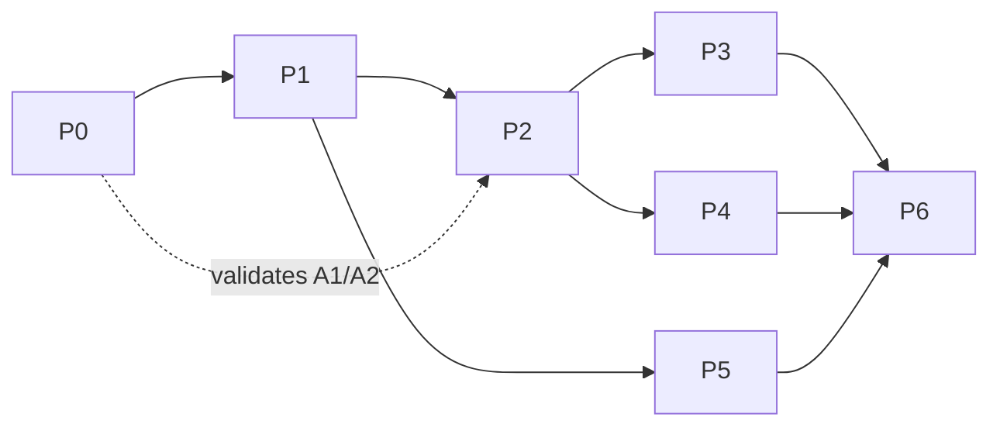

## 14. Development roadmap

Staged so that each phase produces something runnable and each de-risks the next. The plan's Phases
0–8 map onto this; the ordering here front-loads the load-bearing assumptions (A1/A2, persistent
topology) so they are validated before much is built on them.

```mermaid
gantt
  title ARES roadmap (indicative)
  dateFormat  X
  axisFormat %s
  section Foundations
  P0 Representation bench      :0, 2
  P1 Vertical slice (mesh)     :2, 3
  section Core
  P2 Temporal geometry         :5, 3
  P3 Streaming + ABR           :8, 2
  section Breadth
  P4 Splat profile             :10, 2
  P5 Encoders + tooling        :12, 3
  P6 Hardening + v1            :15, 2
```

### Phase 0 — Representation benchmark (de-risk the premise)

- Build the [§13](#13-benchmark-methodology-and-projected-performance) harness and corpus.
- Benchmark Options A–D intra representations + Draco/meshopt/quantization; fill the §6.10 matrix
  with **measured** numbers.
- **Validate [ASSUMPTION A1/A2]:** confirm WebGPU + WebCodecs AV1/VP9 hardware decode on target
  devices via `isConfigSupported`. If A2 fails widely, re-plan the texture path.
- **Exit criteria:** a measured intra baseline; a decision on intra codec default (expect meshopt).

### Phase 1 — Vertical slice (mesh profile, no temporal yet)

- Minimal `.ares` container (header, index, chunks) carrying **intra-only** mesh frames + AV1 texture
  via WebCodecs.
- `@ares/core` demuxer + scheduler + WebGPU renderer + Three.js/React wrappers.
- **Exit criteria:** a real capture plays in-browser end-to-end; TTFF and CPU/frame measured; already
  beats Draco-GLB on CPU and request count. This is the first demo.

> **[MET 2026-07-08]** Reference `ares/apps/demo` plays a full intra `.ares` (meshopt geometry
> blocks + still atlas) end-to-end in WebGPU: single fetch, GPU-side dequant (§12.4), topology/UVs
> once per GOP + positions per frame (§12.3). Measured (AMD 680M iGPU, ~8.8k-vert synth clip):
> TTFF ≈ 160 ms (< 500 ms), main-thread CPU ≈ 0.35 ms/frame (< 3 ms), decode ≈ 0.3 ms/frame, 60 fps,
> **1 request** vs a Draco-GLB sequence's per-frame requests. Deferred to later phases at the time:
> Worker-thread decode (§10.7), WebGL2 fallback (§10.4), WebCodecs video-texture (§7.1) — P1 shipped
> a still atlas (§7.7).
>
> **[UPDATE 2026-07-10]** All three deferred items have since shipped in the reference
> implementation: the WebCodecs VP9/AV1 video-texture path (§7.1) is the default for real captures,
> the WebGL2 fallback (§10.4) auto-selects when WebGPU is absent (61 fps measured), and
> worker-thread geometry decode (§10.7) is available opt-in (main-thread fallback where module
> workers do not inherit import maps).

### Phase 2 — Temporal geometry (the core bet)

- Encoder: persistent-topology tracking (§6.5.1), I/P/B classification, delta + entropy coding.
- Runtime: sparse delta upload (§12.5), triple buffering.
- Run the **video-geometry vs binary-delta** ablation (§8.5.3) and the splat-attribute-in-video test.
- **Exit criteria:** measured size drop from temporal coding on `talk`/`dance`; re-keyframing handles
  `two`; §13.5 targets confirmed or revised with honesty clause (§13.6).

### Phase 3 — Streaming, seeking, ABR

- GOP index seek; prefetch/ring buffer; multi-resolution texture ladder; tier selection; range-request
  and manifest delivery modes.
- **Exit criteria:** smooth seek < 250 ms; ABR adapts on a throttled network; bounded memory verified.

### Phase 4 — Splat profile

- Splat intra + temporal; WebGPU instanced/compute-sorted renderer; optional PackUV-style
  attribute-in-video.
- **Exit criteria:** `splat` clip plays; splat-vs-mesh trade-off documented per capture type.

### Phase 5 — Encoders and conversion tooling

Converters, each landing in the shared IR (§5.2) so every coder improvement applies to all inputs:

- PLY+PNG (primary), OBJ seq, glTF/GLB seq, Alembic, FBX animation, USD.
- Depthkit (color+depth video), 4DViews (`.4ds`), Microsoft HoloVideo where feasible.
- A `gltf-transform`-style CLI: `ares encode ./frames --profile mesh --tier 1024,512 -o out.ares`.
- **Exit criteria:** one-command conversion for PLY+PNG and Depthkit; documented importer matrix.

### Phase 6 — Hardening and v1.0

- Security pass (untrusted-input fuzzing of the demuxer, N6); WebGL2 fallback polish; live-streaming
  hooks stubbed; spec frozen at v1.0; docs + examples.
- **Exit criteria:** published spec, published packages, reproducible benchmark report.

### Dependencies and critical path

Persistent-topology tracking (Phase 2) is the highest-risk item and the critical path; Phase 0
explicitly exists to make sure the assumptions under it hold before Phase 2 starts.
