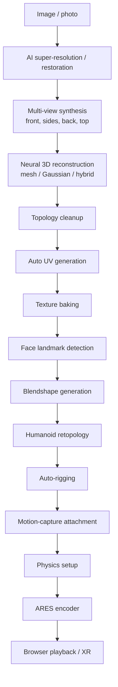

## 15. Future research: the avatar pipeline

This is explicitly **out of the v1 runtime scope** and lives here as a separate module in the broader
ecosystem. It is the "generate volumetric content" counterpart to ARES's "deliver volumetric
content." ARES is the export target at the end of the pipeline, which keeps the pipeline and the
runtime cleanly decoupled.

### 15.1 Pipeline overview

### 15.2 Where it connects to ARES

- **Retopology → persistent topology.** A retopologized humanoid mesh is *already* a stable-topology
  base — exactly what the mesh profile (§6.5) wants. A generated avatar is the ideal ARES input
  because correspondence is free.
- **Blendshapes → morph targets.** Blendshapes map onto the container's morph/motion blocks, so a
  rigged avatar can be delivered as a compact base mesh + animation rather than baked per-frame
  geometry — a different, even smaller, encoding mode. [OPEN]
- **Neural reconstruction → splat or mesh profile.** Whichever the reconstructor emits, the encoder
  ingests it; the runtime does not care.

### 15.3 Research stages and their maturity (2026)

| Stage | Maturity (2026) | Notes |
|---|---|---|
| Super-resolution / restoration | Mature | Off-the-shelf models |
| Multi-view synthesis | Rapidly improving | Diffusion-based novel view synthesis |
| Neural 3D reconstruction | Active | 3DGS/mesh hybrids; quality-vs-time trade |
| Auto UV / retopology | Semi-mature | Human-in-the-loop still common |
| Blendshape / rigging | Mature for humanoids | Template-based |
| Mocap attachment / physics | Mature | Standard DCC/engine tech |

The early stages are the least certain and the most valuable to invest research in; the later stages
are largely integration of existing tech. None of it blocks the ARES runtime — the runtime ships
against real captures (PLY+PNG, Depthkit, 4DViews) long before this pipeline is complete.
